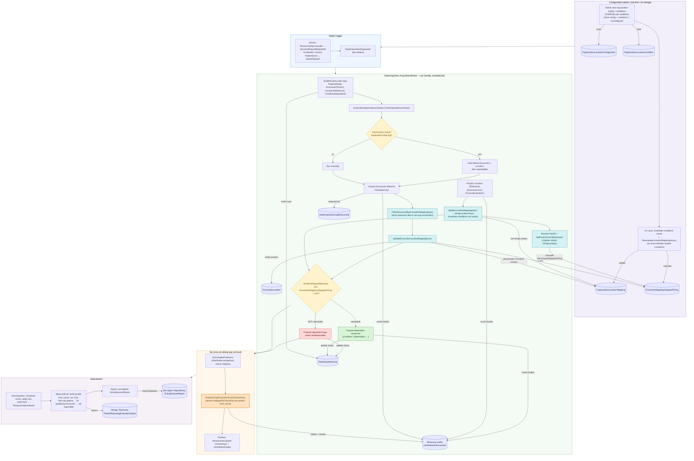
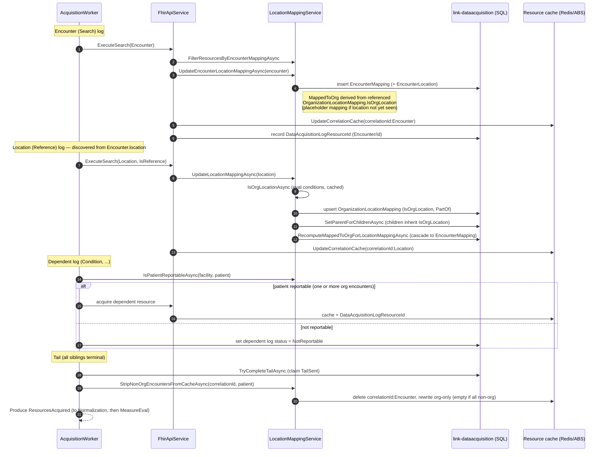
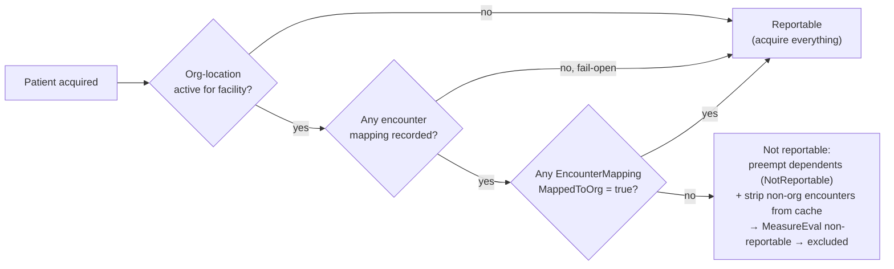

# Org-Location Mapping — As-Built

**Jira:** [LEGPROG-227 — Location OrgID Resolution](https://lantana.atlassian.net/browse/LEGPROG-227)
**Scope:** Data Acquisition (and the downstream effect on MeasureEval / Report)

## Why this exists

Health systems that share a single FHIR endpoint (e.g. URMC) return encounter data for **every**
facility in the system. NHSN requires each submission bundle to contain data for a **single NHSN
Org ID** (minimum-necessary, HIPAA privacy rule). Org-location mapping lets a tenant declare which
**Locations** belong to its reporting organization, and Data Acquisition uses that to keep
non-org patients out of the report:

- A patient is **reportable** only if at least one of their encounters occurs at an **org location**
  (directly, or via a `partOf` ancestor that is an org location).
- For a non-reportable patient, dependent acquisition is **preempted** and the non-org encounter is
  **stripped from the resource cache** before MeasureEval, so the patient evaluates to a
  non-reportable outcome and is excluded from the report.

## When this flow is active

Org-location logic activates when the facility has an **active** `OrganizationLocationConfiguration`
with at least one `OrganizationLocationCondition` (a FHIRPath that flags a `Location` as an org
location). This is exactly what `ILocationMappingService.IsConfigured` checks — the set of active
conditions for the facility, cached per facility (1h, invalidated on change). When there are no active
conditions the mapping hooks and reportability gate are no-ops and every patient is treated as
reportable.

The facility's query plan must still acquire `Encounter` and resolve `Location` references for there
to be encounters/locations to map.

> Note: the `FhirQueryConfiguration.EnableLocationResolutionMapping` property still exists on the
> entity (and CRUD models) but is **no longer used** to gate this flow — activation is driven solely
> by `IsConfigured` (an active org-location config with conditions).

---

## End-to-end flow

**Legend** — phase backgrounds: 🟪 config · 🟦 trigger · 🟩 acquisition · 🟧 tail · 🟪 downstream.
Node types: 🟨 amber diamond = decision · 🩵 teal = org-location mapping hook · 🟩 green = reportable
path · 🟥 red = preemption (non-reportable) · 🟧 orange = cache strip (the key exclusion step) ·
🔵 blue cylinder = persisted data / cache.

---

## Per-correlation acquisition + storage (sequence)

---

## Storage logic & tables affected

All Data Acquisition tables live in the **`link-dataacquisition`** SQL database.

| Table (entity / DbSet) | When written | Key columns | Role in the flow |
|---|---|---|---|
| `OrganizationLocationConfiguration` (`LocationConfigurations`) | Admin config create/update | `ConfigId`, `FacilityId`, `IsActive` | Marks a facility as org-location enabled. `IsConfigured` keys off an active config with conditions. |
| `OrganizationLocationCondition` (`LocationConditions`) | Admin config create/update | `ConditionId`, `ConfigId`, `FhirPath`, `Priority` | FHIRPath rules that flag a `Location` as an org location. Cached per facility (1h, invalidated on change). |
| `OrganizationLocationMapping` (`OrganizationLocationMappings`) | Location acquired, or encounter references an unseen location (placeholder), or config re-eval | `LocationMappingId`, `FacilityId`, `LocationId`, `IsOrgLocation`, `PartOfValue`, `PartOfId` | Per-location org membership. `IsOrgLocation` set by evaluating conditions; children inherit via `PartOf` (`SetParentForChildrenAsync`, OR-semantics — never demote). |
| `EncounterMapping` (`EncounterMappings`) | Encounter acquired; recomputed on location-mapping change | `FacilityId`, `PatientId`, `EncounterId`, `MappedToOrg` | Per-encounter org membership. `MappedToOrg = true` if **any** referenced location is an org location. Drives `IsPatientReportableAsync` and the cache strip. |
| `EncounterLocation` (`EncounterLocations`) | Encounter acquired | `EncounterLocationId`, `EncounterMappingId`, `OrganizationLocationMappingId` | Junction between an encounter mapping and the org-location mappings it references (used for `MappedToOrg` recompute). |
| `DataAcquisitionLog` (`DataAcquisitionLogs`) | Scaffold + every status transition | `Id`, `FacilityId`, `CorrelationId`, `QueryPhase`, `Status`, `SiblingCount`, `TailSent` | One row per query. Status flips to `NotReportable` when a dependent log is preempted; `TailSent` gates tail completion. |
| `DataAcquisitionLogResourceId` (`DataAcquisitionLogResourceIds`) | Each resource acquired | `DataAcquisitionLogId`, `ResourceId` (`Type/id`) | Acquired resource **ids only** (not bodies). The tail derives `CacheKeys` from the distinct resource types here. |
| `DataAcquisitionLogReferenceResource`, `DataAcquisitionLogNote` | Reference resolution / per-step notes | — | Reference-fetch bookkeeping and human-readable acquisition notes (e.g. "Filtered out N resources"). |
| `QueryPlan` (+ `FhirQueryConfiguration`) | Admin config | Encounter / Location / dependent queries | Defines the queries that produce encounters and resolve `Location` references for mapping. Activation of org-location logic is driven by an active org-location config (`IsConfigured`), **not** by `EnableLocationResolutionMapping` (deprecated/unused). |

### Resource cache (not SQL)

- `IResourceCache` (Redis locally / ABS or hybrid in prod). **Resource bodies never travel on Kafka** —
  they are written to the cache keyed `correlationId:resourceType` (Redis hash, fields `TypeName/id`).
- The tail's `ResourcesAcquired` carries **cache keys**, not bodies. Normalization rehydrates each key.
- `StripNonOrgEncountersFromCacheAsync` mutates `correlationId:Encounter` **before** the tail is
  produced: it `Delete`s the key then rewrites only the org encounters (the cache write is an additive
  `HashSet`, so removal requires delete-then-rewrite). All-non-org → the key is left empty.

### Downstream stores

- **`link-measureeval` (Mongo):** `Resource`, `PatientReportingEvaluationStatus` (per facility+correlation,
  with a `reportable` flag per measure), `measureDefinition`. A stripped (all-non-org) patient yields no
  qualifying encounter → `reportable: false`.
- **`link-report` (SQL):** `ReportEntry` / `EntryMeasureReport`. The excluded patient lands at
  `reportingStatus = NotReportable` with no aggregate report blob.

---

## Reportability decision (summary)

## Key code references

- `Application/Services/LocationMappingService.cs` — `IsConfigured`, `UpdateLocationMappingAsync`,
  `UpdateEncounterLocationMappingAsync`, `IsOrgLocationAsync`, `IsPatientReportableAsync`,
  `FilterResourcesByEncounterMappingAsync`, `StripNonOrgEncountersFromCacheAsync`,
  `ReevaluateLocationMappingsAsync`.
- `Application/Services/AcquisitionDependencyChecker.cs` — org-location gating + reportability gate.
- `Application/Services/FhirApi/FhirApiService.cs` — acquisition loop + mapping hooks (`IsConfigured` gate).
- `Application/Managers/OrganizationLocationMappingManager.cs` — `SetParentForChildrenAsync`,
  `RecomputeMappedToOrgForLocationMappingAsync` (PartOf inheritance + cascade).
- `Application/Managers/OrganizationLocationConfigurationManager.cs` — cache invalidation + re-eval on save.
- `Application/Managers/DataAcquisitionLogManager.cs` — `TryCompleteTailAsync` (tail completion).
- `../DataAcquisition.AcquisitionWorker/Services/AcquisitionProcessorBackgroundService.cs` —
  preemption (`NotReportable`) and the cache strip before the tail produces `ResourcesAcquired`.

> Validation: `Tests/Postman/LEGLINK-142-NonReportable.postman_collection.json` drives this whole flow
> end-to-end against the local stack and asserts both the DataAcquisition mappings/status and the
> report-level exclusion.
