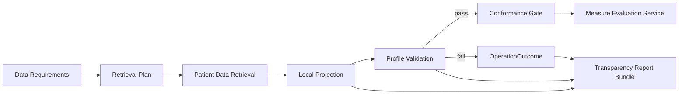

## Custom Validation & Data Transparency

This module ensures that only profile-conformant data flows into measure evaluation while giving implementers a precise, 
auditable view of what was requested, what was received, what was kept, and why.

### Objectives

- Data transparency: Clearly report how data is gathered, validated, trimmed, and forwarded.
- Profile-aware retrieval: Prefer "summary" payloads aligned to the measure's profiles (or simulate summaries locally).
- Custom validation: Validate against measure-specific profiles (e.g., US Core, QI-Core, IG-specific) and record findings.
- Conformance gate: Forward only resources conformant to the configured profiles (and tag them via meta.profile). This gate can be relaxed if needed.
- Non-conformance reporting: Persist or emit OperationOutcome for anything excluded.
- ModelInfo generation (roadmap): Generate a CQL data model from the active profile set to improve authoring and evaluation

### High-Level Architecture



### Workflow

1. Derive data requirements
   - From Measure/$data-requirements (or some other data requirements processor), the IG's profiles, and terminology.
   - Output: target profiles per resource type and mustSupport/required elements (key elements).
2. Plan & retrieve
   - Prefer server-side summarization if supported (e.g., _elements, _summary=true), but be robust when the remote server (e.g., Epic) does not support these.
   - Always record requests and responses (counts, latency, parameters) for transparency.
3. Local projection (summary simulation)
   - Trim each resource to: mustSupport ∪ required (min>0) ∪ ancestors for the target profile(s).
   - This reduces payload size and stabilizes downstream validation.
4. Custom profile validation
   - Validate each resource against one or more configured profiles using HAPI/HL7 validators.
   - The configured profiles will be determined through data requirements analysis of the Measure
   - Capture OperationOutcome.issue[*] with severity, diagnostic, code, and expression (FHIRPath).
5. Conformance gate
   - If all required profiles pass (or pass ≥ configured severity), tag the resource with meta.profile += <canonical|version> and forward.
   - Otherwise, exclude from the evaluation bundle and emit non-conformance OperationOutcome. This will likely need to be configurable.
6. Transparency output
   - Produce a Bundle (collection) containing:
     - A summary Parameters or lightweight JSON of retrieval/validation stats.
     - One OperationOutcome per excluded resource (this can be contained within the resource).
     - Optionally, include the trimmed resources actually sent to the evaluator.

Configuration Example:

```yaml
validator:
  failOnSeverity: error            # or: warning, information (threshold for exclusion)
  tagConformant: true              # add meta.profile when a profile passes
  implementationguides:
    USCORE:
      url: http://hl7.org/fhir/us/core/STU3.1.1/package.tgz
    NHSNMeasures:
      url: http://www.cdc.gov/nhsn/fhirportal/dqm/ig/STU1.0.0/package.tgz
  retrieval:
    preferServerSummary: false     # Epic often lacks _elements/_summary; do local projection
    pageSize: 200
    parallelism: 8
  projection:
    strategy: mustsupport-plus-required
    keepAlways:
      - "*.id"
      - "*.meta"
      - "*.meta.profile"
```

### Data Gathering

Challenges & strategies
- Minimal data set: Start from $data-requirements (or other data requirements processing); constrain by profile + key elements to bound the search scope.
- Remote capabilities differ: Don't assume _elements/_summary/chained search. Fall back gracefully to full resources and local projection.
- Identify relevant data in large sets: Use value sets, codes, and date windows tied to the evaluation period. Keep a per-type include/exclude filter (e.g., only lab Observations used by the measure).

Good patterns
- Cache NPM packages and ValueSet expansion.
- Log request response metrics (count, ms) by query signature and surface timeouts.

### Custom Profile Validation
- Use an InstanceValidator (HAPI/HL7) with a ValidationSupportChain that includes:
  - Base R4 definitions (or whatever FHIR version(s) being used)
  - US Core / QI-Core / IG packages (NPM)
  - Snapshot generation support if needed
  - Terminology support (local server or in-memory)
- Validate each resource against all configured profiles of its type.
- Success criteria: no issue severity higher or equal to failOnSeverity.
- On success ensure the resource declares the canonical in meta.profile (add if missing).

### Reporting

Return one OperationOutcome per resource (or a consolidated one), using:
- issue.severity: information|warning|error|fatal
- issue.code: validator's code (e.g., invalid, structure, processing)
- issue.diagnostic: human-readable explanation of issue
- issue.expression: FHIRPath to the offending element (e.g., Observation.code.coding[0].system)

### Data Conformance Gate
- Include resources that meet profile criteria.
- Exclude resources that exceed the severity threshold.
  - Perhaps these resources will be included with the contained validation messages?
- Tag conformant resources: resource.meta.profile should include the exact canonical (optionally with |version).
- Containment & references: Keep referenced contained resources if the referencing element remains after projection. Consider pruning dangling references and reporting them.

### Local Projection (Summary Simulation)

When servers don't support _elements/_summary, project locally:
- Keep mustSupport elements from the relevant StructureDefinition(s).
- Also keep elements with min > 0 (required by the base/profile), plus their ancestors.
- Normalize choice paths (valueQuantity → value[x]) when comparing to snapshot paths.
- Be cautious with slices: if mustSupport is slice-specific (e.g., category:lab), you need the discriminator to decide which array entries to keep.
