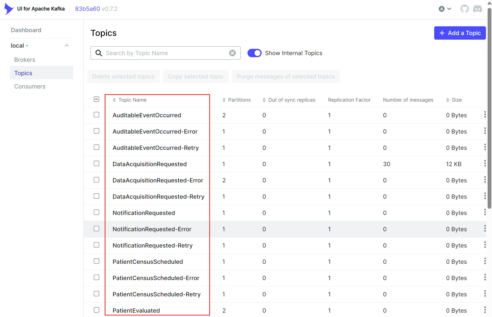
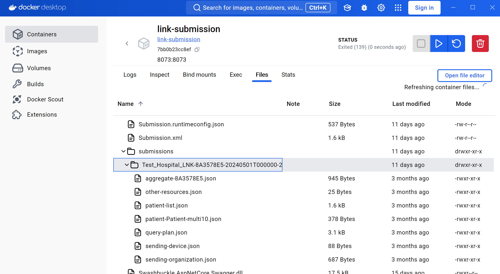
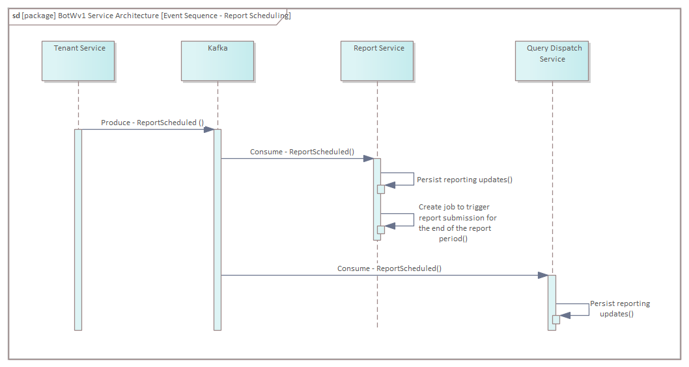
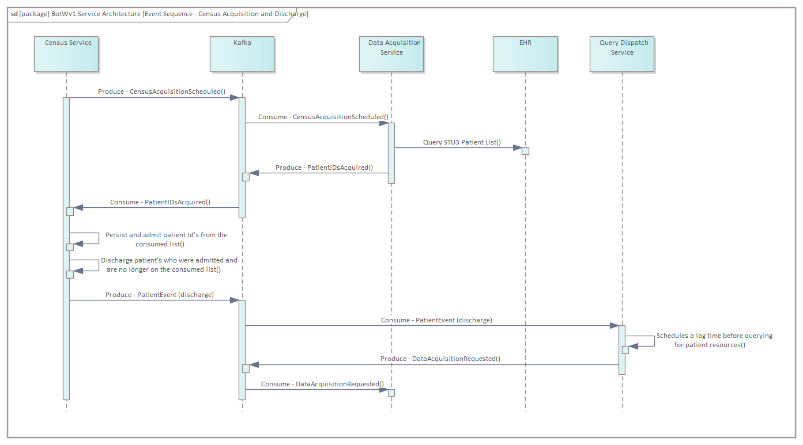
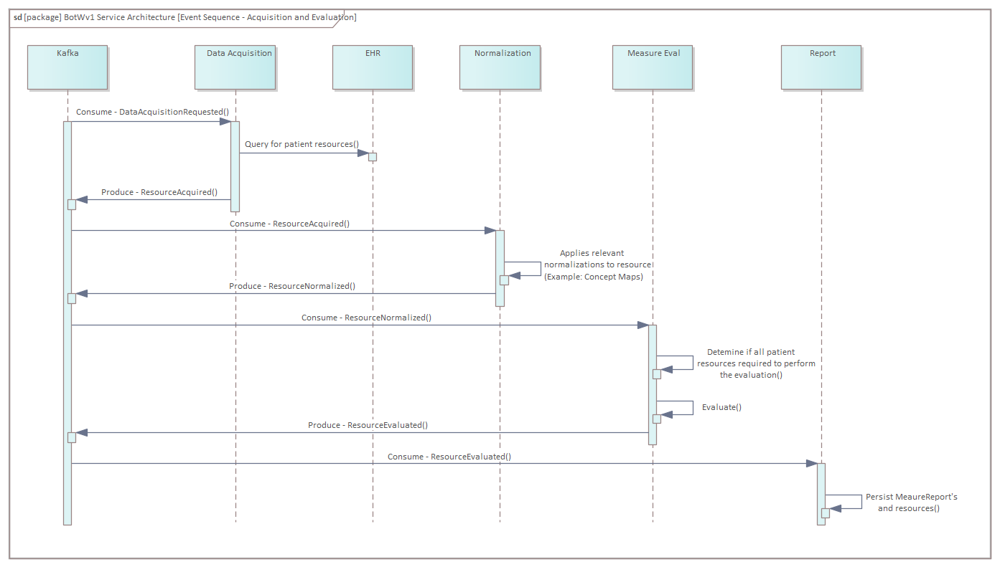

# Link Cloud

## Table of Contents
* [Introduction](#introduction)
* [Link Cloud Services](#link-cloud-services)
* [Helpful Tools](#helpful-tools)
* [Docker Installation](#docker-installation)
* [Quick Tenant Configuration](#quick-tenant-configuration)
* [Manual Reporting](#manual-reporting)
* [Reporting Event Workflow](#reporting-event-workflow)

## Introduction

NHSNLink is an open-source reference implementation for CDC’s National Healthcare Safety Network (NHSN) reporting. It is an application that aggregates, transforms, evaluates, validates and submits patient-level clinical data for patients matching NHSN surveillance requirements. It is based on a event driven micro service architecture using C#, Java, Kafka and other technologies. NHSNLink is designed to handle large-scale data processing efficiently. It leverages streaming technologies that can be configured to continuously query and evaluate patient data throughout the reporting cycle, rather than waiting until the end to initiate this process.

## Link Cloud Services

### Tenant

The Tenant service is the entry point for configuring a tenant into Link Cloud. The service is responsible for maintaining and generating events for the scheduled measure reporting periods that the tenant is configured for. These events contain the initial information needed for Link Cloud to query resources and perform measure evaluations based on a specific reporting period.

### Census

The Census service is primarily responsible for maintaining a tenants admit and discharge patient information needed to determine when a patient is ready for reporting. To accomplish this, the Census service has functionality in place to request an updated FHIR List of recently admitted patients. The frequency that the request is made is based on a Tenant configuration made in the Census service.

### Query Dispatch

The Query Dispatch service is primarily responsible for applying a lag period prior to making FHIR resource query requests against a facility endpoint. The current implementation of the Query Dispatch service handles how long Link Cloud should wait before querying for a patient’s FHIR resources after being discharged. To ensure that the encounter related data for the patient has been settled (Medications have been closed, Labs have had their results finalized, etc), tenants are able to customize how long they would like the lag from discharge to querying to be. 

### Data Acquisition 

The Data Acquistion service is responsible for connecting and querying a tenant's endpoint for FHIR resources that are needed to evaluate patients for a measure. For Epic installations, Link Cloud is utilizing the STU3 Patient List ([Link Here](https://fhir.epic.com/Specifications?api=879)) resource to inform which patients are currently admitted in the facility. While this is the current solution to acquiring the patient census, there are other means of patient acquisition being investigated (ADT V2, Bulk FHIR) to provide universal support across multiple EHR vendors.   

### Normalization

FHIR resources queried from EHR endpoints can vary from location to location. There will be occasions where data for specific resources may need to be adjusted to ensure that Link Cloud properly evaluates a patient against dQM’s. The Normalization service is a component in Link Cloud to help make those adjustments in an automated way. The service operates in between the resource acquisition and evaluation steps to ensure that the tenant data is in a readied state for measure evaluation.

### Measure Eval 

The Measure Eval service is a Java based application that is primarily responsible for evaluating bundles of acquired patient resources against the measures that Link Cloud tenants are configured to evaluate with. The service utilizes the CQF framework ([Link Here](https://github.com/cqframework/cqf-ruler)) to perform the measure evaluations.

### Report

The Report service is responsible for persisting the Measure Reports and FHIR resources that the Measure Eval service generates after evaluating a patient against a measure. When a tenant's reporting period end date has been met, the Report Service performs various workflows to determine if all of the patient MeasureReports are accounted for that period prior to initiating the submission process. 

### Submission
The Submission service is responsible for packaging a tenant's reporting content and submitting them to a configured destination. Currently, the service only writes the submission content to its local file store. The submission package for a reporting period includes the following files:    

| File | Description | Multiple Files? |
| ---- | ---- | ---- |
| Aggregate | A [MeasureReport](https://hl7.org/fhir/R4/measurereport.html) resource that contains references to each patient evaluation for a specific measure | Yes, one per measure | 
| Patient List | A [List](https://hl7.org/fhir/R4/list.html) resource of all patients that were admitted into the facility during the reporting period | No |
| Device | A [Device](https://hl7.org/fhir/R4/device.html) resource that details the version of Link Cloud that was used | No |
| Organization | An [Organization](https://hl7.org/fhir/R4/organization.html) resource for the submitting facility | No |
| Other Resources | A [Bundle](https://hl7.org/fhir/R4/bundle.html) resource that contains all of the shared resources (Location, Medication, etc) that are referenced in the patient Measure Reports | No |
| Patient | A [Bundle](https://hl7.org/fhir/R4/bundle.html) resource that contains the MeasureReports and related resources for a patient | Yes, one per evaluated patient |

An example of the submission package can be found at `\link-cloud\Submission Example`.

### Account

The Account service is responsible for maintaining roles and permissions for Link Cloud users. 

### Audit

The Audit service is responsible for persisting auditable events that are generated by the Link Cloud services.

### Notification

The Notification service is responsible for emailing configured users when a notifiable event occurs when the Link Cloud services attempt to perform their work. 

## Helpful Tools

- SQL Server Management Studio: [Link Here](https://learn.microsoft.com/en-us/sql/ssms/download-sql-server-management-studio-ssms?view=sql-server-ver16)
- Mongo Compass: [Link Here](https://www.mongodb.com/products/tools/compass)
- Mongo Shell: [Link Here](https://www.mongodb.com/docs/mongodb-shell/)
- Docker Desktop: [Link Here](https://www.docker.com/products/docker-desktop)
- Postman: [Link Here](https://www.postman.com)

## Docker Installation

1. Run the following terminal commands at the root directory of the repo to download and build Link Cloud and all necessary dependencies: 

```
docker compose build
docker compose up -d		
``` 
 
The initial building of the services will take a few minutes to run.

2. Confirm that the following Link Cloud service containers are running:
    - link-account
    - link-audit
    - link-bff
    - link-census
    - link-dataacquisition
    - link-measureeval
    - link-normalization
    - link-notification
    - link-querydispatch
    - link-report
    - link-submission 
    - link-tenant
    - link-validation

3. Confirm that the following Link Cloud dependent containers are running: 
    - **Databases/Cache**
      - sql-server
      - mongo
      - redis

    - **Telemetry/Observability**
      - open-telemetry-collector
      - grafana
      - loki
      - promeutheus
      - tempo

    - **Kafka**
      - kafka-broker
      - kafka-rest-proxy
      - kafka-ui

4. There are two 'init' containers that will start processes to populate SQL database tables and Kafka topics. After the following containers run their process, they will automatically stop. 
    - kafka-init
    - sql-init

5. Open a web browser and access Kafka UI. By default, the page can be accessed at `http://localhost:9095`. Click the `Topics` tab and ensure that Kafka topics exist:



If there aren't any topics populated (shown in the image above), attempt to rerun the following command: `docker compose up kafka_init -d`
    
6. Open SQL Server Management Studio and connect. The default server name should be `127.0.0.1,1433`. The `SA` password can be found in the `.env` file (The `LINK_DB_PASS` variable) in the Link Cloud repository. Ensure that the following databases were created:
    - link-account
    - link-audit
    - link-census
    - link-dataacquisition
    - link-normalization
    - link-notification
    - link-querydispatch
    - link-tenant
    - link-validation

If the databases listed above don't exist, attempt to rerun the following command: `docker compose up mssql_init -d`

## Quick Tenant Configuration

Configuration database scripts are provided to generate a tenant named `Test-Hospital`. These scripts will load most of the service configurations needed to run Link Cloud. To be capable of performing resource acquisition, a FHIR endpoint will need to be manually added (detailed below). Here are the steps to run the scripts:

1. Open SQL Server Management Studio and connect to your SQL Server Docker container (Defaulted to port 1433).

2. Open and run `\link-cloud\Scripts\load-sql-data.sql`.

3. To properly query for FHIR resources, update the FHIR endpoints in the SQL `link-dataacquisition` database:

```   
UPDATE fhirQueryConfiguration
set FhirServerBaseUrl = '** INSERT FHIR BASE URL HERE **'

UPDATE fhirListConfiguration
set FhirBaseServerUrl = '** INSERT FHIR BASE URL HERE **'
```

4. Open Mongosh in a separate terminal and run the following: `load("\\link-cloud\\Scripts\\load-mongo-data.js")`.

## Manual Reporting 

Automated report scheduling can be configured through the Tenant API. However, a manual approach can be done to immediately generate a report. Open Kafka UI and produce the following into the `ReportScheduled` topic:

**Key:** 
```
{
  "FacilityId": "Test-Hospital",
  "ReportType": "NHSNdQMAcuteCareHospitalInitialPopulation"
}
```

**Value:**
```
{
  "Parameters": [
  {
    "Key": "StartDate",
    "Value": "2024-09-01T00:00:00"
  },
  {
    "Key": "EndDate",
    "Value": "2024-09-30T23:59:59"
  }]
}
```

Because the report generation process runs immediately after the set `EndDate`, allocate enough time (a few minutes) to perform the subsequent steps. 

To manually admit patients, produce the following into the `PatientIDsAcquired` topic in Kafka UI:
> [!NOTE]
> The patients included in the event below are examples only. Add patient identifiers that exist in your EHR endpoint.

**Key:**
```
Test-Hospital
```

**Value:**
```
{
  "PatientIds": {
  "resourceType": "List",
  "entry": [
    {
      "item": {
      "reference": "Patient/hJOGSZyFOTIiwEBWUU6p9NKxflMTOLCRRpLbAkfPrfqee"
      }
    },
    {
      "item": {
      "reference": "Patient/0VmZaB90pc5yRSefoK6sW9C9WVOvPARAgquBFNtGr6LXk"
      }
    },
    {
      "item": {
      "reference": "Patient/9mDh8TdqYuZP4JZkjbyDkw1SRwOG6TOhCY8GfClh5QG2m"
      }
    }]
  }
}
```

To discharge a patient and begin their reporting workflow, produce the same `PatientIDsAcquired` event without the discharged patient in the list. The example below will discharge `Patient/0VmZaB90pc5yRSefoK6sW9C9WVOvPARAgquBFNtGr6LXk`:

**Key:**
```
Test-Hospital
```

**Value:**
```
{
  "PatientIds": {
  "resourceType": "List",
    "entry": [
      {
        "item": {
        "reference": "Patient/hJOGSZyFOTIiwEBWUU6p9NKxflMTOLCRRpLbAkfPrfqee"
        }
      },
      {
        "item": {
        "reference": "Patient/9mDh8TdqYuZP4JZkjbyDkw1SRwOG6TOhCY8GfClh5QG2m"
        }
      }]
  }
}
```

At the end of the reporting period, the Report service will make additional requests to query and evaluate patients that are currently admitted in the facility prior to submitting. After each of those admitted patients are evaluated, the Report service will then produce a `SubmitReport` event to inform the Submission service that a report is complete. To access the submission package open Docker Desktop and click the `link-submission` container. Select the `files` tab and navigate to the `app\submissions` folder. There, you'll be able to download the submission results for the reporting period:



## Reporting Event Workflow
> [!NOTE]
> As Link Cloud continues to develop, the workflow detailed below to generate reports may be subject to large changes.

Detailed below are the steps Link Cloud takes to generate a report for a tenant reporting period. They are broken into phases. Each phase has a sequence diagram to visualize the workflow. 

### Report Scheduling



At the beginning of a new reporting period, the Tenant service produces a `ReportScheduled` event. The Query Dispatch and Report services consume and persist the reporting information in the event into their databases. The Report service sets an internal cron job (based on the EndDate of the consumed event) to execute the work needed to complete the report. 

### Census Acquisition and Discharge



During the reporting period, the Census service is configured to continually request a new list of patients admitted in a facility by producing the `CensusAcquisitionScheduled` event. The Data Acquisition service consumed this event and queries the facility's List endpoint. After receiving a response back from the EHR endpoints, the Data Acquisition service then produces a `PatientIDsAcquired` event that contains a list of all patients that are currently admitted in the facility.

The Census service consumes the `PatientIDsAcquired` event and applies updates in the database for patients have been admitted or discharged. 

> [!NOTE]
> The Census service treats any patient in the PatientIDsAcquired list as an admitted patient. If the Census service has a patient marked as admitted in the database, but the patient is no longer present on the consumed list, it treats the patient as a discharge.

A `PatientEvent` Kafka message is produced for each patient that has been discharged.

The QueryDispatch service consumes the patient events and appends the tenants' reporting information (the info consumed in the `ReportScheduled` event). The service then sets a cron job based on the configured lag time that the facility wants to apply for each discharge. When that lag time is met, the Query Dispatch service produces a `DataAcquisitionRequested` event to trigger the acquisition and evaluation steps. 

### Resource Acquisition and Evaluation



A `DataAcquisitionRequested` event is generated for patients that have either been discharged or are still admitted when the reporting period end date is met. This event is the trigger that causes the resource acquisition, normalization and evaluation phases for a patient. 

When the Data Acquisition service consumes the `DataAcquisitionRequested` event, the service will use the persisted query plan to make requests to the EHR endpoint for patient FHIR resources that correspond with the report type that is in the value of the consumed event. A `ResourceAcquired` event is produced for each resource that the EHR endpoint responds with.    

The Normalization service consumes the `ResourceAcquired` event and applies any normalization configurations that the facility is configured for (Example: Concept Maps). After a resource has been normalized, the service produces a `ResourceNormalized` event.

The Measure Eval service consumes the `ResourceNormalized` events and persists each resource into its database. When the service has accounted for every normalized resource for a patient, it will then perform work to bundle and evaluate those resources against the CQF libraries for the report type in the event. The generated MeasureReport and its evaluated resources are then produced as separate `ResourceEvaluated` events
  
> [!NOTE]
> Due to the potential large size of a MeasureReport, the MeasureEval service will produce a single ResourceEvaluated event for the MeasureReport that contains only resource references. Then, the MeasureEval service will produce ResourceEvaluated events for each evaluated resource in the MeasureReport. There is information within the event that allows for the consuming Report service to associate evaluated resources to their corresponding MeasureReport.

> [!NOTE]
> The MeasureEval service is capable of producing DataAcquisitionRequested events if the reporting measure also includes the need for additional supplemental data for a patient that meets the initial population criteria of a measure. If this is the case, the MeasureEval service will only produce ResourceEvaluated events after it has evaluated a patient that had had their supplemental resources acquired and normalized. 

When the end of the reporting period is met, the Report service will confirm that it has MeasureReport's for all discharged patients that were within the reporting period. Additionally, it will request that currently admitted patients be evaluated for that reporting period. The service does this by producing `DataAcquisitionRequested` events for each admitted patient which triggers the acquisition/evaluation workflow mentioned above. After those patient MeasureReports are accounted for, the Report service will produce a `SubmitReport` for the Submission service.

