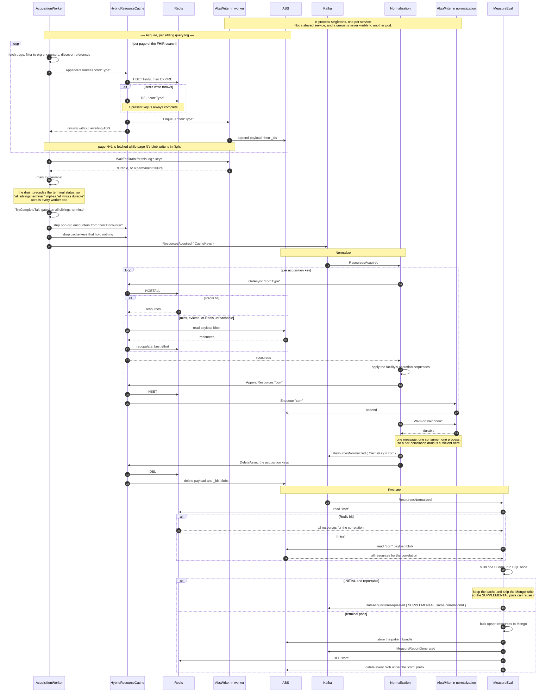
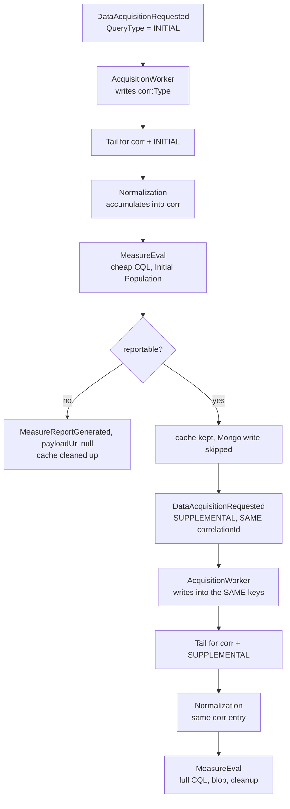

# Resource cache: ABS as the durable source, Redis as the read cache

FHIR resource bodies do not travel on Kafka. They are written to a shared resource cache and the
events carry cache pointers. This document describes how that cache behaves end to end, from the
Acquisition Worker's first write through to MeasureEval completing.

Implemented by `LEGLINK-1118` (.NET: `LEGLINK-1276`, Java: `LEGLINK-1279`), which replaced the
previous Hybrid implementation. That version chose Redis **or** ABS per correlation from a Redis
memory probe and stamped the choice on the Kafka events, so the chosen store held the only copy and
an eviction between passes was unrecoverable. See [Why the previous design was
replaced](#why-the-previous-design-was-replaced).

## The rule

**ABS always holds the data. Redis is a cache in front of it.**

- Writes go to Redis inline, and to ABS on a background queue.
- Reads try Redis first and fall back to ABS, repopulating Redis on the way through.
- A Redis miss, eviction or outage is a slower read, never a failure.
- Nothing advertises a cache key until that key's ABS write is durable.

## Key layout

There are two generations of entry per correlation.

| Generation | Key | Written by | Read by |
|---|---|---|---|
| Acquisition | `{correlationId}:{ResourceType}` | AcquisitionWorker, one key per resource type | Normalization |
| Normalized | `{correlationId}` | Normalization, all types accumulated into one key | MeasureEval |

These two shapes are the only keys a correlation owns, and each generation is cleaned up by the
service that consumes it. Normalization deletes the acquisition keys after producing
`ResourcesNormalized` and purges them on every terminal failure. MeasureEval's Redis cleanup
(`RedisResourceService.cleanup`) unlinks only `{correlationId}`. Acquisition keys that Normalization
fails to delete expire with the TTL. Keeping MeasureEval to one key also keeps it to single-key
commands, which the OSS clustering policy requires: a multi-key `UNLINK` spanning hash slots is
rejected with `CROSSSLOT`.

`(FacilityId, CorrelationId)` identifies **one patient's acquisition run**, not the patient. The
patient travels separately as `PatientId`. A re-run, a readmission or a regenerate gets a new
correlationId and therefore a new set of entries.

In each store:

| | Redis | ABS |
|---|---|---|
| Container | one hash per key | one payload blob per key, plus a `{key}_ids` blob |
| Per resource | hash field `{Type}/{Id}` → JSON | a line pair in the payload: `{Type}/{Id}`, then JSON |
| Membership | implicit | the `_ids` blob, because an append blob cannot be asked what it contains |
| Expiry | `ResourceCache:Redis:CacheEntryTtlDays`, reset on every write | none; storage lifecycle rule only |

Writes are additive. `HashSetAsync` merges fields into the existing hash, and the ABS side reads
`{key}_ids` and diffs before appending, so a resource type acquired across several sibling query
logs accumulates into one key rather than replacing it.

## End to end, one pass

## The two passes

A reportable patient runs the loop twice. Both passes share one correlationId, so the second
**accumulates into the same entries** rather than creating new ones.

The tail group and its lock are `(FacilityId, CorrelationId, QueryPhase)`, so **each pass drains and
advertises independently**. Nothing waits for both. By the time SUPPLEMENTAL reads, INITIAL's writes
are durable, because every INITIAL log drained before going terminal and the INITIAL tail could not
have fired otherwise.

#### A log's terminal status and its acquired ids must commit together

What opens the gate and what fills the event are two different writes to two different tables. The
gate is `DataAcquisitionLog.Status`; the event's `CacheKeys` are built by `TryCompleteTailAsync`
querying `DataAcquisitionLogResourceIds` and projecting `{correlationId}:{type}` from the rows it
finds. `DataAcquisitionLogManager.UpdateAsync` writes both, and writes the **ids first** precisely
because the tail reads them separately.

With the status first, sibling logs running concurrently mean one of them finishes while another has
flipped its status but not yet saved its ids. It sees the whole group terminal, queries an id table
that does not yet hold those rows, and produces a `ResourcesAcquired` advertising **every resource
type except that one**. Normalization is never pointed at the key, so those resources never reach the
correlation entry, MeasureEval, Mongo or the submitted report.

Nothing detects it, which is what makes the ordering load-bearing rather than tidy:

- `ResourcesAcquiredTailFinalizer` drops keys that hold nothing, but the key is absent, not empty.
- `ResourcesAcquiredListener` dead-letters a *listed* key that is empty; it cannot miss a key it was
  never given.
- The durable count recorded for `{correlationId}` matches what was actually copied into it, so the
  partial-entry check above sees agreement and every read is a legitimate `hit`.

It costs the resource type whose log goes terminal last, because that log's own status write is what
opens the gate.

Ordering rather than one transaction, because the context is configured with
`SqlServerRetryingExecutionStrategy`: EF refuses a user-initiated transaction under a retrying
strategy unless the whole unit runs inside `CreateExecutionStrategy().ExecuteAsync(...)`, and
wrapping it threw on every call. Ordering needs neither, and is sufficient -- only the status opens
the gate, so ids written before it are always visible to whoever the gate lets through. A failure
between the two writes leaves ids recorded against a log that is not terminal, which the delete-then-
insert on the next attempt simply replaces.

`IDatabase.ExecuteInTransactionAsync` does wrap a unit correctly for that strategy, and would give
true atomicity, but it calls `ChangeTracker.Clear()` on each attempt. `UpdateAsync` runs on a scoped
context that other work in the same scope has staged changes on, so clearing it would discard their
pending writes. Ordering needs none of that.

Note that the integration-test fixture does **not** enable retry on failure, so a user-initiated
transaction passes there and fails in every deployed environment.

### Who waits on what

A durability failure is recorded **per resource**, against the key it was written to, and it is
**not consumed** when reported. Every waiter whose scope covers a failed resource is told, for as
long as the failure stands. It is cleared only when those same resources are written again and land,
which is what a redelivery does before it reaches its own barrier, or when the key is cancelled for
deletion or replacement.

It used to be the other way round: one failure per key, cleared by the first waiter to see it.
Sibling acquisition logs that return the same type share a key and wait on it together, and a
hand-off can merge their batches into one blob write. So the first waiter could be a sibling whose
own resources had landed, and the log that owned the failure was then told the key was durable,
marked Completed, and advertised data that existed only in Redis.

So acquisition waits on the keys its own log wrote, and passes the ids it acquired (already
`resourceType/resourceId`, the same form the writer records) so that it is failed exactly when its
own resources did not land, never for a sibling's. Normalization waits on the correlation key the
same way, passing the resources it appended in this message.

Reference-scoped waits matter because a failure is only ever cleared on the pod that recorded it. The
redelivery that writes the resources again can land on another pod, so this pod may never see the
rewrite. A key-wide wait here would then keep failing for data durable storage already holds. That
could retry a message to exhaustion, dead-letter it and purge the correlation.

A failure is therefore also **bounded in time**. It is reported for six hours, longer than an
acquisition log can run before stall recovery resets it (240 minutes by default). The owning log only
waits at the end of its execution, and after a reset it is re-run anyway. A sweep every ten minutes
drops expired failures and releases keys with nothing outstanding, so a key whose failed resources
are never written again on this pod does not stay tracked for the life of the process.

### Restoring the correlation entry before the supplemental append

The two query plans are disjoint — INITIAL fetches Encounter, MedicationRequest, Location and
Medication; SUPPLEMENTAL fetches Condition, Coverage, DiagnosticReport, Observation and Procedure —
so the record MeasureEval evaluates exists only as the **accumulation of both passes** in the one
`{correlationId}` entry. MeasureEval reads that entry whole and runs CQL once over it.

The cache can evict the entry while the supplemental acquisition runs, and the Redis write is a
merge that recreates a missing key. An append to an evicted entry therefore produces an entry
holding only the supplemental resources: non-empty, freshly expiring, and indistinguishable from a
complete one. A read then treats it as a hit and never consults the durable copy that *is* complete,
so the measure is evaluated without the encounter it depends on — silently.

Eviction on its own is safe, because an absent entry falls through to durable storage. It is the
**append to an evicted entry** that is not. So Normalization reads the correlation entry once before
processing a supplemental message: on a miss that read repopulates the cache from durable storage,
and the appends that follow extend the initial pass instead of replacing it.

That read narrows the exposure, but it cannot close it: an eviction between the read and the appends
milliseconds later still produces a partial entry, and the same shape exists within a single pass,
where several writes land for one key back to back. A lock does not help — the party that destroys
the entry is the cache's own eviction, which takes no application locks.

### Telling a partial entry from a whole one

So the entry carries the count durable storage holds for it, in a `__durableResourceCount` hash
field. The field name has no `/`, so it cannot collide with a resource field, which is always
`<type>/<id>`.

The `__` prefix is reserved for metadata about an entry rather than a resource in it. Resource
fields are always `<type>/<id>`, so the two cannot collide, and **both runtimes skip `__` fields when
they read an entry** — MeasureEval quietly, because warning about them would fire once per
correlation read. The metadata lives in the entry's own hash rather than beside it so that one
lifetime covers both and deleting the entry clears its metadata with it. That is what makes the
encounter strip safe: its delete drops the count with the entry, so the rewritten entry reads as
"no count recorded" and is trusted until the rewrite's durable write publishes a matching one.

`BackgroundAbsCacheWriter` records it once a durable write has landed — only a landed write gives a
count a reader can rely on, and the cost belongs on that thread rather than the caller's. The count
comes from the durable store's ids listing, which is a small blob of references rather than the
resource payloads. A read compares the entry's resource count against it: fewer means the entry was
recreated by a partial append, so durable storage is read instead and the entry restored from it.

An entry with no recorded count is trusted rather than rejected. No count means no durable write has
landed for that key, so durable storage has nothing more to offer and falling back would turn a
usable entry into an empty read. An entry holding *more* than the recorded count is also trusted:
the cache is ahead of a durable write still in flight, which is the ordinary state between the two
writes and not a partial entry.

A count that is present but cannot be parsed is also trusted, and is the one leniency that is not
routine: something wrote a value no reader can use. Both runtimes log it and increment
`link_resource_cache_durable_count_read_failure_count`, so an entry served without the check is
visible rather than indistinguishable from a clean hit.

Both runtimes apply the same rule. On the .NET side it is `HybridResourceCache.GetCacheEntryStateAsync`,
which returns whole / partial / count-unusable rather than a bool, because serving an entry unchecked
and serving one that agrees with the durable count are not the same event even though both serve;
MeasureEval reads the same hash for its evaluation, so `ResourceCacheReader` reads
`__durableResourceCount` on every non-empty Redis hit and falls back to ABS when the hit holds fewer,
with the same leniencies: no recorded count, a count the hit meets or exceeds, or a failure to read
the count all trust the hit. Without this, the two-pass evaluation is where a partial entry does
real damage — CQL would run without the initial pass's Encounter.

### Deleting a key while a write is running

`Cancel` bumps a generation that queued writes check when they are dequeued and again after taking
the key's write lock. Neither covers a write already executing: it has passed both, and the delete
that follows the cancel can complete underneath it. Durable storage has no expiry, and the purge
that triggers such a delete exists to remove clinical data after a terminal failure or a pipeline
abort, so a write landing afterwards leaves that data behind permanently.

Rather than hold the delete up until the write finishes, the write undoes itself: on success it
re-checks the generation and, if the key was cancelled, deletes it from durable storage. Both orders
reach the same end state, and the delete path stays non-blocking.

`DeleteAsync` deletes from Redis first and raises a failed cache delete **without touching durable
storage**, leaving every key to expiry and the lifecycle rule. It used to tolerate the failure and
delete the blobs anyway, but a cache entry that outlives its blob is still served whole, since its
durable count lives in Redis too. That breaks the release's leading-run guarantee (see
[Releasing the acquisition keys after a success](#releasing-the-acquisition-keys-after-a-success)).
Both callers, the success-path release and the terminal-failure purge, already treat a delete
failure as best effort.

The encounter strip cannot use `DeleteAsync`. A cache write merges, so removing entries means
rewriting the key. Done as a delete and a write, the key is briefly empty, and a failure between the
two loses the survivors.

`ReplaceResourcesAsync` is what the strip uses instead. It clears and repopulates the key as one
Redis `MULTI`/`EXEC` and raises any failure, so the strip either applies or does not happen; failing
reverts the tail claim and the recovery poller runs it again. An empty survivor list removes the key
rather than leaving it empty, because an empty entry is served downstream as "this correlation has no
encounters" while an absent one falls through to durable storage.

#### What exercises the strip

Four suites, and each covers something the others cannot:

| Suite | Covers | Does not cover |
| --- | --- | --- |
| `RedisResourceCacheTests` (unit) | that the commands are queued on a transaction | whether Redis accepts it |
| `LocationMappingServiceTests` (unit) | that the strip replaces rather than deleting and rewriting, and propagates a failure | the cache itself, which is mocked |
| `RedisResourceCacheReplaceTests` (integration) | the entry a real Redis holds afterwards | atomicity, and the survivor list is hand-picked |
| `NonOrgEncounterStripIntegrationTests` (integration) | real conditions in SQL deciding the survivors, real Redis holding them | Kafka, and the pipeline around it |

The local E2E stack reaches none of it. The generator emits one `Encounter` per patient, so a
generated correlation is all-org or all-non-org: all-org returns before touching the cache, and
all-non-org strips to nothing and takes the key delete. The replace needs a correlation holding both,
which is a patient with at least two encounters at differently-mapped locations. Generated locations
*can* be separated — each carries its own `v3-RoleCode` and HSLOC coding, so a condition matching the
ICU alone leaves the ED and the outpatient clinic outside the organization — but the split then falls
between patients rather than inside one correlation. Reaching the replace from a generated run means
teaching the generator to emit a second encounter per patient and teaching the prediction model to
expect it, since every downstream count is reconciled exactly.

## Durability

The barrier is **per log**, immediately before the log's terminal status is written.

A per-correlation drain at the tail would not hold: `ReadyToAcquire` is keyed on `LogId` to spread
sibling logs across worker pods, so one correlation's writes sit in several pods' queues, and a
drain can only ever wait on its own process's queue. Draining per log and letting the existing
sibling gate do the cross-process work closes that without any new distributed state.

**On a hard kill**, the in-memory queue is lost, and the existing recovery handles it:

1. The log was never marked terminal, so it stays `Queued`.
2. `FailStalledQueuedLogsAsync` flips it to `Failed`.
3. `Failed` is **not** a terminal status, so the tail still cannot fire and the correlation is never
   announced with a hole in it.
4. `Failed` is requeue-eligible, so the log is re-acquired.

Re-acquisition is idempotent because the ABS write diffs against `{key}_ids` first. The one gap is a
torn append — the payload is written before `_ids`, so dying between them leaves a resource that the
retry's diff will not skip. `ABSResourceCache.GetAsync` therefore **dedupes by reference id on
read**, which also covers concurrent appends to one key from different pods.

Dedupe only works if the line pairs stay aligned, so **every append block ends on a record boundary**.
`AbsPayloadFormat.BuildBlocks` packs whole records (a reference/JSON pair in the payload, one
reference in `_ids`) into blocks of up to 4 MiB, and each block goes up in its own `AppendBlock`
call, which the service commits whole or not at all. A failure partway through a batch can therefore
leave some whole pairs behind, which the retry repeats and the read collapses, but never a torn line.
The write stream this replaced committed a block whenever its buffer filled, mid-line: the retry
then appended straight onto the partial JSON, and every pair after it was read back with references
and JSON swapped. The same alignment makes two pods' blocks interleave safely on one key. A single
record larger than the service's append-block limit is rejected rather than split.

**On graceful shutdown**, the writer drains within the host shutdown timeout, using a token that is
not the stopping token. Anything that does not finish follows the path above.

## Cleanup

| Trigger | Removes | Both stores |
|---|---|---|
| Normalization success | the acquisition keys, after `ResourcesNormalized` is produced (best effort) | yes |
| MeasureEval terminal pass | `{correlationId}` in Redis; everything under the correlation prefix in blob storage | yes |
| Terminal normalization failure | acquisition keys and the correlation key | yes |
| Redis TTL | Redis entries only | n/a |

A completed correlation leaves nothing behind. What accumulates is **orphans from correlations that
never complete**. Redis orphans age out at `CacheEntryTtlDays`; ABS orphans are permanent unless a
storage lifecycle rule removes them, so each environment needs one.

### Releasing the acquisition keys after a success

The success-path release runs after `ResourcesNormalized` has gone out, so it is **best effort**: a
failure is logged and left to expiry and the lifecycle rule, and it never fails the message. It used
to throw, and the retry then found the keys it had already deleted empty. An empty listed key is
treated as a Data Acquisition defect and dead-lettered, and the dead-letter purge removes the
correlation key too, which is the entry MeasureEval had just been told to read. For an INITIAL pass
that turned out reportable, that also deleted the resources the SUPPLEMENTAL evaluation needed.

A redelivery can still arrive after the release, from a pod dying before the offset commit or from a
duplicate. The release clears every key from Redis, then deletes the blob keys **in listed order**, so
a redelivery always finds a **leading run** of empty keys. That depends on the Redis delete landing
first. If it fails, no blob is deleted: a key whose cache entry survived its blob would be served
from Redis, so a redelivery could copy it and then find a later key, evicted and with no blob, empty.

A leading run of empty keys is the only shape treated as already normalized:

- **The first listed key is empty, nothing has been copied yet in this pass, and the correlation key
  is populated:** the message was already normalized. It finishes the release and is acknowledged
  **without producing again and without purging**.
- **Any other empty key:** a genuine producer defect, dead-lettered as before. An empty key after a
  populated one cannot be left by a release, and by then the correlation key holds what this pass just
  appended, so checking it would prove nothing.

The trade-off: a genuine Data Acquisition defect whose **first** listed key is empty, on a
**SUPPLEMENTAL** pass where the correlation key already holds the INITIAL resources, is acknowledged
instead of dead-lettered. That patient stalls visibly, logged as a warning naming the empty key, rather
than having its data purged. Telling the two apart in that one shape needs an explicit
"already produced" marker.

## Configuration

| Key | Meaning |
|---|---|
| `ResourceCache:CacheImplementation` | `Hybrid` (both stores), `Redis` (cache only, no durability), `ABS` (durable only, no cache) |
| `ResourceCache:Redis:ConnectionString` / `:Password` / `:PoolSize` | Redis connection |
| `ResourceCache:Redis:CacheEntryTtlDays` | Redis entry lifetime, reset on every write |
| `ResourceCache:BlobStorage:ConnectionString` / `:BlobContainerName` / `:BlobRoot` | ABS container |
| `ResourceCache:AbsWriter:QueueCapacity` | bounded queue size; a full queue makes writers await |
| `ResourceCache:AbsWriter:MaxConcurrency` | concurrent blob writes, across distinct keys |
| `ResourceCache:AbsWriter:MaxCoalescedResources` | ceiling on a hand-off batch merged from several writes to one key |
| `ResourceCache:AbsWriter:MaxRetryAttempts` | retries before a write is a permanent failure |
| `ResourceCache:AbsWriter:RetryBaseDelayMilliseconds` | delay before the first retry, doubling on each attempt |
| `ResourceCache:AbsWriter:DrainTimeoutSeconds` | how long shutdown waits for queued writes to finish |

`MaxCoalescedResources` exists because a batch that has been dequeued no longer occupies a queue
slot. A worker that finds a key already being written hands its batch to the holder rather than
waiting, and successive hand-offs merge into one, so without a ceiling that merged batch would grow
outside what `QueueCapacity` bounds. At the ceiling a worker waits for the key instead, which is the
behaviour every worker had before hand-off existed.

`DrainTimeoutSeconds` bounds graceful shutdown only. The durability barrier itself has no timeout:
`WaitForDurableAsync` waits until the key is durable, the write is abandoned as permanently failed,
or the caller's own token is cancelled. Tuning this value to cap barrier latency has no effect.

`Hybrid` requires both stores. Redis eviction is Redis's concern: there is no application-level
memory threshold, and the deployed `maxmemory-policy` must evict rather than reject writes.

> The resource cache shares its Redis instance with the distributed semaphores, the pipeline abort
> registry and `ICacheService`. `maxmemory` and eviction are per instance, not per logical database,
> so resource-cache pressure can evict those co-tenants' keys. Prefer a dedicated instance for the
> resource cache; where that is not possible, monitor `evicted_keys`.

## Instrumentation

| Instrument | Type | Tags | Answers |
|---|---|---|---|
| `link_resource_cache_read_duration` | histogram, ms | `cache.outcome` = hit \| fallback \| empty, `cache.fallback.reason` = miss \| partial \| unavailable | how often the cache serves the read, and what a fallback costs |
| `link_resource_cache_write_duration` | histogram, ms | `cache.store` = redis \| blob, `cache.outcome` = ok \| failed | inline cache cost against background durable cost |
| `link_resource_cache_queue_depth` | observable gauge | — | whether durable storage is keeping up |
| `link_resource_cache_queue_wait_duration` | histogram, ms | — | a backlog, as distinct from storage having slowed down |
| `link_resource_cache_drain_wait_duration` | histogram, ms | — | **what the durability barrier actually costs** |
| `link_resource_cache_write_retry_count` | counter | `cache.outcome` = retried \| exhausted \| interrupted | storage instability |
| `link_resource_cache_durable_count_read_failure_count` | counter | — | how often an entry was served without the partial-entry check |

The service each series came from is already on every metric as `service.name`, so the two barriers
-- per log in the Acquisition Worker, per correlation in Normalization -- are separable without a tag
of their own.

`interrupted` on the retry counter is a shutdown draining the queue, not storage misbehaving. It is
on the same counter because it is the same abandoned write from the caller's point of view, and the
tag is what keeps it out of an instability alert.

`link_resource_cache_drain_wait_duration` is the one to watch after a change: it is the only part of
the ABS write that is not overlapped with other work, so it is the honest measure of what durability
costs the pipeline.

### The read instrument is shared with MeasureEval

Three services read the cache across two runtimes -- the Acquisition Worker and Normalization in
.NET, MeasureEval in Java -- and all three record `link_resource_cache_read_duration` under the same
name deliberately, so one panel covers every reader. That only works if the same conditions produce
the same labels, so the read contract is fixed in both runtimes:

- `cache.fallback.reason` rides every `fallback` **and every `empty`** read. `empty` + `unavailable`
  is the combination worth alerting on -- an empty answer that nothing should trust -- and without
  the reason on the empty read it is indistinguishable from the routine case of a key that simply
  does not exist anywhere.
- On a `hit` the tag is **omitted**, not recorded empty, so that the same condition carries the same
  attribute set in both runtimes. Prometheus would forgive the difference -- a selector of
  `cache_fallback_reason=""` matches series that do not carry the label at all, which is worth knowing
  before writing a query against it -- but OTLP carries the attribute set as given, so an empty value
  is a real dimension to anything reading it before Prometheus flattens it.
- A blob read that throws, and a cancelled caller, record **nothing**. Neither is a cache outcome.
- `link_resource_cache_durable_count_read_failure_count` counts reads that served an entry without
  comparing it to the durable count -- the count was unreadable or unparseable. Those reads are
  recorded as a `hit`, because the entry was served; the counter is what says the partial-entry check
  did not happen. It is incremented once per read, in the read path itself rather than in the shared
  state helper, so `IsEntryCompleteAsync` -- which is not a read -- cannot inflate it.

One asymmetry stays by design: MeasureEval also tags both instruments with `phase`
(`Initial` / `Supplemental`). The .NET read path has no phase concept, and `IResourceCache.GetAsync`
knows nothing of the two passes, so threading one through purely to tag a metric would invert the
dependency. Queries that span runtimes aggregate over `phase`.

`Automation.UI`'s run metrics read `cache_fallback_reason` directly (Prometheus mangles the dots to
underscores) for its miss / partial / unavailable counts. Those queries are scoped to MeasureEval
deliberately -- the question they answer is about the evaluation read -- but the same query shape now
returns comparable series for the two .NET jobs as well.

## Why the previous design was replaced

The earlier Hybrid implementation read Redis `used_memory`, compared it against a configured
`MaxMemoryBytes`, and sent the whole correlation to Redis or to ABS accordingly. The choice was
memoized and stamped on `ResourcesAcquired` and `ResourcesNormalized` as a `CacheType` field, and
every consumer read only the store that field named.

Three consequences:

- **The chosen store held the only copy.** An eviction was data loss, not a slow read.
- **The choice was re-made per process and per pass.** A patient's INITIAL resources could land in
  Redis and its SUPPLEMENTAL pass resolve to ABS, so evaluation failed with
  `ResourceNotFoundException` on resources that had been acquired successfully.
- **Sibling logs could split across stores**, which required a compensating pass at the tail that
  copied Redis-only keys into ABS so a single `CacheType` could be advertised.

Memory utilisation at probe time also did not predict capacity for subsequent writes, which is what
made the threshold unreliable under concurrency in the first place. The `CacheType` field, the
memory-threshold settings and the consolidation pass were all removed.
