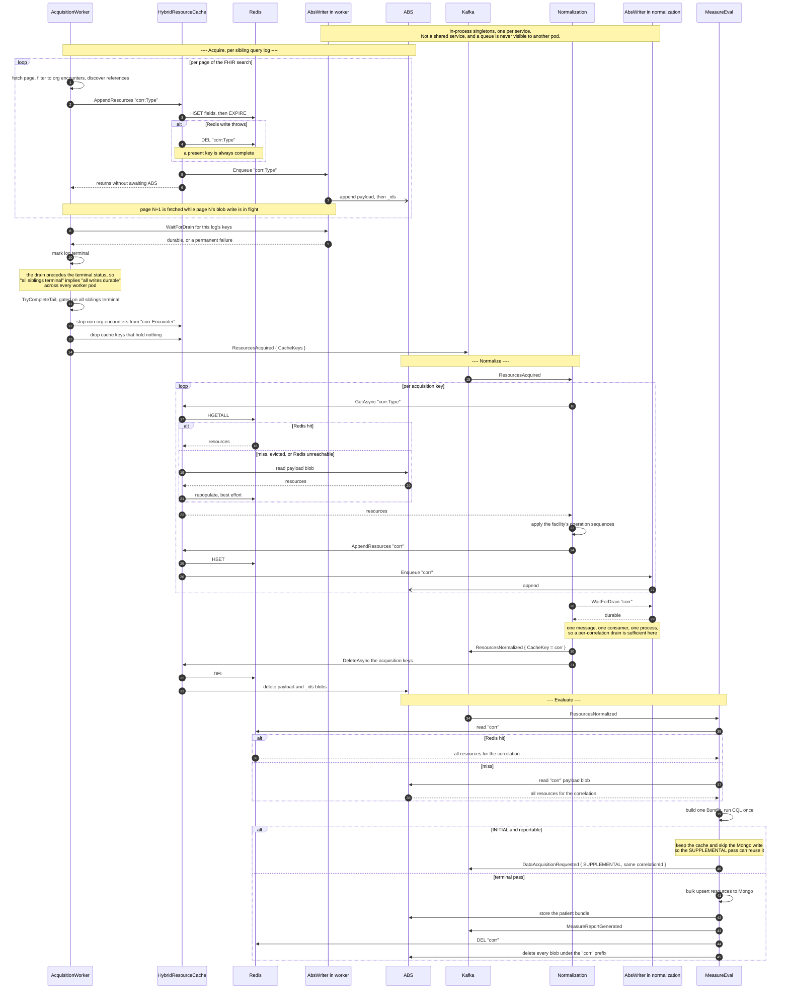
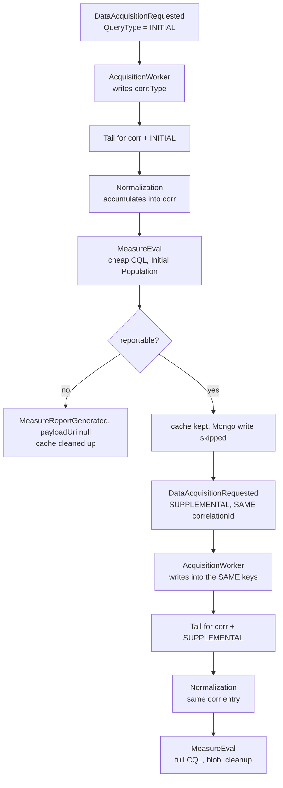

# Resource cache: ABS as the durable source, Redis as the read cache

FHIR resource bodies do not travel on Kafka. They are written to a shared resource cache and the
events carry cache pointers. This document describes how that cache behaves end to end, from the
Acquisition Worker's first write through to MeasureEval completing.

Implemented by `LEGLINK-1118` (.NET: `LEGLINK-1276`, Java: `LEGLINK-1279`), which replaced the
previous Hybrid implementation. That version chose Redis **or** ABS per correlation from a Redis
memory probe and stamped the choice on the Kafka events, so the chosen store held the only copy and
an eviction between passes was unrecoverable. See [Why the previous design was
replaced](#why-the-previous-design-was-replaced).

## The rule

**ABS always holds the data. Redis is a cache in front of it.**

- Writes go to Redis inline, and to ABS on a background queue.
- Reads try Redis first and fall back to ABS, repopulating Redis on the way through.
- A Redis miss, eviction or outage is a slower read, never a failure.
- Nothing advertises a cache key until that key's ABS write is durable.

## Key layout

There are two generations of entry per correlation.

| Generation | Key | Written by | Read by |
|---|---|---|---|
| Acquisition | `{correlationId}:{ResourceType}` | AcquisitionWorker, one key per resource type | Normalization |
| Normalized | `{correlationId}` | Normalization, all types accumulated into one key | MeasureEval |

These two shapes are the only keys a correlation owns. MeasureEval's Redis cleanup does not scan for
them: it builds `{correlationId}` plus `{correlationId}:{ResourceType}` for every FHIR resource type
and unlinks the batch in one round trip (`RedisResourceService.cleanup`). Adding a new key shape
under the correlation prefix therefore means adding it there too, or it outlives the correlation
until its TTL.

`(FacilityId, CorrelationId)` identifies **one patient's acquisition run**, not the patient. The
patient travels separately as `PatientId`. A re-run, a readmission or a regenerate gets a new
correlationId and therefore a new set of entries.

In each store:

| | Redis | ABS |
|---|---|---|
| Container | one hash per key | one payload blob per key, plus a `{key}_ids` blob |
| Per resource | hash field `{Type}/{Id}` → JSON | a line pair in the payload: `{Type}/{Id}`, then JSON |
| Membership | implicit | the `_ids` blob, because an append blob cannot be asked what it contains |
| Expiry | `ResourceCache:Redis:CacheEntryTtlDays`, reset on every write | none; storage lifecycle rule only |

Writes are additive. `HashSetAsync` merges fields into the existing hash, and the ABS side reads
`{key}_ids` and diffs before appending, so a resource type acquired across several sibling query
logs accumulates into one key rather than replacing it.

## End to end, one pass

## The two passes

A reportable patient runs the loop twice. Both passes share one correlationId, so the second
**accumulates into the same entries** rather than creating new ones.

The tail group and its lock are `(FacilityId, CorrelationId, QueryPhase)`, so **each pass drains and
advertises independently**. Nothing waits for both. By the time SUPPLEMENTAL reads, INITIAL's writes
are durable, because every INITIAL log drained before going terminal and the INITIAL tail could not
have fired otherwise.

### Who waits on what

A durability failure is reported **once**, to the waiter that sees it, and is cleared as it is
reported so the redelivery that follows can succeed. That makes the scope of a wait part of its
correctness, not a detail: a caller that waits on keys it does not own consumes a failure meant for
the caller that does, and that caller's own barrier then finds nothing to wait on and reports an
undurable key as durable.

So acquisition waits on the keys its own log wrote — derived from the acquired ids, which are
already `resourceType/resourceId` — and not on the correlation. Normalization and the tail finalizer
wait on the whole correlation, which is correct for them: they own all of it.

### Restoring the correlation entry before the supplemental append

The two query plans are disjoint — INITIAL fetches Encounter, MedicationRequest, Location and
Medication; SUPPLEMENTAL fetches Condition, Coverage, DiagnosticReport, Observation and Procedure —
so the record MeasureEval evaluates exists only as the **accumulation of both passes** in the one
`{correlationId}` entry. MeasureEval reads that entry whole and runs CQL once over it.

The cache can evict the entry while the supplemental acquisition runs, and the Redis write is a
merge that recreates a missing key. An append to an evicted entry therefore produces an entry
holding only the supplemental resources: non-empty, freshly expiring, and indistinguishable from a
complete one. A read then treats it as a hit and never consults the durable copy that *is* complete,
so the measure is evaluated without the encounter it depends on — silently.

Eviction on its own is safe, because an absent entry falls through to durable storage. It is the
**append to an evicted entry** that is not. So Normalization reads the correlation entry once before
processing a supplemental message: on a miss that read repopulates the cache from durable storage,
and the appends that follow extend the initial pass instead of replacing it.

That read narrows the exposure, but it cannot close it: an eviction between the read and the appends
milliseconds later still produces a partial entry, and the same shape exists within a single pass,
where several writes land for one key back to back. A lock does not help — the party that destroys
the entry is the cache's own eviction, which takes no application locks.

### Telling a partial entry from a whole one

So the entry carries the count durable storage holds for it, in a `__durableResourceCount` hash
field. The field name has no `/`, so it cannot collide with a resource field, which is always
`<type>/<id>`.

The `__` prefix is reserved for metadata about an entry rather than a resource in it. Resource
fields are always `<type>/<id>`, so the two cannot collide, and **both runtimes skip `__` fields when
they read an entry** — MeasureEval quietly, because warning about them would fire once per
correlation read. The metadata lives in the entry's own hash rather than beside it so that one
lifetime covers both and deleting the entry clears its metadata with it. That is what makes the
encounter strip safe: its delete drops the count with the entry, so the rewritten entry reads as
"no count recorded" and is trusted until the rewrite's durable write publishes a matching one.

`BackgroundAbsCacheWriter` records it once a durable write has landed — only a landed write gives a
count a reader can rely on, and the cost belongs on that thread rather than the caller's. The count
comes from the durable store's ids listing, which is a small blob of references rather than the
resource payloads. A read compares the entry's resource count against it: fewer means the entry was
recreated by a partial append, so durable storage is read instead and the entry restored from it.

An entry with no recorded count is trusted rather than rejected. No count means no durable write has
landed for that key, so durable storage has nothing more to offer and falling back would turn a
usable entry into an empty read. An entry holding *more* than the recorded count is also trusted:
the cache is ahead of a durable write still in flight, which is the ordinary state between the two
writes and not a partial entry.

Both runtimes apply the same rule. On the .NET side it is `HybridResourceCache.IsCacheEntryWholeAsync`;
MeasureEval reads the same hash for its evaluation, so `ResourceCacheReader` reads
`__durableResourceCount` on every non-empty Redis hit and falls back to ABS when the hit holds fewer,
with the same leniencies: no recorded count, a count the hit meets or exceeds, or a failure to read
the count all trust the hit. Without this, the two-pass evaluation is where a partial entry does
real damage — CQL would run without the initial pass's Encounter.

### Deleting a key while a write is running

`Cancel` bumps a generation that queued writes check when they are dequeued and again after taking
the key's write lock. Neither covers a write already executing: it has passed both, and the delete
that follows the cancel can complete underneath it. Durable storage has no expiry, and the purge
that triggers such a delete exists to remove clinical data after a terminal failure or a pipeline
abort, so a write landing afterwards leaves that data behind permanently.

Rather than hold the delete up until the write finishes, the write undoes itself: on success it
re-checks the generation and, if the key was cancelled, deletes it from durable storage. Both orders
reach the same end state, and the delete path stays non-blocking.

`DeleteAsync` tolerates a failed cache delete, since the entry expires on its own and the durable
delete is what matters. The encounter strip cannot use it. A cache write merges, so removing
entries means rewriting the key, and done as a delete and a write the key is briefly empty and a
tolerated delete failure leaves the stripped encounters in place for the write to merge back in.
Checking afterwards does not close that either: the check reads through the same cache that just
failed and is tolerated there too, so an unreachable cache fails the delete, then reports the key as
clear.

`ReplaceResourcesAsync` is what the strip uses instead. It clears and repopulates the key as one
Redis `MULTI`/`EXEC` and raises any failure, so the strip either applies or does not happen; failing
reverts the tail claim and the recovery poller runs it again. An empty survivor list removes the key
rather than leaving it empty, because an empty entry is served downstream as "this correlation has no
encounters" while an absent one falls through to durable storage.

#### What exercises the strip

Four suites, and each covers something the others cannot:

| Suite | Covers | Does not cover |
| --- | --- | --- |
| `RedisResourceCacheTests` (unit) | that the commands are queued on a transaction | whether Redis accepts it |
| `LocationMappingServiceTests` (unit) | that the strip replaces rather than deleting and rewriting, and propagates a failure | the cache itself, which is mocked |
| `RedisResourceCacheReplaceTests` (integration) | the entry a real Redis holds afterwards | atomicity, and the survivor list is hand-picked |
| `NonOrgEncounterStripIntegrationTests` (integration) | real conditions in SQL deciding the survivors, real Redis holding them | Kafka, and the pipeline around it |

The local E2E stack reaches none of it. The generator emits one `Encounter` per patient, so a
generated correlation is all-org or all-non-org: all-org returns before touching the cache, and
all-non-org strips to nothing and takes the key delete. The replace needs a correlation holding both,
which is a patient with at least two encounters at differently-mapped locations. Generated locations
*can* be separated — each carries its own `v3-RoleCode` and HSLOC coding, so a condition matching the
ICU alone leaves the ED and the outpatient clinic outside the organization — but the split then falls
between patients rather than inside one correlation. Reaching the replace from a generated run means
teaching the generator to emit a second encounter per patient and teaching the prediction model to
expect it, since every downstream count is reconciled exactly.

## Durability

The barrier is **per log**, immediately before the log's terminal status is written.

A per-correlation drain at the tail would not hold: `ReadyToAcquire` is keyed on `LogId` to spread
sibling logs across worker pods, so one correlation's writes sit in several pods' queues, and a
drain can only ever wait on its own process's queue. Draining per log and letting the existing
sibling gate do the cross-process work closes that without any new distributed state.

**On a hard kill**, the in-memory queue is lost, and the existing recovery handles it:

1. The log was never marked terminal, so it stays `Queued`.
2. `FailStalledQueuedLogsAsync` flips it to `Failed`.
3. `Failed` is **not** a terminal status, so the tail still cannot fire and the correlation is never
   announced with a hole in it.
4. `Failed` is requeue-eligible, so the log is re-acquired.

Re-acquisition is idempotent because the ABS write diffs against `{key}_ids` first. The one gap is a
torn append — the payload is written before `_ids`, so dying between them leaves a resource that the
retry's diff will not skip. `ABSResourceCache.GetAsync` therefore **dedupes by reference id on
read**, which also covers concurrent appends to one key from different pods.

Dedupe only works if the line pairs stay aligned, so **every append block ends on a record boundary**.
`AbsPayloadFormat.BuildBlocks` packs whole records (a reference/JSON pair in the payload, one
reference in `_ids`) into blocks of up to 4 MiB, and each block goes up in its own `AppendBlock`
call, which the service commits whole or not at all. A failure partway through a batch can therefore
leave some whole pairs behind, which the retry repeats and the read collapses, but never a torn line.
The write stream this replaced committed a block whenever its buffer filled, mid-line: the retry
then appended straight onto the partial JSON, and every pair after it was read back with references
and JSON swapped. The same alignment makes two pods' blocks interleave safely on one key. A single
record larger than the service's append-block limit is rejected rather than split.

**On graceful shutdown**, the writer drains within the host shutdown timeout, using a token that is
not the stopping token. Anything that does not finish follows the path above.

## Cleanup

| Trigger | Removes | Both stores |
|---|---|---|
| Normalization success | the acquisition keys, after `ResourcesNormalized` is produced | yes |
| MeasureEval terminal pass | everything under the correlation prefix | yes |
| Terminal normalization failure | acquisition keys and the correlation key | yes |
| Redis TTL | Redis entries only | n/a |

A completed correlation leaves nothing behind. What accumulates is **orphans from correlations that
never complete**. Redis orphans age out at `CacheEntryTtlDays`; ABS orphans are permanent unless a
storage lifecycle rule removes them, so each environment needs one.

## Configuration

| Key | Meaning |
|---|---|
| `ResourceCache:CacheImplementation` | `Hybrid` (both stores), `Redis` (cache only, no durability), `ABS` (durable only, no cache) |
| `ResourceCache:Redis:ConnectionString` / `:Password` / `:PoolSize` | Redis connection |
| `ResourceCache:Redis:CacheEntryTtlDays` | Redis entry lifetime, reset on every write |
| `ResourceCache:BlobStorage:ConnectionString` / `:BlobContainerName` / `:BlobRoot` | ABS container |
| `ResourceCache:AbsWriter:QueueCapacity` | bounded queue size; a full queue makes writers await |
| `ResourceCache:AbsWriter:MaxConcurrency` | concurrent blob writes, across distinct keys |
| `ResourceCache:AbsWriter:MaxRetryAttempts` | retries before a write is a permanent failure |
| `ResourceCache:AbsWriter:RetryBaseDelayMilliseconds` | delay before the first retry, doubling on each attempt |
| `ResourceCache:AbsWriter:DrainTimeoutSeconds` | how long shutdown waits for queued writes to finish |

`DrainTimeoutSeconds` bounds graceful shutdown only. The durability barrier itself has no timeout:
`WaitForDurableAsync` waits until the key is durable, the write is abandoned as permanently failed,
or the caller's own token is cancelled. Tuning this value to cap barrier latency has no effect.

`Hybrid` requires both stores. Redis eviction is Redis's concern: there is no application-level
memory threshold, and the deployed `maxmemory-policy` must evict rather than reject writes.

> The resource cache shares its Redis instance with the distributed semaphores, the pipeline abort
> registry and `ICacheService`. `maxmemory` and eviction are per instance, not per logical database,
> so resource-cache pressure can evict those co-tenants' keys. Prefer a dedicated instance for the
> resource cache; where that is not possible, monitor `evicted_keys`.

## Instrumentation

| Instrument | Type | Tags | Answers |
|---|---|---|---|
| `link_resource_cache_read_duration` | histogram, ms | `cache.outcome` = hit \| fallback \| empty | how often the cache serves the read, and what a fallback costs |
| `link_resource_cache_write_duration` | histogram, ms | `cache.store` = redis \| blob, `cache.outcome` = ok \| failed | inline cache cost against background durable cost |
| `link_resource_cache_queue_depth` | observable gauge | — | whether durable storage is keeping up |
| `link_resource_cache_queue_wait_duration` | histogram, ms | — | a backlog, as distinct from storage having slowed down |
| `link_resource_cache_drain_wait_duration` | histogram, ms | — | **what the durability barrier actually costs** |
| `link_resource_cache_write_retry_count` | counter | `cache.outcome` = retried \| exhausted | storage instability |

The service each series came from is already on every metric as `service.name`, so the two barriers
-- per log in the Acquisition Worker, per correlation in Normalization -- are separable without a tag
of their own.

`link_resource_cache_drain_wait_duration` is the one to watch after a change: it is the only part of
the ABS write that is not overlapped with other work, so it is the honest measure of what durability
costs the pipeline.

## Why the previous design was replaced

The earlier Hybrid implementation read Redis `used_memory`, compared it against a configured
`MaxMemoryBytes`, and sent the whole correlation to Redis or to ABS accordingly. The choice was
memoized and stamped on `ResourcesAcquired` and `ResourcesNormalized` as a `CacheType` field, and
every consumer read only the store that field named.

Three consequences:

- **The chosen store held the only copy.** An eviction was data loss, not a slow read.
- **The choice was re-made per process and per pass.** A patient's INITIAL resources could land in
  Redis and its SUPPLEMENTAL pass resolve to ABS, so evaluation failed with
  `ResourceNotFoundException` on resources that had been acquired successfully.
- **Sibling logs could split across stores**, which required a compensating pass at the tail that
  copied Redis-only keys into ABS so a single `CacheType` could be advertised.

Memory utilisation at probe time also did not predict capacity for subsequent writes, which is what
made the threshold unreliable under concurrency in the first place. The `CacheType` field, the
memory-threshold settings and the consolidation pass were all removed.
