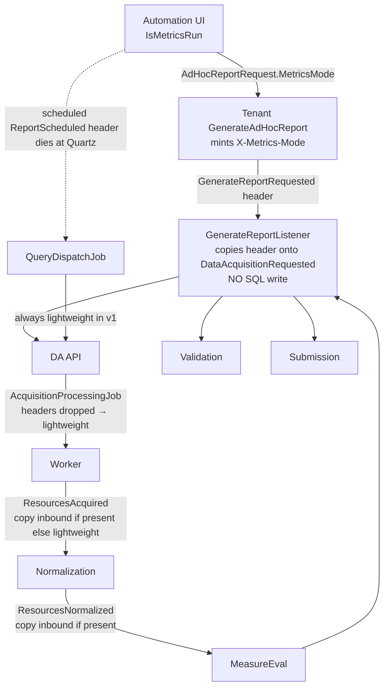

# Two-Tier Service Metrics for Link Cloud

| Field | Value |
| --- | --- |
| Title | Two-Tier Service Metrics: Accurate, Meaningful, Pressure-Safe |
| Author | placeholder |
| Date | 2026-08-25 |
| Status | Draft (revised after design review) |
| Audience | Senior engineers implementing metrics, Automation UI, and observability |
| Related | `docs/design-otel.html`, `docs/design-telemetry.html`, `docs/design-performance-model.html`, `docs/design-logging_error_handling.html`, `dashboards/patient-performance.json` |

---

## Overview

Link Cloud already emits OpenTelemetry traces and a patchwork of custom meters, then exports them through the OTEL Collector to Prometheus (and optionally Azure Monitor). In practice those meters are **inconsistent, often high-cardinality, sometimes unused, and in several cases actively harmful**: patient/correlation/resource IDs leak onto time series; Normalization ignores the `Telemetry:PatientTags` gate; Data Acquisition still tags `resource.id` even when patient tags are off; Validation and MeasureEval encode unbounded numeric values as metric attributes; Automation UI polls five service APIs every 5 seconds per active run; and the only Grafana dashboard (`dashboards/patient-performance.json`) **requires** the high-cardinality tags it also warns against.

This document inventories what exists today (grounded in code), then proposes a **two-tier collection model**:

- **Lightweight (default)** — every production report and every ordinary Automation scenario. Run success, generation-manifest/ABS/log evidence, and low-cardinality in-process counters. No extra Mongo/SQL queries, no per-patient histograms, no extra Kafka topics.
- **Performance / Metrics runs** — an explicit signifier on an Automation `TestScenarioDefinition`. Histogram latency, stage throughput, queue/backlog proxies, and host utilization **already produced by the platform**. Results land on a dedicated Automation UI Metrics page and are compared against prior runs and stored benchmarks.

The metrics subsystem must never become a load generator. Count as you go. Metric **readers aggregate in process**; a slow OTLP export delays a push, it does not drop counter increments — do not claim drop-on-backpressure unless a reader/exporter is configured that way. Never query the operational store “to compute metrics.” Never put unbounded identifiers on meters.

**Guideline (condensed, source is not in this repo):** Metrics runs are a scenario signifier; ordinary runs stay lightweight (success + Generation Manifest + ABS + logs + high-level service counts). Performance tests are triggered from Automation UI, use Thetis for reproducible synthetic patients, collect throughput/latency/utilization on Metrics runs, compare to benchmarks, and flag regressions. Dedicated Metrics dashboard; simplified UI for non-metrics runs.

---

## Background & Motivation

### Why this change is needed

1. **The existing telemetry design is incomplete.** `docs/design-telemetry.html` still contains `TODO: Document custom metrics that are already being collected.` Operators and Automation testers have no single source of truth for meter names, labels, or intended questions.
2. **The performance model already names the bottlenecks, but we do not measure them safely.** `docs/design-performance-model.html` calls out EHR query time, resources-normalized/sec, CQL eval latency, ReadyForValidation consumer lag (~1 patient / 2–3 s / replica), submission success, Kafka lag, and Report write latency. Most of those are either missing, derived from the wrong source, or emitted with unbounded labels.
3. **Cardinality already bites.** The Grafana dashboard itself warns: *“The Data Acquisition and Normalization metrics are high-volume, which are negatively impacted by long/sustained patientId and correlationId tags. Link only includes patientId and correlationId tags … when configured to do so… If Link is configured NOT to produce those tags, then DA and Normalization will show ‘No Data’.”* Lightweight production traffic and useful dashboards are currently mutually exclusive.
4. **Automation already simulates the pipeline and already pays a metrics-shaped cost** from **three independent loops**: `RunSnapshotOrchestrator` (2 s reconcile), `StoreBackedServicePoller` (**always 5 s**, five HTTP domains), and `BackgroundDiagnosticsMonitor` / `ProgressMonitor` (5 s, or 15 s only when `PatientIds.Count >= 500`) plus Loki scrapes. That is the right *place* to hang a Metrics dashboard; it is the wrong *mechanism* to compute throughput (it recounts by querying).
5. **Product intent (guideline, not a spec).** Performance tests should be triggerable from Automation UI, use Thetis for reproducible synthetic patients, mark a scenario as a Metrics run, collect deeply only then, and flag regressions against benchmarks. Non-metrics runs still need success, Generation Manifest, ABS comparisons, logs, and high-level service counts.

### Current telemetry architecture (as deployed in this repo)

```mermaid
flowchart LR
  subgraph services [Services]
    DN[".NET services\nAddLinkTelemetry"]
    JV["Java services\nOpenTelemetryConfig"]
  end
  subgraph local [Local / docker-compose]
    COL["otel-collector\n.docker/collector.yml\nOTLP :4317\nProm exporter :8889"]
    PROM["prometheus\nscrape 10s\notel-collector:8888/8889"]
    GRAF["grafana\nLoki + Tempo + Prometheus"]
    TEMPO["tempo :4417"]
    LOKI["loki :3100"]
  end
  subgraph cloud [Deployed (App Config)]
    COL2["collector-svc.monitoring:55690"]
    AM["Azure Monitor\n(optional, non-dev)"]
  end
  DN -->|OTLP gRPC| COL
  JV -->|OTLP gRPC| COL
  COL --> PROM
  COL --> TEMPO
  DN -->|Serilog GrafanaLoki| LOKI
  JV -->|logback| LOKI
  PROM --> GRAF
  TEMPO --> GRAF
  LOKI --> GRAF
  DN -.->|Telemetry:OtelCollectorEndpoint| COL2
  DN -.->|EnableAzureMonitor| AM
```

**Push path (services):** in-process `System.Diagnostics.Metrics` / OTel Java meters → OTLP exporter → collector `batch` processor → Prometheus exporter.

**Pull path (Prometheus):** scrape interval **10 s** (`.docker/prometheus.yml`), jobs `otel-collector:8889` (app metrics) and `:8888` (collector self-metrics).

**Not in this repo (and not to be reinvented):** Grafana, Prometheus, Tempo, Loki, and the OTEL Collector are deployed as architecture, not as Link source. The repo only ships `dashboards/patient-performance.json`, `.docker/{collector,prometheus,grafana,tempo}.yml`, and service instrumentation.

---

## Goals & Non-Goals

### Goals

- Inventory every existing meter, tag, exporter, dashboard, and Automation-run statistic with file-level citations.
- Introduce a **two-tier** collection depth, switched by a scenario signifier that reaches services **without polling and without a new Kafka topic**.
- Emit **accurate** stage-level counters and histograms (count as you go; O(1) on the hot path).
- Bound cardinality: **no** `patientId`, `correlationId`, `resourceId`, `entityId`, raw `resource.count`, raw issue counts, or period timestamps as meter labels.
- Reuse existing processing-path increments; never add periodic Mongo/SQL aggregations to “compute metrics.”
- Give Automation UI a dedicated Metrics page for Metrics runs and a simplified view for ordinary runs.
- Detect regressions against stored benchmarks and previous Metrics runs of the same scenario.
- Keep Thetis as the synthetic-patient generator (it already is).

### Non-Goals

- Replacing Prometheus/Grafana/App Insights as the platform APM. We consume them; we do not rebuild them inside Mongo.
- Per-patient Grafana. The current `patient_id` dashboard is **retired**. Facility-level Grafana (`sum by (facility_id)`) ships with the cardinality hotfix. `Telemetry:PatientTags` is lab break-glass only — not a Metrics-run feature.
- A new Kafka topic whose only purpose is metrics.
- Service-side scraping of `/metrics` from siblings, Kafka AdminClient lag loops inside app processes, or Cosmos `$collStats` / `$indexStats` / mapReduce.
- Changing CQL/measure logic, EHR query plans, or submission contracts.
- Making every existing TECH_DEBT-style log line a metric.
- Instrumenting **MockFhirServer** (`DotNet/MockFhirServer`, Thetis-backed FHIR used as the Automation EHR). Host/process meters only; out of scope for Link business metrics.
- Per-patient Prometheus series as a Metrics-run *feature*. `Telemetry:PatientTags` remains a **break-glass lab diagnostic** (will blow Prometheus; never enable in shared envs). It is **not** how Metrics runs get per-patient analysis — that stays Generation Manifest + traces (sampled).

---

## Current-State Inventory

### Shared .NET telemetry library

**Registration:** `DotNet/Shared/Application/Extensions/Telemetry/TelemetryServiceExtension.cs` (`AddLinkTelemetry` → `AddOpenTelemetryService`).

When `Telemetry:EnableTelemetry` is true:

| Signal | What is added | Gate |
| --- | --- | --- |
| Tracing | `AddSource(ServiceName)`, ASP.NET Core (excludes `/health`), HttpClient (excludes `/loki`, swagger, `/health`), `Yarp.ReverseProxy`, `AddConfluentKafkaInstrumentation()`, optional EF Core | `EnableTracing` |
| Metrics | `AddAspNetCoreInstrumentation()`, `AddProcessInstrumentation()`, `AddMeter($"Link.{ServiceName}")`, optional `AddRuntimeInstrumentation()` | `EnableMetrics` (default true) |
| Export | OTLP exporter to `Telemetry:OtelCollectorEndpoint` | `EnableOtelCollector` |
| Azure Monitor | `UseAzureMonitor` + `DefaultAzureCredential` | `EnableAzureMonitor` **and not Development** |

**Config type:** `DotNet/Shared/Application/Models/Configs/TelemetrySettings.cs`

| Setting | Default | Notes |
| --- | --- | --- |
| `EnableTelemetry` | true | Master switch |
| `EnableTracing` | true | |
| `EnableMetrics` | true | |
| `EnableRuntimeInstrumentation` | false in code; **True in `Config/app-config.dev.json`** | Process/runtime meters (GC, thread pool, etc.) |
| `InstrumentEntityFramework` | false | Tracing only |
| `EnableOtelCollector` | true (**public field**, not a property) | `Scripts/AzureAppConfig/dump_config_symbols.cs`: “ConfigurationBinder binds properties only, so a value set in a store can never apply.” App Config / appsettings `"EnableOtelCollector": false` is **ignored**; the field default `true` always wins. TECH_DEBT: make it a property. Do not assume the key works today. |
| `OtelCollectorEndpoint` | App Config: `http://collector-svc.monitoring:55690` | Local docker uses collector `:4317` |
| `EnableAzureMonitor` | false in code; App Config False for `Telemetry:*`, True for leftover `TelemetryConfig:*` keys | Dual key namespaces exist |
| `PatientTags` | **false** | “Whether patient and correlation metric tags should be emitted.” Special-cased in `ExternalConfigurationExtension` |
| `PrometheusQueryEndpoint` | unset | **New property** (not a field). Shared Prom HTTP query base URL for Automation snapshots. Not in App Config today. Empty = skip Prom enrichment. Do not reuse `OtelCollectorEndpoint`. |

**Callers of `AddLinkTelemetry`:** Account, Admin.BFF, Audit, Census, DataAcquisition.Domain `RegisterTelemetry` (used by **both** DataAcquisition API and AcquisitionWorker via `RegisterAll`), Normalization, Notification, QueryDispatch, Report, Submission, Tenant, Terminology.

**Does *not* call `AddLinkTelemetry`:** Automation.UI (despite being listed as a `Telemetry:*` consumer in App Config), MockDmrpApi, Web/Admin.UI, Java services (they have their own SDK setup).

**Diagnostic tag names:** `DotNet/Shared/Application/Models/Telemetry/DiagnosticNames.cs` — `facility.id`, `patient.id`, `correlation.id`, `report.tracking.id`, `resource.type`, `resource.id`, `phase`, `operation.type`, etc.

**Histogram helper:** `DotNet/Shared/Application/Services/Telemetry/TrackedRequestDuration.cs` — records elapsed ms on `Dispose`.

**Kafka tracing:** listeners use `ConsumeWithInstrumentation` (Census, Submission, Report, Normalization, QueryDispatch, Notification, Shared `RetryListener`, …). This produces **spans**, not custom meters. There is **no consumer-lag meter** in application code.

**Health checks as accidental load:** `DotNet/Shared/Application/Health/KafkaHealthCheckConfiguration.cs` produces a message to topic `Service-Healthcheck` on every Kafka health probe (`MessageTimeoutMs = 3000`). K8s/BFF probing this is a small but real extra produce path — not a metric.

**`EnableMetrics`:** default true in `TelemetrySettings`. It is **not** present as its own key in the `Telemetry:*` App Config block quoted above (unlike `EnableTelemetry` / `EnableTracing`). Dual leftover `TelemetryConfig:*` keys still exist and are a config smell, not a second live path for .NET `AddLinkTelemetry`.

---

### Shared Java telemetry library

**Config:** `Java/shared/src/main/java/com/lantanagroup/link/shared/config/TelemetryConfig.java` binds `telemetry.exporterEndpoint` (local default `http://localhost:55690` in `application.yml`).

**Setup:** `Java/measureeval/.../configs/OpenTelemetryConfig.java` and `Java/validation/.../configs/OpenTelemetryConfig.java`

- OTLP gRPC span exporter + `BatchSpanProcessor`
- OTLP gRPC metric exporter + `PeriodicMetricReader` (**SDK default export interval: 60 s**; not overridden)
- `RuntimeMetrics.builder(...).enableAllFeatures()` — JVM CPU/mem/GC/threads
- No-op OpenTelemetry if endpoint is missing
- W3C TraceContext propagator

**Diagnostic names:** `Java/shared/src/main/java/com/lantanagroup/link/shared/utils/DiagnosticNames.java` — `facility.id`, `patient.id`, `correlation.id`, `report.tracking.id`, `resource.count`, `validation.outcome`, `issue.count.*`.

OTel Java → Prometheus maps `.` to `_` and appends `_milliseconds` / `_bytes` for units. That is why Grafana queries `link_measureeval_eval_duration_milliseconds_sum` for a meter named `link_measureeval_eval_duration`.

---

### Collector / Prometheus / Grafana (repo-owned config)

`.docker/collector.yml`

- Receiver: OTLP gRPC
- Processor: `batch` (default; no cardinality filter, no tail sampling)
- Exporters: `otlp/tempo` (`tempo:4417`), `prometheus` (`0.0.0.0:8889`) with **`const_labels: { label1: value1 }`** — every series carries a useless label
- No resource-detection processor, no `memory_limiter`, no `filter/ottl` for high-cardinality attributes

`.docker/prometheus.yml` — scrape **10 s**, two targets (collector metrics + exported app metrics). **No scrape of application pods directly.** **No Kafka exporter, no kube-state-metrics, no cAdvisor** in this compose file.

`.docker/grafana.yml` — Loki (default), Tempo, Prometheus. Tempo traces-to-metrics sample query is `process_runtime_dotnet_gc_committed_memory_size_bytes` — runtime, not business.

**Only dashboard in repo:** `dashboards/patient-performance.json`, title **“Link Patient-Based Performance”**. Panels:

| Row | Panels | PromQL source meters |
| --- | --- | --- |
| Notice | Markdown warning about `patientId`/`correlationId` | — |
| Acquisition | Average Acquisition Per Patient; over time | `link_data_acq_query_duration_milliseconds_{sum,count}` |
| Normalization | Average Normalization per Patient; over time | `link_normalization_duration_milliseconds_{sum,count}` |
| Evaluation | Average Evaluation per Patient; over time | `link_measureeval_eval_duration_milliseconds_{sum,count}` |
| Validation | Average Validation per Patient; over time; Average Categorization per Patient; over time | `link_validation_validate_duration_*`, `link_validation_categorization_duration_*` |
| Submission | Average Submission Time per Patient; over time; Average Submission Size (Kb); over time | `link_submission_upload_duration_milliseconds_*`, `link_submission_upload_size_bytes_*` |

Variables: `facility_id`, `report_tracking_id`, `patient_id`, `phase`, `rate_period` (default 10m). All duration queries `sum by (patient_id)` — **dashboard is unusable unless PatientTags (and equivalent Java attributes) are on.**

**Critical dashboard vs code mismatch:** Normalization’s `MeasureNormalizationDuration` histogram **is never recorded in production code** (see Normalization below). The Normalization row will be empty even with PatientTags enabled, unless something else emits `link_normalization_duration`.

---

### Per-service inventory

Convention used below:

- **How:** in-process increment unless noted
- **Where:** OTLP → collector → Prometheus (and traces → Tempo; logs → Loki)
- **Cadence:** .NET OTLP metric export default **60 s**; Java `PeriodicMetricReader` default **60 s**; Prometheus scrape **10 s**
- **Cardinality:** labels listed are those actually passed at the increment site

#### Account (`DotNet/Account`)

| Meter | Type | Increment site | Labels |
| --- | --- | --- | --- |
| `link_account_service.account_added.count` | counter | `CreateUser.cs` | none (`[]`) |
| `link_account_service.account_activiated.count` | counter | `ActivateUser.cs` | tagList (user/facility-ish; low volume) |
| `link_account_service.account_deactivated.count` | counter | `DeactivateUser.cs` | tagList |
| `link_account_service.account_deleted.count` | counter | `DeleteUser.cs` | tagList |
| `link_account_service.account_restored.count` | counter | `RecoverUser.cs` | tagList |

Class: `AccountServiceMetrics` (`MeterName = Link.{AccountConstants.ServiceName}`). Plus ASP.NET + process meters.

Activate / deactivate / delete / restore all start `tagList` with **`DiagnosticNames.UserId`** (`ActivateUser.cs`, `DeactivateUser.cs`, `DeleteUser.cs`, `RecoverUser.cs`) and then add facility claims; that same list is passed to the counter. **`user.id` is unbounded** (low QPS, still a P0-policy violation). Instrument name `account_activiated` is misspelled; keep the Prom name (hotfix does not rename).

**Gaps:** no login/auth failure meters here (those live on Admin.BFF); no latency. Volume is tiny aside from the UserId label leak.

#### Admin.BFF (`DotNet/Admin.BFF`)

| Meter | Type | Purpose |
| --- | --- | --- |
| `link_admin.user_login.count` | counter | logins |
| `link_admin.failed_authentication.count` | counter | auth failures |
| `link_admin.token_generated.count` | counter | bearer mint |
| `link_admin.token_key_refresh.count` | counter | signing-key refresh |

Class: `LinkAdminMetrics`. Live registration is Shared `AddLinkTelemetry` (`Admin.BFF/Program.cs`). `Infrastructure/Extensions/Telemetry/TelemetryServiceExtension.cs` (`AddOpenTelemetryService`) is **unused dead code**, not the live path. Health: optional `MonitorBackendHealthChecks` HTTP-probes Account, Audit, Census, DA, MeasureEval, Normalization, Notification, Report, Submission, Tenant, Terminology (not Validation, QueryDispatch, Automation.UI).

**Pressure:** backend health checks are **pull HTTP** on BFF `/api/health`. Acceptable if probe interval is K8s-scale (seconds to tens of seconds), not a metrics loop.

**Gaps:** no Yarp/proxy latency histogram of our own (ASP.NET + HttpClient instrumentation covers some of this); no downstream error-rate by service as a first-class meter.

#### Admin UI (`Web/Admin.UI`)

Angular SPA. **No meters.** Observability is whatever the BFF and browser RUM (none in-repo) provide. Out of scope for pipeline metrics.

#### Audit (`DotNet/Audit`)

| Meter | Type | Site | Labels |
| --- | --- | --- | --- |
| `link_audit_service.auditable_event.count` | counter | `AuditManager.cs` | `service`, `facility.id`, `audit.log.action`, `resource` |
| `link_audit_service.audit.search.duration` | histogram ms | `AuditController` search | search tags |

**Cardinality risk:** `resource` and `action` are bounded-ish; `facility.id` is bounded by tenant count. Acceptable.

**Gaps:** no Kafka consume lag for `AuditableEventOccurred`.

#### Automation.UI (`DotNet/Automation.UI`) + Automation (`DotNet/Automation`) + Automation.Link (`DotNet/Automation.Link`)

**No OTel meters.** App Config lists AutomationUI as a `Telemetry:*` consumer, but `Program.cs` never calls `AddLinkTelemetry`.

**Run-level “metrics” today are derived, not instrumented:**

| Signal | Store | How |
| --- | --- | --- |
| Run success / fail / cancel / duration | Mongo `automation_runs` (`AutomationRunDocument`) | written by `AutomationRunManager` / `RunExecutor` at start/end |
| Dashboard KPIs (14-day success rate, avg duration, runs/day) | computed in memory by `DashboardStatsAggregator` from `ISnapshotStore.GetAllRunSummariesAsync(since)` | **one range query**, not a hot-path loop |
| Per-run pipeline snapshots | Mongo `automation_run_snapshots` | `StoreBackedServicePoller.PollInterval` is a **constant 5 s** (no patient-count branch). HTTP-calls Report (schedule, entries, populations), DA (acquisition summary), MeasureEval (resources) via `PipelineDataReader` |
| HTTP cache | `PipelineDataReader` TTL **8 s**, single-flight per key | reduces duplicate HTTP but does not eliminate polling |
| Orchestrator | `RunSnapshotOrchestrator` every **2 s** reconciles which runs have pollers | does not itself HTTP-call services |
| Diagnostics / progress | in-process during `RunExecutor` | `BackgroundDiagnosticsMonitor` + `ProgressMonitor` poll every **5 s**, or **15 s** only when `scenarioConfig.PatientIds.Count >= 500`. This is the patient-count branch, **not** the store-backed poller. Also Loki error scrape + Kafka error monitor + milestone probes |
| Logs | Mongo `automation_run_logs` + Loki | `LokiScraper` during diagnostics **and** a post-run Normalization summary scrape (`[NormalizationExecutionSummary]`, limit 5000 × resource types, `RunExecutor`) |
| Generation Manifest | run snapshot / ABS blob | built at generation time; validators compare without interrogating pipeline DBs as source of truth |
| ABS comparison | Report download + validators | `ValidatorRunner` runs **all** validators (does not fail-fast) |
| Progress / stall | `ProgressMonitor` + `PipelineProgressTracker` | same HTTP reader + Loki activity checks every ~5–15 s |

**Thetis (already integrated; Metrics runs use the sibling source repo):**

- `DotNet/Automation/Automation.csproj` defaults `UseThetisProjectReference=true` and refs `..\..\..\thetis\Thetis.Generation.Engine` / `Abstractions` (sibling of `link-cloud`, same as docker-compose `thetis: ../thetis`). NuGet `LantanaGroup.Thetis.Generation.*` is a **fallback when the sibling is missing** — Metrics/CI **must not** take that fallback: require the sibling path to exist (fail the build if it does not).
- Host: `DotNet/Automation/Generation/Thetis/ThetisEngineHost.cs` — in-process, **no Postgres**, seeded by `NhsnRegistrySeed`
- Generator: `ThetisPatientEntryGenerator` implementing `IPatientEntryGenerator`
- Spec mapping: `PatientSpecFactory`
- docker-compose build contexts also use `../thetis` for the Thetis **web** image; Automation generation does not need that process
- Scenario knobs already exist: `Seed`, `PatientCount`, `ResourcesPerPatientMin/Max`, cohorts, query-plan / normalization / org-map templates
- System scenarios: Multi Patient Test = **150 patients × 25–50 resources**; Mega Patient Test = **1 patient × 5,000 resources** (`FhirBundleGenerator.DefaultResourcesPerPatient`)
- Reproducibility: unpinned local source. Mitigate by recording `thetis.gitSha` (`git -C <sibling> rev-parse HEAD`) plus assembly informational version onto `automation_run_metrics`

**Gaps vs guideline:** no `IsMetricsRun` (or equivalent) on `TestScenarioDefinition`; no duration/concurrency/dataset-size parameters beyond patient/resource counts; no dedicated Metrics page (nav is Runs / Scenarios / API Health / Configurations); no benchmark store; no pass/fail vs thresholds except validator pass/fail; poller is the opposite of “non-intrusive.”

#### Census (`DotNet/Census`)

| Meter | Type | Site | Labels |
| --- | --- | --- | --- |
| `link_census_service.patient_admitted.count` | counter | `PatientListService.cs` | `facility.id`, **`patient.id`**, `patient.event` |
| `link_census_service.patient_discharged.count` | counter | same | `facility.id`, **`patient.id`**, `patient.event`, **`correlation.id`** |

**Not gated by `PatientTags`.** Admit/discharge volume is per-patient-event, not per-resource, but `patient.id` is still unbounded over time.

**Gaps:** no list-pull latency (EHR census query time), no PatientListsAcquired throughput.

#### DataAcquisition + AcquisitionWorker (`DotNet/DataAcquisition*`)

Shared meters in `DataAcquisition.Domain/Application/Services/DataAcquisitionServiceMetrics.cs`. Meter name: `Link.{serviceInformation.ServiceConfigName}` so API and Worker register **different** meter names (`DataAcquisition` vs worker config name) against the **same** instrument names.

| Meter | Type | Site | Labels |
| --- | --- | --- | --- |
| `link_data_acq_resource_acquired_count` | counter | `SearchFhirCommand.IncrementResourceAcquiredCounter` — **per bundle/page** | always: `facility.id`, `report.tracking.id`, `phase`, **`resource.type`**, **`resource.id`** (the **bundle id**); if `PatientTags`: `patient_id`, `correlation_id` (underscore keys, not `DiagnosticNames.PatientId`) |
| `link_data_acq_query_duration` (unit ms) | histogram | `PatientDataService.ExecuteLogRequest` via `MeasureDataRequestDuration` | always: `facility.id`, `report.tracking.id`, `phase`, **`retry.attempts`** (not on the allowlist; `MaxRetries` default 3 in Automation facility setup, `DataAcquisitionLog.MaxRetryAttempts = 5`); if `PatientTags`: `patient_id`, `correlation_id` |

`PatientTags` is **false** in `appsettings.json`, **true** in `appsettings.Docker.json` (local docker demos the Grafana dashboard). Azure App Config can override (`ExternalConfigurationExtension` special-cases the key).

**Pressure / accuracy problems:**

1. **`resource.id` is always on the acquired-count counter** — unbounded even when PatientTags is false. This is the worst remaining DA cardinality leak.
2. Histogram is **per DA log / query**, which is the right grain for EHR latency (performance model: avg 5.32 s/query, Observation 22.9 s). Good — keep it, drop patient tags in lightweight mode.
3. Worker shares the same increment path (FHIR search runs in the worker process). Good.
4. No meter for: queue depth of `ReadyToAcquire`, per-facility semaphore wait (`Max Threads per Facility = 8` in the performance model; Automation `FhirQuery:MaxConcurrentRequests` defaults to 8), SFTP/Cerner path, retries, empty-result queries, tail-message recovery.

**Traces:** `ServiceActivitySource` on managers, SFTP handler, listeners. Useful for Metrics runs; too chatty if 100% sampled. QA/prod collector tail-samples; v1 does not raise sampling.

#### MeasureEval (`Java/measureeval`)

Class: `MeasureEvalMetrics.java`. Meter provider name: `com.lantanagroup.link.measureeval.services.ResourcesNormalizedConsumer`.

| Meter | Type | Site | Attributes |
| --- | --- | --- | --- |
| `link_measureeval_records_count` | counter | `AbstractResourceConsumer` + `EvaluationRequestedConsumer` | often only `report.tracking.id`; or full `buildAttributes` |
| `link_measureeval_eval_count` | counter | `EvaluateMeasureService.MeasureEvalDuration` | `facility.id`, **`patient.id`**, `report.tracking.id`, `phase`, **`correlation.id`**, **`resource.count` (string of bundle size)** |
| `link_measureeval_eval_duration` | histogram ms | same | same |
| `link_measureeval_patient_reportable_count` / `_not_reportable_count` | counter | **twice**: per-measure in `evaluateReports` and per-patient in `updatePatientMetrics` (INITIAL only) | patient/correlation/facility (and full set on the per-measure call) |
| `MeasureEval.normalized_to_report_generated.duration` | histogram ms | ingest Kafka timestamp → `MeasureReportGenerated` produce | facility, **patient**, **correlation**, `report.type` |

**Also:** `logger.info("Normalized-to-MeasureReportGenerated duration: {} ms ...")` — **INFO per patient**. Violates AGENTS.md spirit (high-volume persisted logs). Should be DEBUG; the histogram is the metric.

**Pressure:** `resource.count` as an attribute creates a new series per distinct bundle size. `patient.id` + `correlation.id` always on (Java has **no PatientTags equivalent**). Double-increment of reportable counters inflates the Grafana-adjacent counts and will break regression math.

**Gaps:** no CQL cache-hit meter, no Redis/ABS cache miss, no evaluation **failure** counter (exceptions skip `MeasureEvalDuration`), no queue lag.

#### MockDMRPAPI (`DotNet/MockDmrpApi`)

**No OTel.** `IResponseDelayService` + `ResponseDelayMiddleware` can inject latency (useful for Metrics-run submission tests). Health checks exist. Out of production path unless a scenario points submission at it.

#### Normalization (`DotNet/Normalization`)

| Meter | Type | Site | Labels |
| --- | --- | --- | --- |
| `link_normalization_resource_changed_count` | counter | `ResourcesAcquiredListener` on `OperationStatus.Success` | `facility.id`, **`correlation.id`**, **`patient.id`**, `resource.type`, `operation.type` |
| `link_normalization_resource_not_changed_count` | counter | same API, but **only called when Success** (the `changed` flag is always true at the call site) | would use same tags |
| `link_normalization_duration` | histogram ms | **defined, never recorded** | — |

`appsettings.json` has `PatientTags: false` and Docker `true`, but **the listener never reads `TelemetrySettings.PatientTags`.** Patient and correlation are always tagged.

Additionally, **every resource** logs at Information:

```
[NormalizationExecutionSummary] FacilityId=..., PatientId=..., CorrelationId=..., ReportTrackingId=..., ResourceType=..., ResourceId=..., Steps=[...]
```

Comment in code: Automation validators **parse this Loki line**. That is logs-as-metrics / logs-as-oracle. At 708 resources/patient × thousands of patients this is the hottest log in the system. AGENTS.md: high-volume per-resource events must be DEBUG or ignored by default. The stable message shape is a contract with Automation — any change must keep a Metrics-run-only or sampled path.

**Gaps:** duration histogram unused (Grafana Normalization row is dead); no resources-in / resources-out; no cache write latency; not-changed counter effectively unused.

#### Notification (`DotNet/Notification`)

| Meter | Type | Labels |
| --- | --- | --- |
| `link_notification_service.notification_created.count` | counter | `facility.id` and `DiagnosticNames.NotificationType` at `CreateNotificationCommand.cs`. **`NotificationType` is not defined** on `DotNet/Shared/Application/Models/Telemetry/DiagnosticNames.cs` (same for `NotificationId` used as an activity tag). Directionally: facility + type. |
| `link_notification_service.notification_sent.count` | counter | similar |

Low volume. Fine. Do not treat this as a pipeline stage.

#### QueryDispatch (`DotNet/QueryDispatch`)

`QueryDispatchServiceMetrics` **creates a meter and no instruments.** Interface is empty. Listeners (`ReportScheduledEventListener`, `PatientEventListener`) are traced via Kafka instrumentation only.

**Gaps (this is a real pipeline stage):** time from `PatientEvent`/`ReportScheduled` → `ReadyToAcquire` / query dispatch; number of patients dispatched; failures/retries. Performance-model “first half” starts here.

#### Report (`DotNet/Report`)

| Meter | Type | Site | Labels |
| --- | --- | --- | --- |
| `link_report_service.report_generated.count` | counter | `PatientAggregator.cs` **per aggregated MeasureReport written** | **`facilityId`** (not `facility.id`!), `measure.schedule.id`, `measure` |

**Label mismatch** with every other service (`facility.id`) — PromQL `facility_id` variable will **not** attach this series. `measure.schedule.id` is a GUID per report → high cardinality over time.

Listeners (`MeasureReportGenerated`, `ValidationComplete`, `GenerateReport`, `PatientEvent`, `ReportScheduled`, `PayloadSubmitted`) are traced, not metered.

**Gaps:** no persist/write latency (called out in the performance model), no patients aggregated/sec, no ReadyForValidation produce count, no status-transition counters (`Pending` → `Submitted`, etc.).

#### Shared (`DotNet/Shared`, `Java/shared`)

Libraries only. Kafka retry listener is traced. `Service-Healthcheck` topic is health, not a metric. No shared “pipeline stage” meter API today — every service reinvented `*ServiceMetrics`.

#### Submission (`DotNet/Submission`)

| Meter | Type | Site | Labels |
| --- | --- | --- | --- |
| `link_submission_resource_count` | counter | `SubmitPayloadListener` after successful external upload | `correlation.id`, `report.tracking.id`, **`patient.id`**, `facility.id`, `destination.type` — **always**, via `BuildTags` (no PatientTags gate) |
| `link_submission_upload_duration` | histogram ms | same | same |
| `link_submission_upload_size` | histogram bytes | same | same |

Grain is **per patient payload upload**, which matches the Grafana “per patient” panels. Cardinality is the problem, not the grain.

**Gaps:** no success/failure counter (failures throw `TransientException` and skip Record*), no retry count, no internal-blob download duration.

#### Tenant (`DotNet/Tenant`)

| Meter | Type | Site | Labels |
| --- | --- | --- | --- |
| `link_tenant_service.report_scheduled.count` | counter | `ReportScheduledJob.cs` after produce | `facility.id`, `report.type`, **`period.start`**, **`period.end`** |

`period.start`/`end` as labels → new series every reporting period. Unbounded over months.

Quartz `ScheduleService` is the dual-scheduler; no schedule-lag meter.

#### Terminology (`DotNet/Terminology`)

`AddLinkTelemetry` only — **no custom meters.** Code-system/value-set lookups are on the Validation/MeasureEval hot path (HTTP). **Gap:** lookup latency, cache hit/miss (`CodeGroupCacheService`). Without this, “validation is slow” cannot distinguish FHIR validator vs terminology.

#### Validation (`Java/validation`)

| Meter | Type | Site | Attributes |
| --- | --- | --- | --- |
| `link.validation.counter` | counter | `ReadyForValidationConsumer.validate` | `correlation.id`, `facility.id`, **`patient.id`**, `report.tracking.id`, **`resource.count` (int)**, `validation.outcome` (Passed/Failed), **`issue.count.total/uncategorized/unacceptable/acceptable`** |
| `link.validation.validate.duration` | histogram ms | same (excludes persist) | same |
| `link.validation.categorization.duration` | histogram ms | categorize (excludes persist) | same |

**This is the highest-cardinality Java meter.** Every distinct (patient × issue-count tuple × resource-count) is a series. Grafana queries it by `patient_id`.

Validation also **HTTP GETs the submission model from Report** (`reportClient.getSubmissionModel`) per patient before validating — that latency is **inside** `validationDuration` if measured around `validationService.validate(bundle)` only (the REST fetch is *outside* the timer — good). The fetch itself is unmetered.

Persist of submitted results is unmetered (by design of the histogram description).

**Gaps:** no ReadyForValidation consume lag (performance model’s primary scaling signal); no “unacceptable-only vs full” mode tag (bounded, would be useful).

#### Web (Admin UI)

Covered above. No meters.

---

### Kafka / logs / Mongo used as metrics today

| Mechanism | Used as metric? | Pressure |
| --- | --- | --- |
| Kafka consumer lag | **Cited in performance model; not collected in app code** | Must come from a **broker-side exporter** (not in this compose file) or a single shared collector receiver — never from each service calling AdminClient on a tight loop |
| `Service-Healthcheck` produces | health probe | extra produces under K8s probe load |
| Loki `NormalizationExecutionSummary` | Automation validator oracle | Information × resources (millions) |
| Loki error scrape | Automation progress / export | LogQL every poll cycle during a run |
| Mongo `automation_runs` + snapshots | dashboard KPIs, run details | Poller: 5 HTTP domains × 5 s × active runs. `PipelineDataReader` 8 s cache. For 150-patient runs this repeatedly pulls entries/populations/acquisition summaries — **this is the current metrics-induced load** |
| Cosmos/SQL operational stores | not aggregated for Prometheus | Do not start |

---

### Existing cost / pressure problems (ranked)

| Sev | Problem | Evidence |
| --- | --- | --- |
| **P0** | Unbounded meter labels (`patient.id`, `correlation.id`, `resource.id`, issue counts, `resource.count`, period dates) | DA `SearchFhirCommand`, Normalization listener, Census, Submission `BuildTags`, MeasureEval `buildAttributes`, Validation `buildMetricAttributes`, Tenant job, Report `measure.schedule.id` |
| **P0** | Grafana dashboard **requires** those labels | `patient-performance.json` notice + `sum by (patient_id)` |
| **P0** | Normalization duration histogram never recorded | `MeasureNormalizationDuration` unused |
| **P1** | `PatientTags` only honored in DA PatientDataService/SearchFhirCommand (and SearchFhirCommand still emits `resource.id`); Normalization/Java/Submission/Census ignore it | grep `PatientTags` |
| **P1** | Per-resource Information logs in Normalization | `ResourcesAcquiredListener` `[NormalizationExecutionSummary]` |
| **P1** | MeasureEval INFO duration log per patient | `AbstractResourceConsumer.recordNormalizedToReportGeneratedDuration` |
| **P1** | Three Automation HTTP/log loops during **every** run | `RunSnapshotOrchestrator` 2 s; `StoreBackedServicePoller` **always 5 s × 5 domains**; `BackgroundDiagnosticsMonitor`/`ProgressMonitor` 5 s (15 s only if ≥500 patients) + Loki |
| **P2** | MeasureEval double-counts reportable patients | per-measure + per-patient increments |
| **P2** | Collector `const_labels.label1=value1` | `.docker/collector.yml` |
| **P2** | QueryDispatch/Terminology/Automation.UI/MockDMRP/Admin.UI have no useful business meters | empty or missing classes |
| **P2** | No Kafka lag, no host-vs-app split in dashboards | performance model §6 unmet |
| **P3** | Dual config namespaces `Telemetry:*` vs `TelemetryConfig:*` | App Config JSON |
| **P3** | Report label `facilityId` vs `facility.id` | PromQL join broken |

---

## Proposed Design

### Design principles (pressure-safety, first-class)

1. **Count as you go.** If the processing path already knows a fact (resource acquired, measure evaluated, validation passed), increment there. Never `COUNT(*)` later.
2. **O(1) on the hot path.** A metric call is an in-process add/record. No I/O, no `await`, no extra Kafka produce, no extra Mongo.
3. **No new persistence in pipeline services.** Do **not** add tables, columns, extra saves, or extra reads on Normalization, DataAcquisition, Report, QueryDispatch, MeasureEval, Validation, Census, Submission, Tenant, or Account **for metrics or evidence**. Prior performance work removed round trips; metrics must not put them back. Automation.UI Mongo (`automation_run_metrics`) is the only new store, written **once at run end** from data Automation already has (wall-clock, validators, optional Prom).
4. **Bounded labels.** Allowlist: `facility.id`, `phase` (Initial/Supplemental), `resource.type` (~20 FHIR types in play), `operation.type`, `measure` (**normalized configured measure id**, not canonical URL), `destination.type`, `outcome` (success/failure/retry), `query.kind`. Forbidden on **all** Prometheus meters, including Metrics runs: `patient.id` / `patient_id`, `correlation.id`, `resource.id`, `user.id`, `report.tracking.id`, `measure.schedule.id`, `scenario.id`, bundle sizes, issue counts, timestamps, `metrics.mode`. `retry.attempts` is dropped (default max is `DataAcquisitionLog.MaxRetryAttempts = 5` or facility `MaxRetries`, but it is not on the allowlist).
5. **Cross-service mode is a Kafka header copied on same-process produces only.** No `MetricsMode` column on `ReportSchedule`, `ScheduledReportEntity`, `PatientDispatchEntity`, or `DataAcquisitionLog`. Job hops that drop headers (QueryDispatch Quartz, DA `AcquisitionProcessingJob`, tail recovery) **default to lightweight**. In-process cache is a same-process hint only.
6. **Metric export behavior (accurate):** OTel metric readers **aggregate** (cumulative counters / explicit-bucket histograms) and **push on an interval** (60 s default). A slow exporter delays the next push; it does **not** drop `Add`/`Record` calls. There is no application-side bounded metric `Channel`. Collector-side `memory_limiter` is required in shared envs (PR 12), not optional. Do not claim SDK drop-on-backpressure for metrics.
7. **Host vs app:** CPU/mem/network come from existing `AddProcessInstrumentation` / Java `RuntimeMetrics` and from **platform** (K8s metrics, not in this repo). Services must not scrape themselves. The Metrics **page** in v1 does **not** query Prometheus for host CPU; those charts are Grafana/ops.
8. **Cosmos Mongo RU:** Automation writes **one** `automation_run_metrics` document per Metrics run at completion. Indexed point/range reads only. No `$collStats`.
9. **Loki remains the Normalization evidence oracle.** Do **not** persist `[NormalizationExecutionSummary]` into Normalization SQL or the FHIR resource cache. Do **not** drop those Information logs in v1 (old PR 3/4 cancelled). Validators keep scraping Loki as they do today.

### Two-tier collection model



Hard invariant used by Prom snapshots: **`RunExecutor` sets `facilityId = state.RunId.ToString()`** (`RunExecutor.cs`). Every Metrics-run Prom query is `facility_id == runId` plus the run time window. Do not add `metrics.mode` as a Prom label (a dropped header would mix series; a present header in prod would split series).

#### Signifier

Add to `TestScenarioDefinition`:

```csharp
public bool IsMetricsRun { get; set; }
public string? BenchmarkKey { get; set; }
public int? TargetDurationSeconds { get; set; }
/// <summary>1–8 inclusive. Maps to DA MaxConcurrentRequests; cannot exceed the existing clamp or worker MaxConcurrentAcquisitions without a separate, explicit change.</summary>
public int? Concurrency { get; set; }
/// <summary>When true, a benchmark miss fails the Automation run. Default false.</summary>
public bool FailRunOnBenchmark { get; set; }
```

Persist on `TestScenarioDocument` and `AutomationRunDocument`. No production “metrics facility” flag.

#### Propagation — Kafka header only (no job-entity columns)

**Rejected:** persisting `MetricsMode` on `ReportSchedule`, `ScheduledReportEntity`, `PatientDispatchEntity`, or `DataAcquisitionLog`. Those hops already persist operational rows; adding a metrics column is extra persistence on the pipeline.

**v1:** copy `X-Metrics-Mode` only when the produce is in the **same process** as the consume that observed it. Quartz/log-recovery produces emit lightweight. Scheduled Metrics extra-depth is deferred.

`KafkaHeaderHelper` today only **reads** `X-Correlation-Id` / `X-Exception-Facility-Id`. There is **no** copy helper and **no** shared producer wrapper. Most producers **mint a new `Headers` collection** with only `X-Correlation-Id`, often a **new GUID**, discarding inbound headers. Treating this as “copy like correlation” is false.

Add `KafkaConstants.HeaderConstants.MetricsMode = "X-Metrics-Mode"` (`lightweight` | `performance`). Missing/unknown → **lightweight**.

**v1 does not add `metrics.mode` to Prometheus.** The header **only gates PR-only instruments**. Log levels after the validator-migration PR are Debug for **all** runs, not header-gated.

Integration tests (PR 5/6): header absent ⇒ PR histograms not recorded; header present ⇒ recorded; snapshot still builds from LW histograms + wall clock if PR histograms missing.

##### Origin producers (must mint the header)

The **primary Automation path is ad-hoc REST**, not Kafka from `RunExecutor`.

1. **Tenant `FacilityController.GenerateAdHocReport`** today produces `GenerateReportRequested` with `Headers = new Headers()` (**empty**). Ad-hoc origin: add `MetricsMode` to `AdHocReportRequest`; Automation sets it from `IsMetricsRun`; Tenant **only mints the Kafka header**. Tenant does **not** write `ReportSchedule` (it never sees Report SQL).
2. **Tenant `FacilityController.RegenerateReport`** — same empty `Headers`; GET `/schedules/{id}` is existence-check only and **discards the body**. Add optional `RegenerateReportRequest.metricsMode` (Automation already knows `IsMetricsRun`). Tenant mints the header; it must **not** parse `ReportScheduleApiModel` for mode.
3. **`GenerateReportListener.ProcessMessageAsync` is the writer of `ReportSchedule.MetricsMode`.** Today it builds a new `ReportScheduleModel` from `AdhocReportId` with no mode and does not read inbound headers. Required: on AddAsync, set `MetricsMode` from inbound `X-Metrics-Mode`; on regenerate (`value.Regenerate`, already loads `existing`), use inbound header if present else `existing.MetricsMode`; else `lightweight`.
4. **Automation `ReportApiHelper` scheduled path** already produces `ReportScheduled` with `X-Correlation-Id = trackingId`. Add `X-Metrics-Mode` for scheduled Metrics runs. QueryDispatch must persist that onto **`ScheduledReportEntity`** (see persist table).
5. **Tenant `ReportScheduledJob`** (production scheduler) — always lightweight.
6. **Admin.BFF integration commands** — default lightweight; out of Metrics-run UX for v1.

##### Must persist (headers die at these hops)

| Hop | Today | Required |
| --- | --- | --- |
| **`GenerateReportListener` → `ReportSchedule`** | New `ReportScheduleModel` from `AdhocReportId`; **does not read headers**; regenerate loads `existing` then **creates a new schedule** | **Writer:** inbound `X-Metrics-Mode`, else `existing.MetricsMode` on regenerate, else `lightweight`. This is the only writer of Report SQL mode. `DataAcquisitionRequestedProducer` **reads** it. |
| QueryDispatch `ReportScheduled` → `ScheduledReportEntity` | `CreateScheduledReport` persists periods + tracking id only | **Writer:** `ReportScheduledEventListener` sets `ScheduledReportEntity.MetricsMode` from inbound header (default lightweight). **Required for scheduled Metrics runs.** `PatientEventListener` already `FirstOrDefaultAsync` that entity. |
| QueryDispatch `PatientEvent` → Quartz `QueryDispatchJob` | `CreatePatientDispatch` copies `CorrelationId` only | Copy `scheduledReport.MetricsMode` onto `PatientDispatchEntity.MetricsMode`; job re-emits header. Census `PatientEvent` can stay correlation-only. |
| DA API consume → `DataAcquisitionLog` | correlation on the log | Write `MetricsMode` from inbound `DataAcquisitionRequested` header |
| DA API `AcquisitionProcessingJob` → Worker `ReadyToAcquire` | Job mints correlation from log only | Copy `DataAcquisitionLog.MetricsMode` onto `ReadyToAcquire`. After worker restart, next message carries mode |
| Worker / recovery → `ResourcesAcquired` | `TryProduceTailMessageAsync` and `TailMessageRecoveryJob`: correlation + optional `traceparent` **only** | Copy `DataAcquisitionLog.MetricsMode` (both already have the completed log / `tailResult`). **This is how Normalization sees mode.** |
| Normalization → `ResourcesNormalized` | `ProduceResourcesNormalizedMessage`: correlation only | Copy inbound `X-Metrics-Mode`. **This is how MeasureEval sees mode.** |
| Report `DataAcquisitionRequestedProducer` | new correlation GUID + `traceparent` | Read `schedule.MetricsMode` (already loaded). Zero extra queries |
| Shared `RetryJob` | copies `RetryModel.Headers` | Persist `X-Metrics-Mode` into retry headers with the rest |

`ReportSchedule` **is SQL EF** (`DotNet/Report/Data/Entities/ReportSchedule.cs`) — migration **up and down**. QueryDispatch **does** need `ScheduledReportEntity.MetricsMode`: `PatientDispatchEntity` is created later from a `PatientEvent` that has **no** mode header (`Census/Application/Services/EventProducerService.cs`). Without the scheduled-report column, scheduled `IsMetricsRun` dies before `QueryDispatchJob`.

Normalization, MeasureEval, Validation, and Submission **do not load Report’s schedule**. They require the header on `ResourcesAcquired` / `ResourcesNormalized` / `ReadyForValidation` / `SubmitPayload`.

##### Producer inventory (every `new Headers` / `new RecordHeaders` that is on the pipeline)

Each site must either copy inbound `X-Metrics-Mode`, read it from a persisted entity it already loaded, or explicitly emit `lightweight`. A unit/integration test **per site**: dropped header ⇒ PR-only instruments not recorded (run looks like lightweight). Silent failure is the risk.

**.NET**

| Site | Today | Action |
| --- | --- | --- |
| `Tenant/Controllers/FacilityController.cs` `GenerateAdHocReport` | empty Headers | Origin: header from `AdHocReportRequest.MetricsMode` |
| `Tenant/Controllers/FacilityController.cs` `RegenerateReport` | empty Headers; GET schedule discarded | Origin: header from `RegenerateReportRequest.metricsMode` (optional). **Do not** parse schedule GET |
| `Report/Listeners/GenerateReportListener.cs` `ProcessMessageAsync` | no mode on new `ReportScheduleModel`; regenerate loads `existing` then new row | **Writes `ReportSchedule.MetricsMode`:** inbound header, else `existing.MetricsMode`, else lightweight |
| `Report/Listeners/GenerateReportListener.cs` regenerate `EvaluationRequested` | **new GUID** correlation | Copy `reportSchedule.MetricsMode` |
| `Tenant/Jobs/ReportScheduledJob.cs` | correlation only | lightweight |
| `Tenant/Jobs/RetentionCheckScheduledJob.cs` | correlation | n/a |
| `Tenant/Commands/CreateAuditEventCommand.cs` | new Headers | n/a |
| `Automation.Link/Services/ReportApiHelper.cs` scheduled produce | correlation = trackingId | Origin for scheduled Metrics runs |
| `Report/KafkaProducers/DataAcquisitionRequestedProducer.cs` | **new GUID** + traceparent | From `schedule.MetricsMode` (**read**; listener wrote it) |
| `Report/KafkaProducers/ReadyForValidationProducer.cs` | correlation var | From consume/schedule |
| `Report/KafkaProducers/SubmitPayLoadProducer.cs` | correlation var | From consume/schedule |
| `QueryDispatch/Listeners/ReportScheduledEventListener.cs` | persist periods only | **Writes `ScheduledReportEntity.MetricsMode`** from inbound header |
| `Census/Application/Services/EventProducerService.cs` | `PatientEvent` correlation only | Leave; QD copies mode from `ScheduledReportEntity` in `CreatePatientDispatch` |
| `QueryDispatch/Jobs/QueryDispatchJob.cs` | correlation from entity | From `PatientDispatchEntity.MetricsMode` |
| `QueryDispatch/Domain/Managers/ScheduledReportManager.cs` (2) | new Headers | Copy inbound or persist |
| `DataAcquisition/Jobs/AcquisitionProcessingJob.cs` | correlation from log | From `DataAcquisitionLog.MetricsMode` |
| `DataAcquisition.Domain/.../DataAcquisitionLogService.cs` | `ReadyToAcquire` **no headers** (REST re-trigger) | Set header from `log.MetricsMode` |
| `DataAcquisition.AcquisitionWorker/.../AcquisitionProcessorBackgroundService.cs` `TryProduceTailMessageAsync` | `ResourcesAcquired`: correlation + optional `traceparent` | From `DataAcquisitionLog.MetricsMode` / `tailResult`. **Required for Normalization** |
| `DataAcquisition/Jobs/TailMessageRecoveryJob.cs` | same `ResourcesAcquired` shape | Same as tail produce |
| `Normalization/Listeners/ResourcesAcquiredListener.cs` `ProduceResourcesNormalizedMessage` | `ResourcesNormalized`: correlation only | Copy inbound header. **Required for MeasureEval** |
| `DataAcquisition.Domain/.../ValidateFacilityConnectionService.cs` | new Headers | lightweight |
| `DataAcquisition.Domain/.../CernerCCLExtractProcessor.cs` | `CernerPatientsAcquired`, **new** correlation GUID | **Always lightweight / n/a for v1 Metrics** (SFTP; not Automation) |
| `Submission/KafkaProducers/PayloadSubmittedProducer.cs` | new Headers | Copy inbound |
| `Shared/Application/Jobs/RetryJob.cs` | copies `RetryModel.Headers` | Keep; persist mode into retry headers |

Per-site tests **must include `ResourcesAcquired` (tail + recovery) and `ResourcesNormalized`**, not only DA-requested / ReadyToAcquire.

**Java**

| Site | Today | Action |
| --- | --- | --- |
| `AbstractResourceConsumer.produceDataAcquisitionRequestedRecord` | `new RecordHeaders().add(CORRELATION_ID, …)` | Copy inbound mode (consumer must thread it through) |
| `MeasureReportGeneratedProducer` | correlation only | Copy inbound mode |
| `ReadyForValidationConsumer.produceValidationCompleteRecord` | `new RecordHeaders()` | Copy inbound mode |

Admin.BFF `CreateReportScheduled` / `CreatePatientEvent` / `CreateDataAcquisitionRequested` / `CreatePatientAcquired` / `CreatePatientListAcquired`: correlation only; v1 always lightweight.

Introduce `KafkaHeaderHelper.SetMetricsMode` / `GetMetricsMode` and a small `PropagatedHeaders.FromConsume(result)` used at each produce site. This is **cross-language fan-out**, not “plumbing only.”

##### In-process cache (same process only)

```csharp
// MemoryCache, size-capped (e.g. 10k entries), sliding TTL 2h, no unbounded ConcurrentDictionary
public interface IMetricsModeCache
{
    MetricsMode Get(string? reportTrackingId); // default Lightweight
    void Set(string reportTrackingId, MetricsMode mode);
}
```

Populate from an inbound header in the same process that will **produce without going back to Kafka** (rare). After pod recycle the cache is empty; the **next message’s header** is the recovery path. Do **not** HTTP-get Report’s schedule from Normalization/MeasureEval/Validation/Worker.

#### What each tier collects

| Class | Lightweight | Performance / Metrics run |
| --- | --- | --- |
| Run success | yes | yes |
| Generation Manifest, ABS, validators, logs | yes | yes |
| Low-cardinality counters / stage histograms | yes, allowlist labels only | **same Prom series** (no extra labels). Additional **PR-only** instruments (semaphore wait, persist duration, terminology lookup, …) recorded **only** when inbound header is `performance` |
| Per-patient Prom series | never | never |
| `metrics.mode` / `scenario.id` Prom labels | never | never (`scenario.id` lives on the Mongo snapshot only) |
| Host CPU/mem | process instrumentation | same; **not** on the Automation Metrics page in v1 |
| Kafka lag | not on Metrics page in v1; optional kafka-exporter (PR 12) | same |
| Automation loops | **all three** throttled (see poller policy) | current 5 s poller + diagnostics (15 s if ≥500 patients) |
| `[NormalizationExecutionSummary]` Information | stays Information until validators read persisted evidence; then **Debug for all runs** | same — do not gate on header |

Lightweight **does** record duration histograms. Explicit histogram buckets (ms), set on DA/eval/validate/upload/normalization instruments:

`1, 2, 5, 10, 25, 50, 100, 250, 500, 1000, 2500, 5000, 10000, 15000, 30000, 45000, 60000`

Default OTel explicit buckets top out near 10 s; the performance model’s Observation query is **22.9 s** — without this, snapshot p95 is `+Inf`. Java `histogramBuilder` must set the same advice/boundaries.

### Metrics-run snapshot (v1 source of truth)

**Do not** ship a per-service `RunMetricsAccumulator` / `LongConcurrentHistogram` as the snapshot source: that type is not in the repo, it does not merge across replicas, and a GET of one pod’s memory is wrong.

**v1 source of truth**

1. **Always written:** Automation-owned fields it already has at terminal status — wall-clock e2e, patient counts, validator table, Generation Manifest totals, run outcome, Thetis seed/generator/`gitSha`, `facilityId` (= runId).
2. **Optional enrichment:** Prometheus range queries **after waiting** `OTEL export interval + scrape interval + 1s` (default **60 + 10 + 1 = 71 s**) so the last buckets are visible. Filter **`facility_id == runId`** and the run `[startedAt, finishedAt]`. One query per stage histogram (`*_sum` / `*_count` and histogram quantiles). No `metrics.mode` filter.
3. If `Telemetry:PrometheusQueryEndpoint` is empty or the query fails: persist the snapshot with `stages.*.unavailable = true`. The run **still succeeds**. UI shows “stage latency unavailable.”
4. **Do not** have services POST summaries. **Do not** add `/api/{service}/run-metrics/{reportTrackingId}` in v1 (replica-wrong).

**Prometheus URL (shared App Config, not Automation-only):** there is **no** Prometheus key in `Config/app-config.*.json`, `app-config.yaml`, or `docs/config-key-inventory.md`. Do **not** invent `Automation:Prometheus:BaseUrl`. Do **not** reuse `Telemetry:OtelCollectorEndpoint` (`http://collector-svc.monitoring:55690`) — that is **OTLP gRPC**, not the Prometheus HTTP API.

Add one property (not a field) on existing `TelemetrySettings`:

```csharp
/// <summary>Prometheus query base URL for run-end snapshots. Empty = skip Prom enrichment.</summary>
public string? PrometheusQueryEndpoint { get; set; }
```

Key: **`Telemetry:PrometheusQueryEndpoint`**. Same `Telemetry:*` section already consumed by AutomationUI (`app-config.yaml` consumers include AutomationUI; `Program.cs` already reads shared `Loki:Url` the same way). Local docker default `http://prometheus:9090`. Empty/unreachable ⇒ degrade. Pattern matches `Loki:Url` (shared observability URL, not `Automation:Loki`).

`OTEL_METRIC_EXPORT_INTERVAL=15000` is a **load-test deployment** flag on the service pods, not something Automation can set per scenario. If that env is set, the snapshot wait uses the same value. `FinalPollAsync` must **not** issue Prom queries immediately on terminal status.

Host CPU/mem over the run window is **out of v1 Metrics page** (Prom reachability + `service.name` across replicas). Use Grafana.

Counter: `link_automation_metrics_snapshot_missing` incremented when a Metrics run finishes with `stages` unavailable. UI warning on Details.

### Cardinality hotfix (ships with a facility-level Grafana panel)

Apply in every increment site. **Keep existing instrument names** through the hotfix (Java `link.validation.*` dots and `link_measureeval_*` underscores already diverge; Prometheus maps `.` → `_`). Do **not** rename `MeasureEval.normalized_to_report_generated.duration` in the hotfix — that is a breaking Prom name change. New instruments later use `link_<service>_<name>`.

| Label | On Prometheus? |
| --- | --- |
| `facility.id` | yes |
| `phase` | yes |
| `resource.type` | yes (DA, Normalization only) |
| `operation.type` | yes (Normalization) |
| `outcome` | yes |
| `measure` | yes, **normalized to configured measure id** (not `measureReport.Measure` canonical URL) |
| `destination.type` | yes |
| `patient.id` / `correlation.id` / `resource.id` / `user.id` | **never** |
| `report.tracking.id` / `measure.schedule.id` / `scenario.id` / `metrics.mode` | **never** |
| `resource.count` / issue counts / `period.start` / `period.end` | **never** as labels |
| `retry.attempts` | **never** (strip from DA query histogram) |

`Telemetry:PatientTags`: break-glass **lab** only, default false. Not a Metrics-run feature. Grafana `patient-performance.json` is rewritten in the **same change** to `sum by (facility_id)` (see PR 1). Per-patient Grafana is retired, not moved to Metrics mode.

Also in the hotfix:

- DA `SearchFhirCommand`: drop `resource.id` unconditionally.
- Normalization: honor `PatientTags` (default off).
- Account activate/deactivate/delete/restore: drop `user.id` from **meter** tags (activity tags may keep it).
- MeasureEval: remove double increment; drop patient/correlation/resource.count attributes; keep `phase` + `facility.id` + `report.type`.
- Validation: labels = `facility.id` + `outcome`; issues as `link.validation.issues{severity=...}` counters.
- Report: `facility.id` not `facilityId`; drop schedule GUID; normalize measure id.
- Tenant: drop period.start/end.
- Census / Submission: drop patient/correlation.

Keep misspelled `account_activiated` name (TECH_DEBT later).

---

## Per-Service Plan

Shared instrument prefix: `link.<service>.<name>` (Prometheus will snake_case). Unit on histograms: `ms` or `By`. All counters are monotonic.

**Budget (lightweight, production, 100 facilities):**  
Resource type only on DA acquired-count, DA query duration, and Normalization counters. Other meters: `facility.id` + `phase` + `outcome` only. Expected custom series: **low thousands**. ASP.NET/runtime add more but are clustered by pod.

**Export interval:** keep 60 s OTLP; scrape 10 s. **Do not** lower export interval from application code. A 15 s interval is a **load-test deployment env var** on the pods (`OTEL_METRIC_EXPORT_INTERVAL`), not a per-scenario switch. Snapshot wait must match whatever interval is actually deployed.

**Backpressure:** `Counter.Add` / `Histogram.Record` are non-blocking aggregations. Slow OTLP export delays the **next push**. Collector `memory_limiter` is how we protect shared envs.

Below, **LW** = lightweight, **PR** = performance-run additional.

### DataAcquisition + Worker

| Name | Type | Unit | Labels (bounded) | Tier | Question |
| --- | --- | --- | --- | --- | --- |
| `link_data_acq_resource_acquired_count` | counter | 1 | facility.id, phase, resource.type, outcome | LW | How many resources did we pull? |
| `link_data_acq_query_duration` | histogram | ms | facility.id, phase, resource.type | LW | EHR query latency (the 5.32 s / Observation 22.9 s number) |
| `link_data_acq_query_count` | counter | 1 | facility.id, phase, resource.type, outcome | LW | Queries attempted vs failed vs empty |
| `link_data_acq_semaphore_wait_duration` | histogram | ms | facility.id | **PR** (header `performance` on the **worker**, via `ReadyToAcquire`) | Time waiting to **acquire** the distributed facility lock |
| `link_data_acq_ready_to_acquire_delay` | histogram | ms | facility.id | **PR** | Measured in **DA API** `AcquisitionProcessingJob` (log create → produce ReadyToAcquire). Does **not** include QueryDispatch delay; see QueryDispatch |

Mechanism: existing increment sites; add `outcome`; **remove `resource.id` and `retry.attempts`**. Semaphore: record **`waitMs`** (`semAcquiredAt - semWaitStart` in `SearchFhirCommand`), **not** `holdMs`. `holdMs` is time **holding** the lock (query duration, already `link_data_acq_query_duration`). The lock is `IDistributedSemaphoreProvider` (Redis/lock-provider latency is in `waitMs`); high wait ≠ automatically “8-thread cap.” Cadence: in-process. Regression: p95 query duration by resource.type vs benchmark; acquired-count vs Generation Manifest predicted set.

### Normalization

| Name | Type | Labels | Tier | Question |
| --- | --- | --- | --- | --- |
| `link_normalization_resources_in_count` | counter | facility.id, phase, resource.type | LW | Input rate |
| `link_normalization_resource_changed_count` | counter | facility.id, resource.type, operation.type | LW | Did ops fire? |
| `link_normalization_resource_not_changed_count` | counter | facility.id, resource.type, operation.type | LW | Ops no-op’d? (actually increment on NoAction) |
| `link_normalization_duration` | histogram ms | facility.id, phase | LW | Time per ResourcesAcquired message (fix the unused histogram) |
| `link_normalization_operation_duration` | histogram ms | operation.type | **PR** | Which op is hot? |

`[NormalizationExecutionSummary]`: **stays Information.** `NormalizationDiagnosticsWriter` is built from those Loki lines (`NormalizationExecutionSummaryParser`); `RunExecutor` queries Loki for the marker; `NormalizationSuiteApplicationValidator` warns “no parsable records” if they are missing.

**Do not add a Normalization SQL table, GET API, or resource-cache sidecar for these lines.** That would add a DB write on every `ResourcesAcquired` message — the opposite of prior round-trip elimination. **Do not use `IResourceCache`** for evidence either (FHIR bodies only).

v1 evidence path remains Loki (already paid). Dropping those Information logs is **out of v1** until a non-pipeline-DB store exists (for example Automation Mongo written by Automation after a Loki scrape, not by Normalization).

### QueryDispatch

Fill the empty `QueryDispatchServiceMetrics`.

QueryDispatch produces **`DataAcquisitionRequested`**, then DA API creates logs, then `AcquisitionProcessingJob` produces `ReadyToAcquire`. “Dispatch → worker start” is **three hops**. A histogram only in QueryDispatch does not include API queue/job delay.

| Name | Type | Labels | Tier | Question |
| --- | --- | --- | --- | --- |
| `link_querydispatch_patients_dispatched_count` | counter | facility.id, outcome | LW | Patients for which DA was requested |
| `link_querydispatch_dispatch_duration` | histogram ms | facility.id | **LW** (first-half start; cheap) | Time in QueryDispatch to produce `DataAcquisitionRequested` (consume PatientEvent/ReportScheduled → produce). Not ReadyToAcquire. |

### MeasureEval

| Name | Type | Labels | Tier | Question |
| --- | --- | --- | --- | --- |
| `link_measureeval_records_count` | counter | facility.id, phase | LW | Kafka ingest rate |
| `link_measureeval_eval_count` | counter | facility.id, phase, measure, outcome | LW | Evals (success/fail) — **once per eval**, not double |
| `link_measureeval_eval_duration` | histogram ms | facility.id, phase, measure | LW | CQL time (performance model §3) |
| `link_measureeval_patient_reportable_count` | counter | facility.id, phase | LW | Reportable patients (**once per patient**, INITIAL) |
| `link_measureeval_patient_not_reportable_count` | counter | facility.id, phase | LW | Non-reportable |
| `MeasureEval.normalized_to_report_generated.duration` (existing Java name) | histogram ms | facility.id, phase | **PR** | Gate the **existing** instrument on inbound `X-Metrics-Mode=performance`. Do **not** add `link_measureeval_normalized_to_report_generated_duration`. Drop patient/correlation attributes in the hotfix. |
| `link_measureeval_bundle_size` | histogram | facility.id, phase | **PR** | Resources in eval bundle (value, not label) |

Drop INFO duration log to DEBUG. Drop patient/correlation/resource.count attributes.

### Report

| Name | Type | Labels | Tier | Question |
| --- | --- | --- | --- | --- |
| `link_report_service.report_generated.count` | counter | facility.id, measure, outcome | LW | **Keep the existing name.** Hotfix changes labels only (`facility.id`, drop schedule GUID, normalize measure id). Do not dual-publish a rename. |
| `link_report_status_transition_count` | counter | facility.id, from, to | LW | Pipeline progress (from/to are enum — bounded) |
| `link_report_persist_duration` | histogram ms | facility.id | **PR** | DB write latency (performance model §7) |
| `link_report_aggregation_duration` | histogram ms | facility.id | **PR** | PatientAggregator wall time |

### Validation

| Name | Type | Labels | Tier | Question |
| --- | --- | --- | --- | --- |
| `link.validation.counter` | counter | facility.id, outcome | LW | Patients validated |
| `link.validation.validate.duration` | histogram ms | facility.id, outcome | LW | ~2–3 s/patient target |
| `link.validation.categorization.duration` | histogram ms | facility.id | LW | Categorize cost |
| `link.validation.issues` | counter | facility.id, severity | LW | acceptable/unacceptable/uncategorized — **not** raw counts as labels |
| `link.validation.report_fetch_duration` | histogram ms | facility.id | **PR** | Report HTTP fetch vs validator CPU |

ReadyForValidation lag: **not** an app meter. See Kafka lag below.

### Submission

| Name | Type | Labels | Tier | Question |
| --- | --- | --- | --- | --- |
| `link_submission_upload_count` | counter | facility.id, destination.type, outcome | LW | Success/fail (today failures are uncounted) |
| `link_submission_upload_duration` | histogram ms | facility.id, destination.type | LW | Last-mile latency |
| `link_submission_upload_size` | histogram By | facility.id, destination.type | LW | Payload size |
| `link_submission_resource_count` | counter | facility.id, destination.type | LW | Keep, drop patient tags |

### Census

| Name | Type | Labels | Tier |
| --- | --- | --- | --- |
| `link_census_service.patient_admitted.count` | counter | facility.id, patient.event | LW — **drop patient.id** |
| `link_census_service.patient_discharged.count` | counter | facility.id, patient.event | LW — drop patient.id + correlation.id |
| `link_census_list_pull_duration` | histogram ms | facility.id | **PR** |

### Tenant

| Name | Type | Labels | Tier |
| --- | --- | --- | --- |
| `link_tenant_service.report_scheduled.count` | counter | facility.id, report.type | LW — **drop period.start/end** |

### Terminology

| Name | Type | Labels | Tier | Question |
| --- | --- | --- | --- | --- |
| `link_terminology_lookup_count` | counter | outcome, group.kind (codesystem/valueset) | LW | |
| `link_terminology_lookup_duration` | histogram ms | group.kind, cache (hit/miss) | **PR** | Is validation blocked on terminology? |

`group.kind` and `cache` are 2×2 — fine. Do **not** label by code.

### Account / Audit / Admin.BFF / Notification

Keep existing counters. Drop any accidental high-cardinality tags. Add:

- Admin.BFF: `link_admin.downstream_duration` histogram with label `downstream.service` (from existing HttpClient instrumentation we can **derive** in Grafana; only add a custom meter if HttpClient metrics are too coarse). **Prefer traces/HttpClient metrics over a new meter.**
- Audit search duration: keep (low QPS).

### Automation.UI

| Name | Type | Labels | Tier |
| --- | --- | --- | --- |
| `link_automation_run_count` | counter | outcome, `run.kind` (`metrics`/`standard`) | LW — **not** a Prom `scenario.id` |
| `link_automation_run_duration` | histogram ms | `run.kind` | LW |
| `link_automation_poller_http_count` | counter | domain, outcome | LW |
| `link_automation_metrics_snapshot_missing` | counter | — | LW |

Register `AddLinkTelemetry` so App Config’s AutomationUI consumer is real. `scenario.id` belongs on the Mongo snapshot, not Prom (`TestScenarioDefinition` rows are user-created and unbounded).

**Poller policy (all three loops, or do not claim ordinary runs stop being a load generator):**

| Loop | Today | Lightweight (`!IsMetricsRun`) | Metrics run |
| --- | --- | --- | --- |
| `RunSnapshotOrchestrator` | 2 s reconcile | 15 s reconcile | 2 s |
| `StoreBackedServicePoller` | **always 5 s**, 5 domains | **schedule status only**, 15 s; full domains once in `FinalPollAsync` | 5 s, 5 domains, 8 s HTTP cache |
| `BackgroundDiagnosticsMonitor` / `ProgressMonitor` / Loki scrape | 5 s, or 15 s if ≥500 patients | 15 s; skip per-resource-type Normalization summary scrape during the run (post-run evidence comes from persisted summaries after that PR) | keep 5 s / 15 s ≥500 |

Throttling only the store-backed poller leaves diagnostics still hitting Report/DA/MeasureEval/Loki every 5 s.

### MockDMRP / Admin.UI / HAPI FHIR

No custom Link meters. Host metrics only. MockDMRP delay remains a test knob, not a metric source.

### Kafka lag and host utilization (platform, not app)

**Do not put Kafka lag on the Metrics page in v1.** A `danielqsj/kafka-exporter` (or OTel Kafka metrics receiver) remains an **optional** PR 12 infra proposal until ops confirms they want it. Topics that would matter: `ResourcesAcquired`, `ResourcesNormalized`, `ReadyForValidation`, `ReadyToAcquire`, `SubmitPayload`, `ReportScheduled`.

**Do not** have each service call `AdminClient.ListConsumerGroupOffsets` on a timer.

Host: use existing process/runtime meters + cluster metrics (outside this repo). **Not** on the Automation Metrics page in v1.

---

## API / Interface Changes

### Kafka header

```csharp
// DotNet/Shared/Settings/KafkaConstants.cs
public const string MetricsMode = "X-Metrics-Mode";
```

Java: `com.lantanagroup.link.shared.kafka.Headers`. Values: `lightweight` | `performance`. Unknown/missing → lightweight.

### Shared helper (new)

`DotNet/Shared/Application/Services/Telemetry/MetricsTagBuilder.cs` — allowlist so services cannot pass `patient.id` / `user.id` onto meters.

```csharp
public static TagList Stage(string facilityId, string? phase = null, string? outcome = null);
```

Java: `MetricAttributes.stage(...)`.

Plus `KafkaHeaderHelper.GetMetricsMode` / `SetMetricsMode` and `PropagatedHeaders.FromConsume`.

### REST body (ad-hoc origin)

`AdHocReportRequest` (`DotNet/Shared/Application/Models/Tenant/AdHocReportRequest.cs`) gains `metricsMode` (`lightweight`|`performance`, default lightweight). Tenant `GenerateAdHocReport` **mints the header only**. `GenerateReportListener` **writes** `ReportSchedule.MetricsMode`.

`RegenerateReportRequest` gains optional `metricsMode` the same way. Tenant does not parse the schedule GET body.

### Report / QueryDispatch / DA SQL fields

- `ReportSchedule.MetricsMode` nvarchar(16) not null default `lightweight` — EF **up and down**. Written only by `GenerateReportListener`.
- `ScheduledReportEntity.MetricsMode` — QueryDispatch EF up and down. Written by `ReportScheduledEventListener`. Copied in `CreatePatientDispatch`.
- `PatientDispatchEntity.MetricsMode` — EF up and down.
- `DataAcquisitionLog.MetricsMode` — EF up and down. Read by `AcquisitionProcessingJob`, `DataAcquisitionLogService`, `TryProduceTailMessageAsync`, `TailMessageRecoveryJob`.
- `NormalizationExecutionSummaries` — new Normalization table (PR 3). Not a metrics-mode column.

No hot-path GET of these from other services.

### Automation UI HTTP

Existing service-to-service API is `[Route("api/runs")]` + `ApiBearerPolicy` (`AutomationRunsApiController`). AGENTS.md base route: `/api/<servicename>`. Do **not** invent `/api/automation/metrics/...` or `POST /api/automation/scenarios/{id}/runs`.

Extend `AutomationRunsApiController` (same bearer policy). Add Swagger (Automation.UI has **no** OpenAPI today — add it for these endpoints). 500s return RFC Problem Details with `traceId`. MVC pages stay cookie/gateway-authenticated and call **server-side** services, not Prom.

| Method | Route | Status | Body |
| --- | --- | --- | --- |
| GET | `/api/runs/metrics?pageNumber=&pageSize=` | **200** `records` + `metadata` (empty `records` if none) | `MetricsRunListItem` |
| GET | `/api/runs/{runId}/metrics` | 200 snapshot; **404** if run missing; 200 with `stages.unavailable` if snapshot row missing | `MetricsRunDetailViewModel` |
| GET | `/api/runs/metrics/benchmarks` | 200 `records` + `metadata` | |
| GET | `/api/runs/metrics/benchmarks/{key}` | 200 / 404 | |
| PUT | `/api/runs/metrics/benchmarks/{key}` | **202**; 400 if key mismatch | |
| POST | `/api/runs/start` | **existing** `202`/`Accepted`; scenario already carries `IsMetricsRun` | `StartScenarioApiRequest` |

`RunHub` is unchanged (live run status). Metrics Index/Details are request/response, not SignalR.

View-models (server-rendered MVC + JSON):

```csharp
public sealed class MetricsRunListItem
{
    public Guid RunId { get; set; }
    public Guid? ScenarioId { get; set; }
    public string ScenarioName { get; set; } = "";
    public string Outcome { get; set; } = "";
    public double E2eDurationSeconds { get; set; }
    public bool BenchmarkPass { get; set; }
    public bool StagesUnavailable { get; set; }
    public DateTimeOffset? FinishedAt { get; set; }
}

public sealed class MetricsRunDetailViewModel : MetricsRunListItem
{
    public Dictionary<string, StageSnapshot> Stages { get; set; } = new();
    public double? PatientsPerMinute { get; set; }
    public IReadOnlyList<string> BenchmarkViolations { get; set; } = [];
    public IReadOnlyList<string> RegressionFlags { get; set; } = [];
    public Guid? PreviousRunId { get; set; }
}

public sealed class StageSnapshot
{
    public bool Unavailable { get; set; }
    public long Count { get; set; }
    public double? P50Ms { get; set; }
    public double? P95Ms { get; set; }
    public double? P99Ms { get; set; }
    public long ErrorCount { get; set; }
}
```

Prom HTTP from Automation.UI is **server-side, behind shared `Telemetry:PrometheusQueryEndpoint`**, used **only** at snapshot capture (not from the MVC Details action on every page load). Details reads Mongo. Empty key ⇒ `stages.unavailable`.

### Scenario editor

`Views/Shared/_ScenarioEditorModal.cshtml`: checkbox **Metrics / Performance run**, benchmark key, concurrency **1–8**, target duration, **Fail run on benchmark**. Quick-launch uses existing start-run.

---

## Data Model Changes

### Mongo (Automation.UI)

New collection `automation_run_metrics` (one doc per Metrics run):

```json
{
  "_id": "<runId>",
  "scenarioId": "<guid>",
  "scenarioName": "Multi Patient Test",
  "benchmarkKey": "nhsn-monthly-150",
  "facilityId": "...",
  "reportId": "...",
  "startedAt": "ISODate",
  "finishedAt": "ISODate",
  "outcome": "Succeeded|Failed|Cancelled",
  "patientCount": 150,
  "resourcesPerPatient": { "min": 25, "max": 50 },
  "thetis": { "generator": "thetis", "source": "sibling-project-ref", "gitSha": "<rev-parse HEAD of ../thetis>", "assemblyInformationalVersion": "...", "seed": 20260328, "durationMs": 1234 },
  "prometheusWaitMs": 71000,
  "stages": {
    "acquisition": { "unavailable": false, "count": 0, "p50Ms": 0, "p95Ms": 0, "p99Ms": 0, "errorCount": 0 }
  },
  "throughput": { "patientsPerMinute": 0, "resourcesPerSecond": 0 },
  "e2eDurationSeconds": 0,
  "benchmark": { "key": "...", "pass": true, "violations": [] },
  "regression": { "previousRunId": "...", "flags": [] }
}
```

Indexes: `_id` (default), `scenarioId + finishedAt`, `createdAt`. Point reads and bounded range queries only.

**Migration:** add collection; no down-migration needed beyond drop collection. Existing `automation_runs` gets `IsMetricsRun` bool (default false) — additive.

### SQL / EF (required for header survival)

`ReportSchedule` **is** SQL EF. Add `MetricsMode` nvarchar(16) not null default `'lightweight'` — migration **up and down**. Same for `DataAcquisitionLog`, `PatientDispatchEntity`, **and `ScheduledReportEntity`** (QueryDispatch SQL). `CreateScheduledReport` / `ReportScheduledEventListener` must persist inbound mode; `CreatePatientDispatch` copies it. Without `ScheduledReportEntity.MetricsMode`, scheduled Metrics runs cannot survive Census `PatientEvent` (correlation-only).

### Prometheus

No schema migration. Cardinality hotfix will **drop** series; dashboards that `sum by (patient_id)` will go empty in shared envs — that is intended. The Automation Metrics page replaces them for test analysis.

### Thetis artifacts

Generation Manifest already records `Generator = "thetis"` (`FhirGenerationPipeline`). Persist seed, generator, **sibling git SHA**, and assembly informational version on the metrics doc. Metrics/CI builds with `UseThetisProjectReference=true` and **fail if** `..\..\..\thetis\Thetis.Generation.Engine.csproj` is missing (no silent NuGet fallback).

---

## Dashboard, Benchmarking, Automation UI

### Dedicated Metrics page

New MVC area `Views/Metrics/Index.cshtml` + `Details.cshtml`, nav item next to Runs.

**Index:** list Metrics runs only; KPI cards: last run p95 e2e, patients/min vs benchmark, regression flags (14-day window — reuse `DashboardStatsAggregator` pattern, **do not** add a 5 s poller). Charts from `automation_run_metrics` (already aggregated). Button: “Run Metrics scenario…” → existing start-run flow with `IsMetricsRun` scenarios.

**Details:** stage waterfall from the **Mongo snapshot** (p50/p95 or “unavailable”); throughput from wall-clock / patient count; validator/ABS/manifest links; pass/fail vs benchmark; diff vs previous same-`scenarioId` Succeeded Metrics run. **No PromQL from the MVC controller.** Host CPU/mem is Grafana/ops, not this page in v1. Warning banner if `link_automation_metrics_snapshot_missing` / `stages.unavailable`.

### Simplified UI for non-metrics runs

`Views/Runs/Details.cshtml` today mixes live poller domains, logs, validators, manifest. For `!IsMetricsRun`:

- Keep: status, duration, validator table, manifest, ABS, logs, error summary
- Hide: per-patient Prom-style charts, throughput sparkline, host graphs
- Poller: status-only (see above)

### Triggering performance tests

Already true: Scenarios page + Runs quick-launch + `POST` start. Metrics runs are the same path with the checkbox. No separate “performance runner” process.

**Concurrency / duration / dataset size:** map onto existing knobs plus the new fields:

| Guideline knob | Existing / new |
| --- | --- |
| Dataset size | `PatientCount`, `ResourcesPerPatientMin/Max`, cohorts, Mega = 5k resources |
| Duration | `TargetDurationSeconds` is a **pass/fail SLO only**. The run still processes the Thetis package to completion. Not a time box. Soak is **out of v1**. |
| Concurrency | **v1: 1–8 only.** `FacilitySetupHelper.EnsureQueryConfigAsync` already `Math.Clamp(..., 1, 8)` (“cap it to reduce downstream service saturation”). Worker `AcquisitionWorkerProcessorSettings:MaxConcurrentAcquisitions` is a **separate** cap, also **8** in appsettings. Setting a scenario field of 16 **silently becomes 8** unless **both** clamps are lifted. v1 does **not** lift them; document the cap. Raising it is a later, explicit saturation risk. |
| Thetis package | sibling `../thetis` project references (`UseThetisProjectReference=true`); record git SHA on the snapshot |

### Benchmarks and regression

Store benchmarks in Mongo `automation_metrics_benchmarks`:

```json
{
  "_id": "nhsn-monthly-150",
  "scenarioId": "...",
  "thresholds": {
    "e2eDurationSeconds": { "max": 1800 },
    "patientsPerMinute": { "min": 10 },
    "stages.validation.p95Ms": { "max": 4000 },
    "stages.acquisition.p95Ms": { "max": 30000 },
    "errorRate": { "max": 0.01 }
  },
  "regressionPercent": 10
}
```

At Metrics-run completion (`RunExecutor` already has a completion phase):

1. Wait export+scrape+1s; optionally query Prom by `facility_id == runId`; always persist wall-clock + validators even if Prom is down
2. Compare thresholds → `benchmark.pass`
3. Load previous Succeeded Metrics run for `scenarioId` → flag any stage p95 worse by `regressionPercent`
4. Persist `automation_run_metrics`
5. Run outcome remains validator-driven; **metrics failure does not fail the functional run unless** `FailRunOnBenchmark=true` on the scenario (default false — so we can collect a baseline before enforcing)

Actionable bottleneck: the stage with the largest p95 × count product, annotated with queue vs compute:

- High `ready_to_acquire_delay` + low query duration → queue/dispatch
- High query duration + high semaphore wait → EHR / concurrency cap
- High eval duration + low records_count rate → compute (scale MeasureEval replicas; performance model already says 10)
- High validation duration + growing ReadyForValidation lag (Prom) → validation CPU
- High persist_duration → Report DB

### Observability of the metrics path itself

`link_automation_poller_http_count` + poller latency histogram (PR only). Alert (ops, not in-repo): poller RPS per run > 2 is a bug.

---

## Alternatives Considered

### 1. Keep PatientTags and the Grafana patient dashboard as the Metrics product

**Pros:** already exists; dashboard is built.  
**Cons:** dashboard is empty without unbounded labels; with labels it will not survive thousands of patients; Normalization duration isn’t even emitted; no run-scoped comparison; no Automation integration. **Rejected** as the primary UX. Keep Grafana for ops after cardinality hotfix (facility-level charts).

### 2. New Kafka topic `PipelineMetrics` with per-patient events

**Pros:** easy to join in a consumer.  
**Cons:** millions of extra messages on `ResourceNormalized`-scale paths; exactly the load generator we forbid. **Rejected.**

### 3. Services write metrics rows to Mongo/Cosmos on every resource

**Pros:** convenient for the Metrics page.  
**Cons:** RU explosion; AGENTS.md Cosmos constraints; hotter than the pipeline. **Rejected.** One summary document per run, written by Automation at the end.

### 4. Pull metrics by polling service APIs / SQL aggregations

**Pros:** no instrumentation work.  
**Cons:** this is today’s poller; it already costs, it recounts, and it cannot see histograms. **Rejected** as a source of truth. Poller remains UX for live status only, and is throttled for lightweight runs.

### 5. App Insights / Azure Monitor as the only backend

**Pros:** already wired (`UseAzureMonitor`).  
**Cons:** App Config has it False for `Telemetry:EnableAzureMonitor` in dev; Grafana/Prometheus is what docker-compose and the existing dashboard use; Metrics-run snapshots still need a run-scoped store Automation owns. **Decision:** keep OTel → Collector → Prometheus as the live backend; Automation Mongo holds run snapshots. **App Insights is out of this work.** Dual `Telemetry:EnableAzureMonitor` vs leftover `TelemetryConfig:EnableAzureMonitor` is separate TECH_DEBT; do not change exporters in the PR plan.

### 6. W3C baggage / `traceparent` instead of `X-Metrics-Mode`

**Pros:** `DataAcquisitionRequestedProducer` already mints `traceparent`.  
**Cons:** baggage is not read anywhere in this repo; traces are not the metric gate; a custom header is explicit and matches existing `X-Correlation-Id` style. **Rejected** for v1. Keep minting `traceparent` as today.

### 7. Skip Kafka mode headers; key off `facilityId == runId` GUID convention

Automation already sets `facilityId = state.RunId.ToString()`. A service could treat “facility id is a GUID” as Metrics mode.

**Pros:** avoids touching ~15 produce sites.  
**Cons:** false positives if any non-Automation facility id is a GUID; production must never look like a Metrics run; PR-only instruments would fire for any GUID facility even without `IsMetricsRun`; QueryDispatch/Worker still would not know *which* instruments to skip without a stored flag. **Rejected** as the sole mechanism. The GUID invariant **is** used to **scope Prom queries**, not to enable PR-only collection. Header + persist-on-job-entity remains required.

### 8. OTLP spanmetrics connector instead of new histograms

**Pros:** derive stage latency from existing traces.  
**Cons:** traces still carry `patient.id`; spanmetrics would inherit that cardinality; we already have unused/wrong meters to fix. **Rejected as the v1 path.** Ops confirmed QA/prod `collector-svc.monitoring` already has **tail sampling + memory_limiter**, so a **later** follow-up may consider higher Metrics-run sampling and spanmetrics. **v1 still does not turn on 100% sampling** (needs an explicit follow-up PR). Local `.docker/collector.yml` still has neither — PR 12 adds `memory_limiter` for compose parity.

---

## Security & Privacy Considerations

- **No PHI on meters.** Patient, correlation, resource, user ids must not be Prometheus labels. Traces still carry `patient.id`. QA/prod collector already tail-samples; local compose does not until PR 12. **Do not** enable 100% Metrics-run trace sampling in v1 (explicit follow-up PR only).
- Metrics-run Mongo docs store `facilityId` (= run GUID) and Thetis seed; **do not** add patient-id lists to `automation_run_metrics` (manifests already have them).
- **Auth:** `/api/runs/...` uses existing `ApiBearerPolicy`. MVC Metrics pages use the same gateway/cookie auth as Runs. No anonymous Metrics APIs. `/health` unchanged.
- **Facility isolation:** snapshot Prom queries (server-side, capture time only) filter `facility_id == runId`. Never `.*`.
- **Break-glass `PatientTags`:** sensitive; default false; **not** a Metrics-run feature.
- **PR 1 rollback is a separate Prom/Grafana event.** Removing the Kafka header restores lightweight *mode* but does **not** restore dropped series names/labels; facility-level Grafana stays.

---

## Observability

### Logging

- `[NormalizationExecutionSummary]`: stay Information until the validator-migration PR; then Debug **for all runs**.
- MeasureEval normalized-to-generated INFO → Debug (no header gate; histogram is enough). Can ship with the cardinality/duration PRs.
- No per-increment metric logs.
- AGENTS.md: ResourceNormalized-scale logs stay Debug.

### Metrics of metrics

- `link_automation_poller_http_count`
- `link_automation_metrics_snapshot_missing`
- Collector self-metrics on `:8888`

### Alerting (ops; not in this repo)

- Kafka lag on `ReadyForValidation` / `ResourcesNormalized`
- Validation p95 > 4 s (facility-aggregated histograms)
- Cardinality / collector memory after hotfix
- Metrics run completed with empty snapshot (UI + counter, not paging)
- Benchmark failures: UI only unless `FailRunOnBenchmark`

---

## Rollout Plan

1. Cardinality hotfix **and** facility-level Grafana in the same change (or an immediately following pair). Accepting an empty `patient-performance.json` in shared envs is not the plan.
2. Record Normalization duration (after labels are safe).
3. Persist Normalization execution evidence; point validators at it; **then** drop Information logs.
4. MetricsMode plumbing with the enumerated producer list + SQL persist columns; tests that a dropped header makes a Metrics run look lightweight.
5. Scenario `IsMetricsRun` **depends on** plumbing.
6. Throttle **orchestrator + poller + diagnostics** for lightweight runs.
7. Snapshot that waits for export and degrades without Prom.
8. Metrics UI reading Mongo.
9. Benchmarks / concurrency 1–8 / Thetis knobs.
10. Collector `memory_limiter` (required in compose) + optional Kafka exporter.

**Feature flags:** `Telemetry:PatientTags` (break-glass). No `MetricsModeHonored` flag; unknown header → lightweight.

**Rollback:** header removal ⇒ lightweight **mode**. PR 1 label changes need a **separate** Prom/Grafana rollback. Poller throttle and `automation_run_metrics` revert independently.

---

## Risks

| Risk | Sev | Mitigation |
| --- | --- | --- |
| Grafana patient dashboard goes dark | H if Grafana ships later | Facility Grafana **with** PR 1 |
| Dropped `X-Metrics-Mode` on one produce | H | Enumerated inventory + per-site tests; default lightweight; PR-only instruments simply absent |
| Prom unreachable / snapshot races 60 s export | M | Wait 71 s; persist wall-clock anyway; `snapshot_missing` counter |
| Diagnostics monitor still 5 s after poller throttle | M | Throttle **all three** loops |
| Log gate without a non-DB evidence store | H | **Do not drop Information logs in v1.** Loki stays the oracle. |
| Concurrency > 8 silently clamped | M | v1 is 1–8; both DA facility clamp and worker cap documented |
| Histogram +Inf p95 (22.9 s Observation) | M | Explicit 1 ms–60 s buckets |
| PR 1 rollback ≠ header rollback | M | Document as two events |
| Thetis sibling source drift | M | Record `thetis.gitSha` + assembly version on every Metrics snapshot; CI fails if sibling repo is missing |
| MeasureEval double-count fix changes absolute numbers | L | Bugfix; reset baselines |

---

## Key Decisions

1. **Two tiers, default lightweight.** Production never opts into identity tags on meters.
2. **`X-Metrics-Mode` is a Kafka header only — no pipeline DB columns.** Copy it on same-process produces (Tenant ad-hoc origin → GenerateReportListener → DataAcquisitionRequested; Normalization copies inbound if present). Job hops that already drop headers stay lightweight. No `MetricsMode` on `ReportSchedule` / `ScheduledReportEntity` / `PatientDispatchEntity` / `DataAcquisitionLog`. No new topic. v1 Metrics-run extra depth is therefore **ad-hoc and same-process**; scheduled/Quartz/recovery paths look like lightweight. In-process cache is a same-process hint only.
3. **Do not put `metrics.mode` or `scenario.id` on Prometheus.** Scope Metrics Prom queries by `facility_id == runId` (RunExecutor invariant) + time range.
4. **Snapshot v1 = Automation wall-clock/validators + optional Prom after export wait.** No per-replica accumulator, no service POST, no v1 `/run-metrics` GET. Degrade if Prom is down.
5. **Count as you go; never query operational stores to compute metrics; never add pipeline tables/columns for metrics or evidence.** Throttle **all three** Automation loops on lightweight runs.
6. **Unbounded labels forbidden on all meters**, including Metrics runs. `PatientTags` is lab break-glass, not a Metrics-run feature. Per-patient analysis = Manifest + sampled traces.
7. **Thetis from sibling `../thetis` project references** (`UseThetisProjectReference=true`; fail the build if missing). Record git SHA + assembly version on the snapshot. Concurrency v1 is **1–8**.
8. **Dedicated Automation UI Metrics page** under existing `/api/runs` + MVC `/Metrics`. Grafana stays ops after a facility-level rewrite **shipped with the hotfix**.
9. **Host/K8s utilization and Kafka lag are platform signals.** Not on the Metrics page in v1. kafka-exporter is optional infra (PR 12).
10. **Cardinality hotfix before new charts**, with replacement Grafana in the same pair. **Do not drop `[NormalizationExecutionSummary]` Information logs** in v1 (Loki stays the validator oracle; no SQL evidence table). Benchmark failure does not fail the functional run unless `FailRunOnBenchmark`. `TargetDurationSeconds` is an SLO, not a soak.
13. **v1 Metrics runs that need PR-only instruments are ad-hoc / same-process header copies.** Scheduled Metrics and Worker/Normalization PR-only histograms that require surviving Quartz/log hops are deferred until a non-DB header-survival mechanism exists. Lightweight in-process meters (no header) still apply to all traffic including scheduled.
11. **QA/prod collector already has tail sampling + memory_limiter.** v1 still does **not** turn on 100% Metrics-run trace sampling (explicit follow-up PR). Local compose gets `memory_limiter` in PR 12 for parity. Spanmetrics / higher sampling may be considered later.
12. **Prom snapshot URL is shared `Telemetry:PrometheusQueryEndpoint`**, not `Automation:Prometheus:BaseUrl`. Empty/unreachable ⇒ degrade. App Insights is out of this work.

---

## Resolved Open Questions

1. **Deployed collector** — Ops confirmed QA/prod `collector-svc.monitoring` has **tail sampling + memory_limiter**. Higher Metrics-run sampling and spanmetrics may be considered later. **v1 does not enable 100% sampling** without a follow-up PR. PR 12 still adds `memory_limiter` to `.docker/collector.yml` for docker-compose parity.
2. **Kafka lag exporter** — Keep **optional** in PR 12 (recommended). **Not** on the Metrics page in v1. Labeled infra proposal until ops confirms they want an exporter.
3. **Prometheus reachability** — v1 **degrades** without Prom (wall-clock + validators always persist; stage p50/p95 optional). Query URL is shared **`Telemetry:PrometheusQueryEndpoint`** (new property on `TelemetrySettings`). No existing Prom key in App Config / inventory; `Telemetry:OtelCollectorEndpoint` is OTLP, not Prom HTTP. AutomationUI already consumes `Telemetry:*` and `Loki:Url`. Empty/unreachable ⇒ `stages.unavailable`.
4. **App Insights** — **Out of this work.** `Telemetry:EnableAzureMonitor` vs leftover `TelemetryConfig:EnableAzureMonitor` is separate TECH_DEBT. Do not change exporters in the PR plan.
5. **Soak / duration** — v1 `TargetDurationSeconds` is a **pass/fail SLO**. Runs still process the Thetis package to completion. Duration is not a time box. Soak is **out of v1**.
6. **Thetis** — **Always build from sibling `../thetis`** (`UseThetisProjectReference=true`; fail if the csproj is missing). Do not pin NuGet `1.0.0-alpha.1` for Metrics. Record `thetis.gitSha` + assembly informational version on `automation_run_metrics`.

Footnote (not an open question): Admin.BFF `MonitorBackendHealthChecks` still omits Validation and QueryDispatch.

Closed earlier:

- **No** `MetricsMode` SQL columns. Scheduled Metrics extra-depth deferred (Quartz drops headers).
- Normalization evidence stays on Loki; **no** SQL evidence table; **no** Debug gate in v1.
- `Concurrency` **1–8** in v1.
- No v1 per-service `/run-metrics` GET.

---

## References

- `docs/design-otel.html` — .NET OTel setup, `ServiceActivitySource`, Kafka `ConsumeWithInstrumentation`, example `AuditServiceMetrics`
- `docs/design-telemetry.html` — OTEL + Loki + Prometheus + Grafana; TODO for custom metrics
- `docs/design-performance-model.html` — scale table (12k patients/facility/month), first/second half, 8 threads/facility, validation 2–3 s/patient, replica counts
- `docs/design-logging_error_handling.html` — Serilog + Loki, exclude `/health`
- `docs/design-retry_topics.html` / `topics.txt` — topic list including retry/error and `Service-Healthcheck`
- `dashboards/patient-performance.json` — current Prom dashboard
- `.docker/collector.yml`, `.docker/prometheus.yml`, `.docker/grafana.yml`
- `DotNet/Shared/Application/Extensions/Telemetry/TelemetryServiceExtension.cs`
- `DotNet/Shared/Application/Models/Configs/TelemetrySettings.cs` (`PatientTags`)
- `DotNet/Shared/Application/Models/Telemetry/DiagnosticNames.cs`
- Per-service `*ServiceMetrics` classes listed in the inventory
- `Java/measureeval/.../MeasureEvalMetrics.java`, `Java/validation/.../ValidationMetrics.java`
- `DotNet/Automation/Generation/Thetis/*`
- `DotNet/Automation.UI/Models/TestScenarioDefinition.cs`, `Services/StoreBackedServicePoller.cs`, `Services/RunExecutor.cs`, `Helpers/BackgroundDiagnosticsMonitor.cs` (in Automation.Link), `Services/DashboardStatsAggregator.cs`
- Guideline intent is quoted in Overview (local path is not in the repo)
- `AGENTS.md` — logging volume; Cosmos Mongo aggregation limits; REST list 200+empty

---

## PR Plan

Each PR is independently reviewable once its listed dependencies have merged. Titles follow `LNK-XXX:` once a ticket is assigned.

### PR 1 — LNK-XXX: Cardinality hotfix + facility-level Grafana

- **Files:** `SearchFhirCommand.cs` (drop `resource.id`; strip `retry.attempts` from the query histogram); `PatientDataService.cs` (same); `ResourcesAcquiredListener.cs` (honor `PatientTags`); `PatientListService.cs`; `SubmissionServiceMetrics.BuildTags`; `PatientAggregator.cs` (`facility.id`, drop schedule GUID, normalize measure id); `ReportScheduledJob.cs` (drop period labels); Account `ActivateUser`/`DeactivateUser`/`DeleteUser`/`RecoverUser` (drop `user.id` from **meter** tags); MeasureEval Java (drop patient/correlation/resource.count; **fix double increment**; **keep meter names**); Validation Java (labels → facility + outcome; issues as counter; **keep `link.validation.*` names**); `dashboards/patient-performance.json` **or** new `dashboards/facility-performance.json` using `sum by (facility_id)` (no `patient_id`); tests including existing PatientTags tests
- **Depends on:** none
- **Change:** Prom usable at facility grain; Grafana does not go dark. Does **not** rename Java instruments (`MeasureEval.normalized_to_report_generated.duration` stays).

### PR 2 — LNK-XXX: Record Normalization duration + explicit histogram buckets

- **Files:** `ResourcesAcquiredListener.cs` (`MeasureNormalizationDuration` around the **message**, not per operation); histogram bucket advice 1 ms–60 s on DA/eval/validate/upload/normalization instruments (.NET + Java)
- **Depends on:** PR 1
- **Change:** duration histograms exist at facility grain and can represent 22.9 s Observation queries

### PR 3 — LNK-XXX: Lightweight in-process stage meters (no extra I/O)

- **Files:** `QueryDispatchServiceMetrics` + `QueryDispatchJob` (dispatch duration + patients dispatched); Submission failure `outcome` label if increment already exists; keep names. **No** new SQL, **no** Normalization evidence table, **no** new HTTP GETs.
- **Depends on:** none (PR 1–2 already on this branch)
- **Change:** first-half “patients dispatched / time to produce DataAcquisitionRequested” is counted in-process. Header-gated PR-only histograms wait for PR 5.

### PR 4 — CANCELLED: Persist Normalization execution evidence in SQL

- **Cancelled.** A `NormalizationExecutionSummaries` table / GET API would add a write per `ResourcesAcquired` message. Loki remains the validator oracle. `[NormalizationExecutionSummary]` stays Information.

### PR 5 — LNK-XXX: MetricsMode Kafka header (no DB columns)

- **Files:** `KafkaConstants` / Java `Headers`; `KafkaHeaderHelper` Get/Set/Copy; Tenant `GenerateAdHocReport` mints `X-Metrics-Mode`; `GenerateReportListener` copies inbound header onto outbound `DataAcquisitionRequested` **in the same consume** (does **not** write `ReportSchedule.MetricsMode`); Normalization copies inbound header onto `ResourcesNormalized` **if present**. **No** columns on `ReportSchedule`, `ScheduledReportEntity`, `PatientDispatchEntity`, `DataAcquisitionLog`. Quartz/job hops emit lightweight.
- **Depends on:** none
- **Change:** ad-hoc same-process header flow; missing header ⇒ lightweight. Scheduled Metrics extra-depth deferred.

### PR 6 — LNK-XXX: Scenario `IsMetricsRun` + Tenant/Automation origin wiring

- **Files:** `TestScenarioDefinition` (`IsMetricsRun`, `BenchmarkKey`, `TargetDurationSeconds`, `Concurrency` 1–8, `FailRunOnBenchmark`); documents; editor modal; `AutomationRunDocument`; `StartScenarioRequest`; `ReportApiHelper.GenerateAdhocReportAsync` passes `metricsMode`; scheduled produce sets header
- **Depends on:** **PR 5**
- **Change:** flag end-to-end; missing header still looks like lightweight (tested)

### PR 7 — LNK-XXX: LW stage meters + PR-only histograms gated by **header** (worker-visible)

- **Files:** `QueryDispatchServiceMetrics` + listeners (dispatch duration is **LW**); Terminology lookup; Submission failure outcome; Validation report-fetch (PR-only); DA `waitMs` semaphore histogram (PR-only, recorded in **worker** after ReadyToAcquire header); Report persist/status-transition
- **Depends on:** PR 5 (and PR 6 if gating on real Metrics runs in e2e)
- **Change:** first-half questions answerable; DA semaphore does not fire until the worker sees the header

### PR 8 — LNK-XXX: Throttle orchestrator, poller, **and** diagnostics monitor

- **Files:** `StoreBackedServicePoller.cs`, `RunSnapshotOrchestrator.cs`, `RunExecutor` diagnostics interval, `BackgroundDiagnosticsMonitor`, `ProgressMonitor`; `Automation.UI/Program.cs` `AddLinkTelemetry`; poller HTTP counter
- **Depends on:** PR 6 (`IsMetricsRun` per run)
- **Change:** ordinary runs are no longer a 5 s × 5-domain + Loki load generator

### PR 9 — LNK-XXX: `automation_run_metrics` snapshot (degrades without Prom)

- **Files:** Mongo document + store; `RunExecutor` completion: wait `export+scrape+1s`, optional Prom query `facility_id == runId`, always persist wall-clock/validators; add **`Telemetry:PrometheusQueryEndpoint`** property on `TelemetrySettings` + App Config key (AutomationUI already a `Telemetry:*` consumer); `link_automation_metrics_snapshot_missing`; record Thetis git SHA on the snapshot
- **Depends on:** PR 6; PR 7 preferred so stages exist. **Does not** require Prom in every env
- **Change:** durable run-scoped metrics; empty stages marked unavailable

### PR 10 — LNK-XXX: Metrics dashboard UI + simplified non-metrics Details

- **Files:** `MetricsController` MVC; `Views/Metrics/*`; `_Layout.cshtml`; `Views/Runs/Details.cshtml`; `AutomationRunsApiController` routes under `/api/runs/...`; Swagger; Problem Details; view-models above
- **Depends on:** PR 9
- **Change:** dedicated Metrics page; no PromQL from MVC

### PR 11 — LNK-XXX: Benchmarks, regression flags, concurrency 1–8

- **Files:** `automation_metrics_benchmarks`; `RunExecutor` comparison; `FailRunOnBenchmark`; `TargetDurationSeconds` as SLO (not a time box); `Concurrency` clamped 1–8 in `FacilitySetupHelper` **and documented against** `MaxConcurrentAcquisitions`; Thetis sibling SHA + seed on snapshot; CI/build requires `UseThetisProjectReference=true` and sibling csproj present
- **Depends on:** PR 10
- **Change:** pass/fail vs thresholds including duration SLO; does **not** lift the 8-thread cap; does **not** soak/time-box the run

### PR 12 — LNK-XXX: Collector `memory_limiter` (required) + optional Kafka exporter

- **Files:** `.docker/collector.yml` drop `label1=value1`, add `memory_limiter` (**required** for docker-compose parity with QA/prod); optional kafka-exporter compose snippet **labeled infra proposal** (not Metrics-page work)
- **Depends on:** none for `memory_limiter`; exporter waits on ops confirmation
- **Change:** local collector matches deployed memory limiter; Kafka lag still not on the Metrics page
