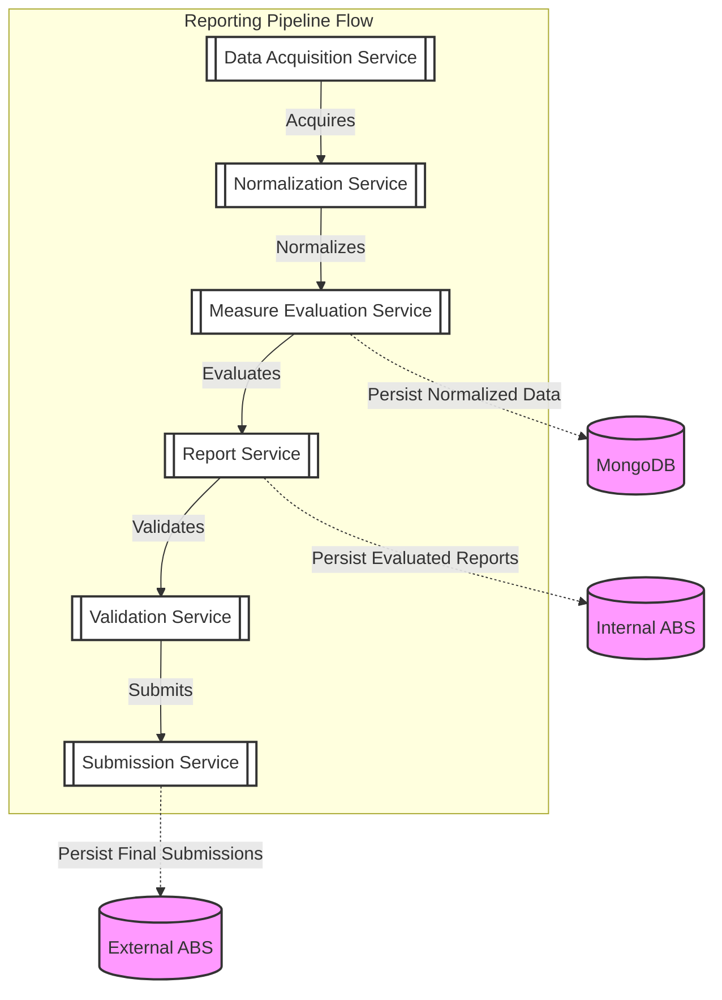

This page provides a comprehensive overview of the data persistence strategy across the Link platform. Persistence is categorized into three main types, each serving specific architectural needs.

## Persistence Strategy Overview

The Link platform utilizes a polyglot persistence approach to optimize for different data characteristics:

```mermaid
graph TD
    %% Databases
    SQL[(SQL Server)]
    Mongo[(MongoDB)]
    ABS[(Azure Blob Storage)]

    %% Services
    AccountService[[Account Service]]
    AuditService[[Audit Service]]
    CensusService[[Census Service]]
    DAService[[Data Acquisition Service]]
    NormService[[Normalization Service]]
    NotifService[[Notification Service]]
    TenantService[[Tenant Service]]
    MEService[[Measure Evaluation Service]]
    ReportService[[Report Service]]
    SubService[[Submission Service]]
    ValService[[Validation Service]]

    %% Connections to SQL
    AccountService --- SQL
    AuditService --- SQL
    CensusService --- SQL
    DAService --- SQL
    NormService --- SQL
    NotifService --- SQL
    TenantService --- SQL
    ValService --- SQL
    SubService --- SQL

    %% Connections to MongoDB
    MEService --- Mongo
    ReportService --- Mongo

    %% Connections to ABS
    MEService --- ABS
    SubService --- ABS
    ValService --- ABS

    classDef database fill:#f9f,stroke:#333,stroke-width:2px;
    class SQL,Mongo,ABS database;
```

*   **SQL Server**: The primary store for **configuration and metadata**. Most services use SQL Server to maintain state, tenant settings, and operational logs.
*   **MongoDB (Azure Cosmos DB)**: Deployed as Azure Cosmos for MongoDB, this layer is used for **clinical data and reporting artifacts**. It handles the high-volume, semi-structured nature of FHIR resources and evaluation results.
*   **Azure Blob Storage**: Used for **large file persistence** (e.g., patient bundles, submission NDJSON files). 
    *   *Platform Agnosticism*: Blob storage access is abstracted into interface patterns (e.g., `IBlobStorageService`) to ensure the platform remains agnostic of the underlying cloud provider.
    *   *Usage*: Used for internal submissions within the reporting pipeline and external submissions to public health agencies.

---

## Service-Specific Persistence

Detailed persistence schemas for each service are available directly on their respective documentation pages under the "Database Schema" section. These schemas are maintained as JSON Schema files (`db.schema.json`) within each service's directory.

### SQL Server (Relational)
The following services utilize SQL Server for structured configuration and metadata:
*   [[service|AccountService]]
*   [[service|AuditService]]
*   [[service|CensusService]]
*   [[service|DataAcquisitionService]]
*   [[service|NormalizationService]]
*   [[service|NotificationService]]
*   [[service|SubmissionService]]
*   [[service|TenantService]]
*   [[service|ValidationService]]

### MongoDB (Document-based)
Used for high-volume clinical and reporting data:
*   [[service|MeasureEvalService]]
*   [[service|ReportService]]

### Azure Blob Storage (Object Storage)
Used for large artifacts and submission bundles:
*   [[service|MeasureEvalService]] (evaluated reports)
*   [[service|SubmissionService]] (internal and external bundles)
*   [[service|ValidationService]] (validation results)

---

## Reporting Pipeline Data Flow

The following diagram illustrates the flow of data through the reporting pipeline and the specific points where it is persisted to the various database layers:

### Data Persistence Lifecycle
1.  **Acquisition & Normalization**: Data is retrieved from EHRs and normalized to ensure FHIR compliance.
2.  **Measure Evaluation**: The normalized data is passed to the [[service|MeasureEvalService]], where it is **persisted in MongoDB** for evaluation processing.
3.  **Evaluation & Reporting**: After the CQL engine evaluates the data, the resulting MeasureReports are processed by the [[service|ReportService]] and **persisted in Internal Blob Storage**.
4.  **Validation & Submission**: The evaluation results are validated against FHIR profiles and quality measures. Once validated, the [[service|SubmissionService]] packages the content and **persists the final bundles in External Blob Storage** for delivery to public health agencies.

<AccordionGroup>
    <Accordion title="Prompt: Initial">
        Use the GH-link-cloud tool to identify the persistence points across all of the services and to create an AVRO schema for each service that shows each of the tables/collections and their columns. Then create a "Data Persistence" custom page that describes the persistence layers (including blob storage in Measure Eval and Submission) across the platform as a whole. I'd like each service to have a good level of detail (the AVRO schema) for the database of each service, and a good summary of data persistence across the platform in the custom doc.
        There are three types of persistence:
        * SQL Server (most services use this at least for configuration)
        * MongoDB (deployed as Azure Cosmos for MongoDB) used by MeasurEval and Report services
        * Azure Blob Storage (which needs to be abstracted out into interface patterns so that we can stay platform agnostic) used for internal submissions and eventually external submissions after patient data has completed moving through the reporting pipeline
    </Accordion>
    <Accordion title="Prompt: Schema Corrections Prompt">
        Instead of putting json blocks in the data-persistence.mdx file, put each .avsc avro file in its associated service directory (i.e. domains/Compliance/AccountService/db.avsc) and add `&lt;Schema file="db.avsc" title="Database Schema" /&gt;` to each of the service's index.mdx files
        Instead of &lt;Schema&gt; use &lt;SchemaViewer&gt; on all pages. Narrative description of the service should show before the schema viewer. Rename all of the .avsc files to .avro
    </Accordion>
    <Accordion title="Prompt: Covert AVRO to JSON Schema">
        The AVRO schemas are displaying in the viewer, but they're only showing the first level of properties. I can't expand each property to see the sub-properties.
        I don't want to rely on custom changes to files in `.eventcatalog-core` to view the schema successfully. Switch from using AVRO for the schema definitions to regular JSON schema. Rename the .avro files to db.schema.json and change the content to JSON schema format.
    </Accordion>
</AccordionGroup>