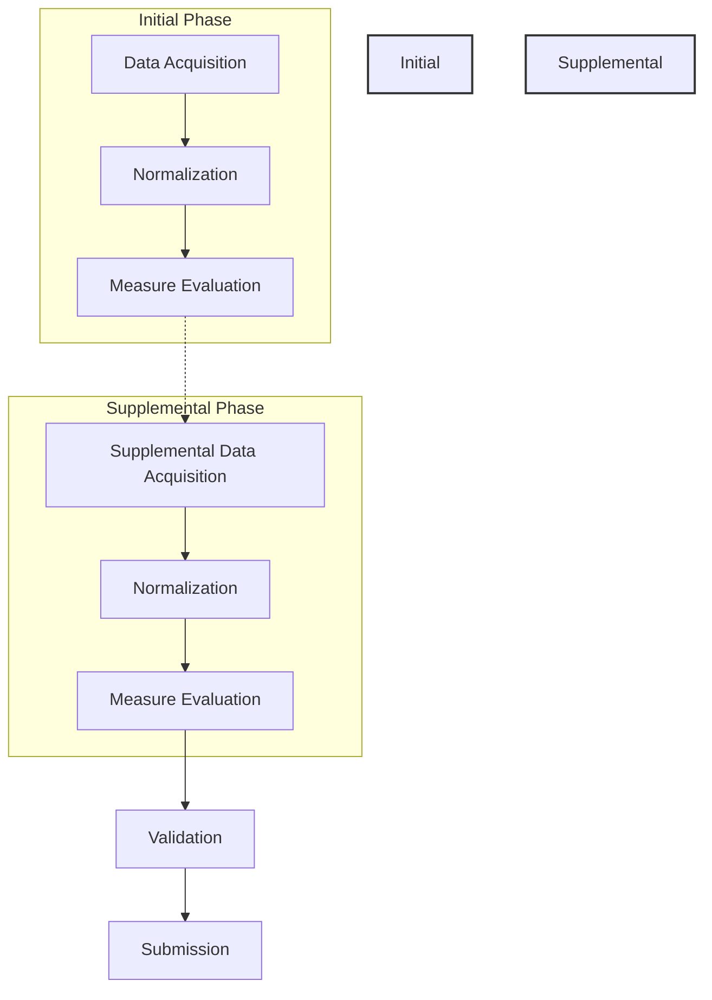

### Overview

The National Healthcare Safety Network (NHSN) reporting use case leverages the entire Link stack of services to generate automated reports for NHSN on behalf of healthcare facilities. 

The primary goals of this implementation are:
- **Increasing the reliability of near-real-time reporting:** By automating the data flow and analysis, the platform ensures that reports are accurate and delivered promptly.
- **Reducing the reporting burden on facilities:** Automating the data collection and processing significantly reduces the manual effort required by healthcare staff, allowing them to focus on patient care.

### Primary Reporting Workflow

The reporting workflow involves multiple facilities integrating through several stages, often split into initial and supplemental phases to ensure data completeness and accuracy.

### Data Submission

Once the data has been processed, evaluated, and validated, it is submitted to down-stream NHSN systems. A key feature of this process is the inclusion of **raw patient-level (aka: "line-level") data**. 

This detailed data submission allows NHSN to perform further metrics and calculations at a granular level, providing deeper insights and more flexible analysis capabilities than aggregate reporting alone.

### Facility/Tenant Configuration Requirements

Each facility or tenant in the NHSN reporting workflow must be configured with specific requirements to ensure reliable data flow and processing.

#### Data Source Configuration
The primary data source for NHSN reporting is a FHIR server. This requires:
- **Authentication**: Currently, we support **Epic** and **Cerner** authentication models, with plans to support more EHR vendors in the future.
- **Throttling**: Throttling configuration is critical to ensure that data acquisition does not negatively impact the facility's clinical systems during peak usage.

#### Census Acquisition Methods
The system supports multiple methods for determining the patient census, depending on the facility's technical capabilities:
- **FHIR Patient List**: Utilizing the Epic FHIR Patient List resource, if supported by the facility.
- **SFTP with CSV**: Securely transferring patient census data via CSV files over SFTP.
- **Future Support (Not Yet Available)**:
    - ADT via SFTP
    - Bulk Data
    - ADT via REST

#### Query Plan and Data Normalization
- **Query Plan**: A specific query plan must be defined for each facility to identify the exact FHIR resources and search parameters required for measure evaluation.
- **Normalization Operations**: Normalization processes are used to convert local codes and formats to standard codes (e.g., SNOMED-CT, LOINC, RXNORM) required for reporting.

#### Measure Configuration and Reporting Cadence
The reporting cadence and specific measures must be configured based on the facility's reporting requirements. Examples include:
- **NHSN Acute Care Monthly Initial Population**: Evaluating and submitting data on a monthly basis.
- **Daily Reporting**: Real-time or daily reporting for specific metrics to provide high-frequency insights.

### Core Services Involved

The following core services are instrumental in the NHSN reporting workflow:
- [[service|DataAcquisitionService]]
- [[service|CensusService]]
- [[service|NormalizationService]]
- [[service|MeasureEvalService]]
- [[service|ValidationService]]
- [[service|SubmissionService]]
