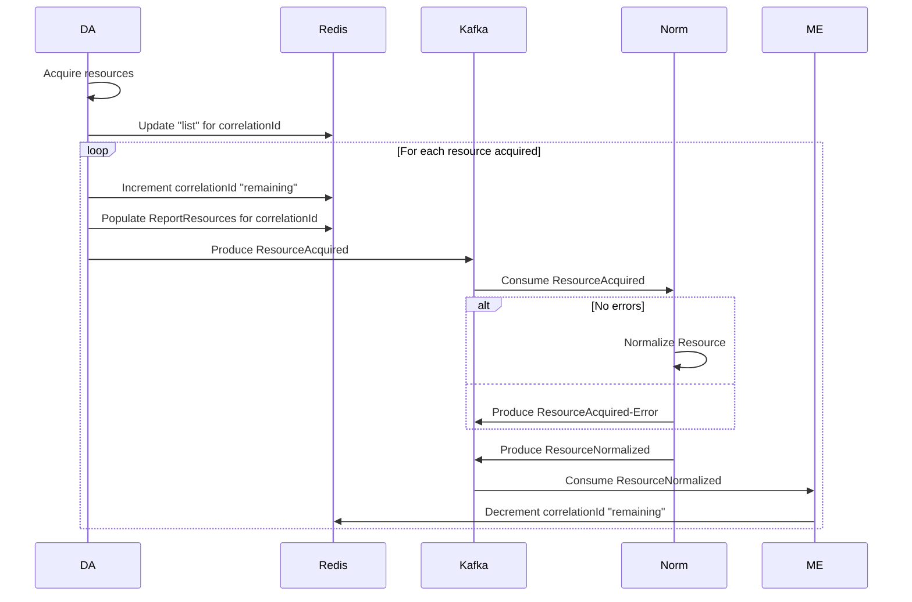

---
title: FHIR Resource Consumption
summary: Explains how the fhir half of the reporting pipeline keeps track of what resources have been processed and how it knows when it's done, ready for evaluation, etc.
---

# Overview

## Redis Data

**Keys**

* `reportResources:list:\<correlationId>` = List of resources to be processed for this correlationId
* `reportResources:evalPersistenceRemaining:\<correlationId>` = Number of resources remaining to be processed for this correlationId

**Subscription Channels**

* `reportResources:evalPersisted:\<correlationId>` = Published when all resources for this correlationId have been processed

### Format of "list" values

* New-line delimited list of resources for the specified correlationId.
* Each line is a FHIR "reference" formatted string (i.e. "Observation/X")

**Example**

```
Patient/234982
Encounter/98234ks9234
Observation/123
Observation/456
```

# Interactions Between Services

**Consumption**



**Normalization Failure**

```mermaid
    Kafka->>ME: Consume ResourceAcquired-Error
    ME->>Redis: Decrement correlationId "remaining"
```

**Consumption Complete**

```mermaid
    Redis->>ME: Publish "evalPersisted" when remaining 0
    ME->>DB: Collect all resources and bundle
    ME->>Redis: Get list of resources
    ME->>ME: Cross-reference list to bundle
    alt Not all resources found
        ME->>ME: Throw exceptio and log error
    end 
    ME->>CQF: Evaluate
    ME->>Kafka: Produce ResourceEvaluated events
    ME->>Redis: Clear Cache Keys
```