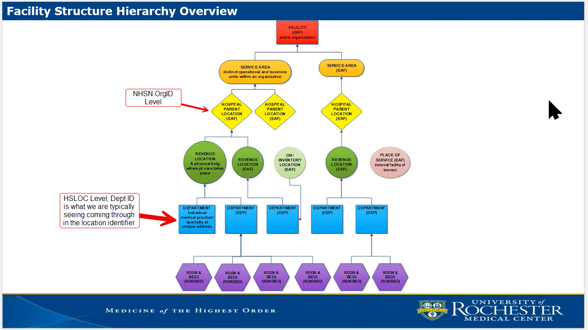
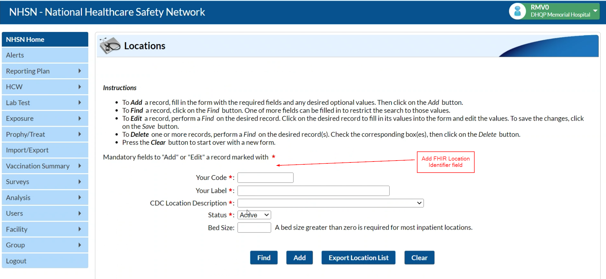
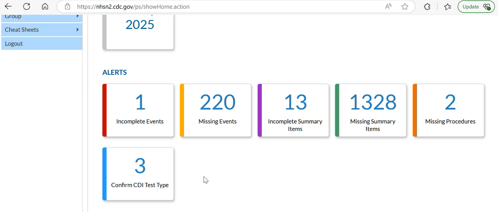
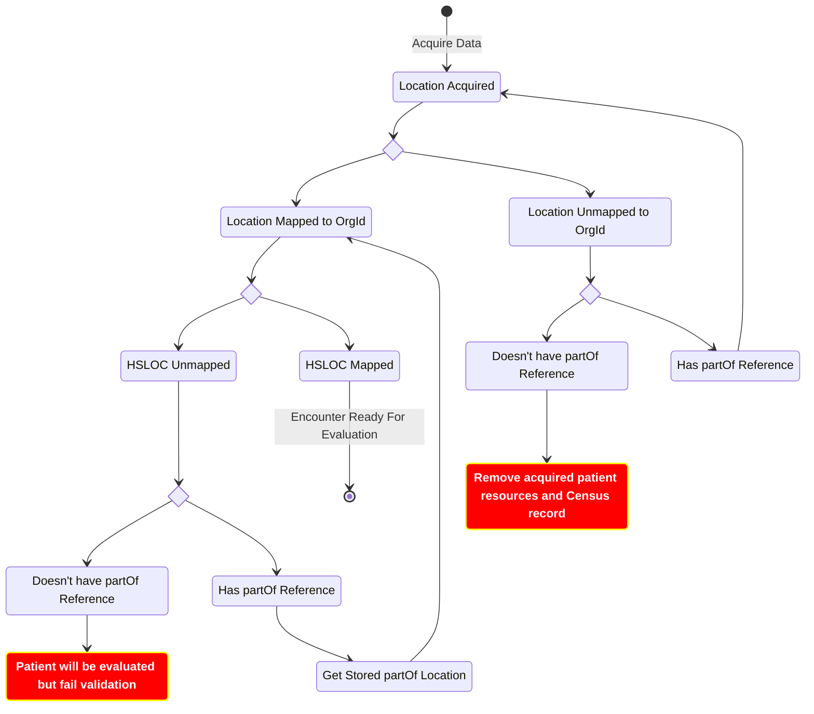
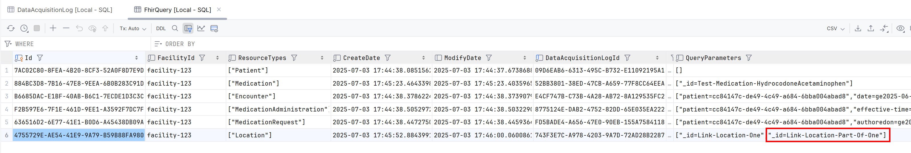
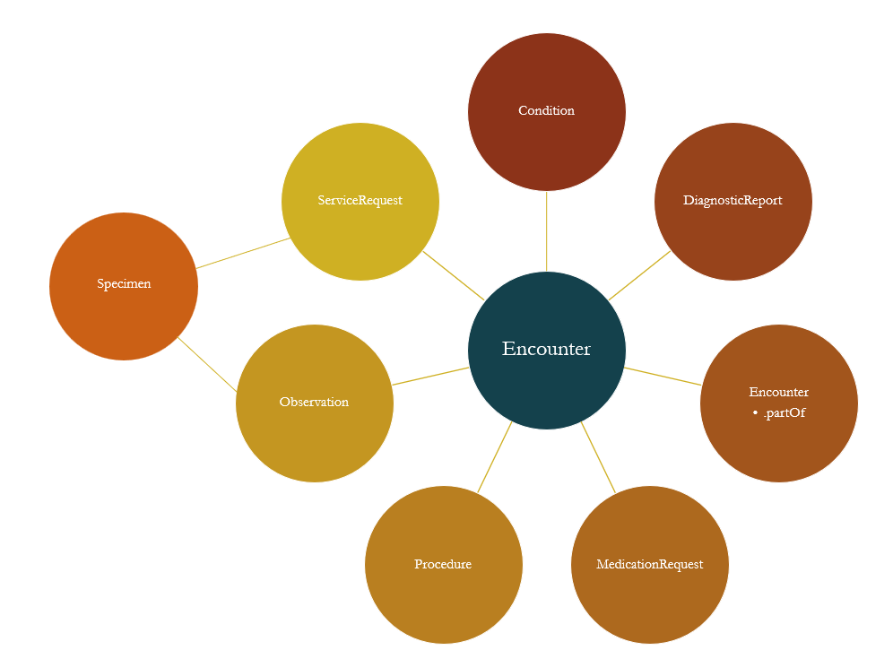

# Background

The NHSN has a location mapping page where infection preventionists can map patient care areas in their facility to CDC location codes defined by NHSN in order to report surveillance data collected from these areas ([Link to Document](https://www.cdc.gov/nhsn/pdfs/pscmanual/15locationsdescriptions_current.pdf)). As a requirement, the NHSN wants at least one HSLOC mapped location to be a part of the initial population definition when performing NHSN measure evaluations. Because of this, Link must be capable of accessing, maintaining, and mapping queried Location resources to their associated HSLOC mappings.

Additionally, many health systems operate multiple facilities under a single shared FHIR endpoint. When NHSNLink queries for a single patient’s data, the returned results may include Encounters and other resources from multiple facilities, each associated with a different NHSN OrgID. However, NHSN requires that each submission bundle only include data from a single NHSN OrgID.

# Links

- Initial findings for HSLOC mapping changes: [Link Here](https://lantana.atlassian.net/wiki/spaces/LSD/pages/1322483718)
- HSLOC Page: [Link Here](https://www.cdc.gov/nhsn/cdaportal/terminology/codesystem/hsloc.html)
- CDC HSLOC PDF: [Link Here](https://www.cdc.gov/nhsn/pdfs/pscmanual/15locationsdescriptions_current.pdf)
- HSLOC Value Set: [Link Here](https://cts.nlm.nih.gov/fhir/res/ValueSet/2.16.840.1.113762.1.4.1046.265)
- Collab Data Mapping to NHSN OrgId: [Link Here](https://lantana.atlassian.net/wiki/spaces/LSD/pages/1041661955/CoLab+Data+Mapping+to+NHSN+Org+ID)

# How to Match a Reporting Organization to a Location Resource

## Epic

Below is an example of the Epic location hierarchy that Rochester has provided for their facility. It's been identified that the EAF/Hospital Location node represents the reporting facility. The Location.identifier element of that node has been found as a reliable source for Link to identify whether the Encounter location belongs to the proper organization for facilities that use Epic. To do this, Link will need to be capable of traversing up from the Encounter location to its parent EAF Location. 
  

Detailed in the 'Collab Data Mapping to NHSN OrgId' document, the following sites have had a consistent Location.identifiers that represent the reporting organization:

| Collab             | Code       | System                                              |
| ------------------ | ---------- | --------------------------------------------------- |
| Nebraska           | 10         | urn:oid:1.2.840.114350.1.13.**310**.2.7.2.696570    |
| Yale               | 10         | urn:oid:1.2.840.114350.1.13.**301**.2.7.2.696570    |
| URMC               | 101        | urn:oid:1.2.840.114350.1.13.**247**.2.7.2.696570    |
| UC Davis           | 100        | urn:oid:1.2.840.114350.1.13.**93**.2.7.2.696570     |
| Michigan           | 10         | urn:oid:1.2.840.114350.1.13.**277**.2.7.2.696570    |

## Cerner

When pulling inpatient Encounter Location resources from Billings, the location was associated for the encounter represented a bed. The partof hierarchy went up to room, wing and eventually the Billings Hospital location. Below are some findings:

The following parent Facility Locations were found:
    - Beartooth Billings Clinic
    - Stillwater Billings Clinic
    - Billings Clinic Downtown
    - Billings Clinic Hospital (the reporting org for Link)

Each parent Location has the same `Location.type` and `Location.physicalType`. While the coding system is the same across both parent and child locations, the code looks to be unique. Each of the 4 listed parent facilities has a code of '783' with a display of 'Facility(s)':

~~~
"type": [
    {
        "coding": [
            {
                "system": "https://fhir.cerner.com/**omitted_route**/codeset/222",
                "code": "783",
                "display": "Facility(s)",
                "userSelected": true
            }
        ],
        "text": "Facility(s)"    
    }
]
~~~

If it's determined that `Location.id` is not how we want to target reporting organizations for Cerner, we could use a combination of this code and the name or alias of the resource which is the facility name.

Addtionally, each child location that was searched had a matching `Location.managingOrganization` to it's parent facility. Even if the Location represented a bed within a room, it had a matching organization that mapped one of the four Parent facilities. In recent calls (as of 8/15/2025), there were mentions that `Location.managingOrganization` can be unreliable, but from the small testing done, it seems like it could be used for Billings (and maybe Cerner). We would need staging data from another Cerner site to see if these findings hold true across facilities.

Cerner Millenium supports querying for locations based on the physical type [Link Here](https://docs.oracle.com/en/industries/health/millennium-platform-apis/mfrap/op-location-get.html). With the following query, we're able to get back all Locations in a Bundle that have been tagged as 'Site' which seem to correlate with Billings facilities: `<FHIR url>/Location?-physicalType=si`. The same query was made against the Baycare collab endpoint. The query response contained the same bundle with facility Location resources tagged as 'Site'. As of 8/19/2025, these Location resources were not validated by Baycare as reporting organization facilities. 

# How to Match an HSLOC mappings to a Location Resource

In MVP, the following Location elements are copied to `Location.type` so that Link can apply location based HSLOC Location Concept Maps: 

**Epic:** Normalize `Location.identifier` to `Location.type`

**Cerner:** Normalize `Location.alias` to `Location.type`

# Requirements

## Stakeholder Requirement for HSLOC Mapping

[LNK-4041](https://lantana.atlassian.net/browse/LNK-4041): Each Patient must have an Encounter location that maps to an NHSN HSLOC code

### System Requirements

| Link | Description | Requirement Type |
| ---- | ----------- | ---------------- |
| [LNK-4042](https://lantana.atlassian.net/browse/LNK-4042) | Link must be capable of querying `Location.partOf` references so that potential parent HSLOC mapped Locations can be included when evaluating an Encounter | Functional |
| [LNK-4043](https://lantana.atlassian.net/browse/LNK-4043) | Link must be capable of including the `Location.partOf` hierarchy when performing measure evaluations | Functional | 
| TODO                                                      | Link must be must have an API endpoint to manually configure HSLOC mappings for a reporting facility | Interface |
| [LNK-4045](https://lantana.atlassian.net/browse/LNK-4045) | To reduce external request activity, Link must maintain an internal state for queried HSLOC mappings | Functional | 
| [LNK-4046](https://lantana.atlassian.net/browse/LNK-4046) | Link must have an API endpoint available to manually update HSLOC mappings for a given facility | Interface | 
| [LNK-4047](https://lantana.atlassian.net/browse/LNK-4047) | Link must be capable of appending mapped HSLOC codes to acquired `Location.type` resources | Functional | 
| [LNK-4048](https://lantana.atlassian.net/browse/LNK-4048) | Link must be capable of posting un-mapped location alerts to an external NHSN API | Functional | 
| [LNK-4063](https://lantana.atlassian.net/browse/LNK-4063) | Link admin users must be capable of manually updating the HSLOC mappings from a UI | Interface |
| [LNK-4079](https://lantana.atlassian.net/browse/LNK-4079) | Prior to evaluating, Link must generate an audit event when an Encounter does not have any HSLOC mapped locations  | Functional | 
| [LNK-4080](https://lantana.atlassian.net/browse/LNK-4080) | Link must bypass evaluation if reported patient does not have any Encounters that map to an HSLOC location | Functional | 

## Stakeholder Requirement for Org Id Mapping

| Link | Description | Requirement Type |
| ---- | ----------- | ---------------- |
|[LNK-4057](https://lantana.atlassian.net/browse/LNK-4057) | Link must exclusively perform measure evaluations for Encounters that have a Location resource that maps to the reporting tenant organization | Stakeholder | 
|[LNK-4203](https://lantana.atlassian.net/browse/LNK-4203) | Link must only persist patient and facility related FHIR resources that maps to the reporting tenant organization | Stakeholder |
|[LNK-4058](https://lantana.atlassian.net/browse/LNK-4058) | Link must only maintain a patients of interest list for patients that have an Encounter location that maps to the reporting tenant organization | Stakeholder |

### System Requirements

| Link | Description | Requirement Type |
| ---- | ----------- | ---------------- |
|[LNK-4060](https://lantana.atlassian.net/browse/LNK-4060) | Link must have an API endpoint for storing the `Location.identifier` value(s) that represent the reporting organization identifier for a tenant using Epic | Interface |
|[LNK-4204](https://lantana.atlassian.net/browse/LNK-4204) | Link must have an API endpoint for storing a combination of `Location.type.coding.code` and `Location.alias` that represent the reporting organization identifier for a tenant using Cerner | Interface |
|[LNK-4061](https://lantana.atlassian.net/browse/LNK-4061) | Link must be capable of traversing and querying partOf Location references to find the mapped tenant reporting organization | Functional |
|TODO                                                      | Link must maintain a list of acquired Locations | Functional |
|TODO                                                      | Link must maintain a list of unmapped Encounters | Functional |
|[LNK-4062](https://lantana.atlassian.net/browse/LNK-4062) | Link must only produce `ResourceAcquired` Kafka events for FHIR resources that have been mapped to a reporting organization | Functional | 
|[LNK-4075](https://lantana.atlassian.net/browse/LNK-4075) | Link must generate audit events when a Patient has no Encounter Locations that map to the reporting organization for a tenant | Functional |
|[LNK-4076](https://lantana.atlassian.net/browse/LNK-4076) | Link must generate audit events when an Encounter Location does not map to the reporting organization for a tenant | Functional |
|[LNK-4077](https://lantana.atlassian.net/browse/LNK-4077) | Link must purge the patient of interest record for patient's that do not have any Encounter Locations that map to the reporting organization for a tenant | Functional |
|[LNK-4078](https://lantana.atlassian.net/browse/LNK-4078) | Link must generate an audit event when a patient of interest record is purged due to not having an Encounter Location that maps to the reporting organization for a tenant | Functional |

## Stakeholder Requirements for NHSN app

| Link | Description | Requirement Type |
| ---- | ----------- | ---------------- |
| TODO                                                      | Link must be capable of retrieving mapped codes from an external NHSN Location API that represent the reporting organization | Functional | 
| [LNK-4044](https://lantana.atlassian.net/browse/LNK-4044) | Link must be capable of retrieving HSLOC mapped codes from an external NHSN Location API | Functional | 

### System Requirements 

| Link | Description | Requirement Type |
| ---- | ----------- | ---------------- |
| [LNK-4045](https://lantana.atlassian.net/browse/LNK-4045) | To reduce external request activity, Link must maintain an internal state for queried HSLOC mappings | Functional | 

# External Request: NHSN Location API 

**GET operation**
- GET all locations for a given NHSN Org Id
- GET single location - Param: NHSN Org Id, Location identifier)
- Responses should contain all values from the Location page.

**POST operation**
A post operation to alert when a location was found that does not have a mapping notification back to NHSNLink

When a location mapping is inserted or modified, the external NHSN app POSTs the update to Link (Normalization API detailed below).

# BotW Change Proposal

## State Diagram

## Data Acquisition Changes

Reporting facilities often share the same FHIR data source with other facilities within their hospital network. Due to the FHIR query limitations provided by EHR vendors, there is a risk that Link queries for resources that don't belong to the reporting facility. Becuase of this, Link must maintain Location resource information that can reliably check to see if queried Encounters map to a reporting facility. The `How to Match a Reporting Organization to a Location Resource` section above shows findings on which Location elements can represent facilties for Cerner and Epic vendors. The Data Acquisition will need to have the following functionality:

### Query partOf Locations

Currently, Data Acquisition is capable of maintaining and querying resource references that are found on acquired resources. For example, if an Encounter contains a Location resource reference, the reference will be queried if configured to do so. Additionally, if that referenced Location contains a partOf reference to another Location, the partOf Location is added to the acquisition logging workflow and also queried. However, as of 7/7/2025, the acquisition log for the partOf Location was not being produced as a ResourceAcquired event. A story will need to be created if this has not been resolved.

### Org ID Checking

**API for Configuration:** A REST API endpoint will need to be available for sites to configure Location resource element values that represent their reporting organization. The `How to Match a Reporting Organization to a Location Resource` section details how those elements differ between vendors. This implementation must be fluid as we continue to investigate the reliability of the information in the before mentioned section. The Data Acquisition service must persist this information when a POST/PUT request is made by the user.

**Location Tree Table:** A new table should be created to keep track of previously queried Location resource id's and whether they eventually mapped to one of the configured organization Location resources. Some of the columns that may be needed for this table are:
    - Facility Id
    - Location Id
    - A status flag on whether or not the location resouce maps to a facility's orgaization
    - Date that the Location resource was last queried
    - PartOf column that contains the table ID of the parent location tree record 

**Unmapped Encounter Table:** To ensure that Link does not process intial or supplemental resources that reference an Encounter that doesn't belong to the reporting facility, Data Acquisition must persist these Encounter Id's. While querying for resources, Data Acqusition must cross check that acquired resources don't reference an Encounter in this table. Below is a diagram to show the relationship other FHIR resources relevant to NHSN reporting have to an Encounter:

**During Intitial Query Phase**: When an Encounter is queried, the Data Acquisition service must check the new location tree table to see if there is a mapping for the location referenced in the encounter. NOTE: This is intended to replace the current Location searching called in the Query Plan. Location in the Query Plans can be removed.
    - If there is a mapped Location and it matches to an org id: Continue the standard acquisition process
    - If there is a mapped Location and it does not map to an org id:
        - Don't continue querying
        - Produce Audit event that the Encounter Id belonged to an outside OrgId
        - Do not produce `ResourceAcquired` event for the Encounter Id
    - If there is no mapping for the Location:
        - Create an acquisition log to query for the location. The QueryType of the log should be distinct from the current Search/Read types.        
        - The worker of the new Data Acquisition log type should:
            1. Query for the Location resource
            2. Add the queried location reference to the new Location mapping table and check to see if the Location.identifier matches the reporting the organization identifier of the facility. Update the record to indicate whether the location is part/not part of the reporting org Id.
            3. If the Location contains a partOf reference, repeat step 1.
            4. If no queried Location.identifier matches one of the org id's for the facility, don't produce an acquired event for the related Encounter and it's Locations
    - If ALL Encounters have Location resources that don't map to a reporting Org Id, create an Audit event 
    - A lock on producing `ResourceAcquired` events should be placed on each patient until Link verifies that there is an Encounter that maps to the reporting Location.type org Id.

## Census Changes

**Org Id Resolution**: If Data Acquistion determines that a patient does not have any Encounters that map to the reporting organization, an event should be published to the Census service so that the service can clear census records for that patient.

## Normalization Changes

<Admonition type="info">
This section on the proposal may change based on what is developed for us by Leidos.
</Admonition>

**Location Mapping Table**: A SQL table will need to be created to persist HSLOC mappings. The table should include the following information:

- The NHSN Org Id (Facility Id)
- FHIR Location.Type Identifier
- The HSLOC code
- Ignore (Un-mapped NHSN Location type that doesn’t need mapping from external endpoint)

**API Update**: The Normalization service will expose a Rest API endpoint that will allow the external NHSN app to post when a facility location has been updated. Additionally, an endpoint needs to be added to manually trigger the NHSN Location update where Normalization queries the NHSN endpoint and perform the GET request and updates the local mapping table.

**Consumer Workflow**: The Normalization service will be responsible for externally accessing and maintaining HSLOC mappings for each reporting facility. As Location resources are consumed, the Normalization service will internally persist these mappings to reduce the number of made external requests.

## Measure Eval Changes

**HSLOC Checking**: Link currently processes all patient and shared resources indiscriminately during measure evaluation. However, encounters may be not meet the initial population because of missing/invalid HSLOC mappings. This evaluation could waste compute resources. After consuming the last resource for the initial Encounter evaluation, the Measure Eval should check to see if there is a qualifying HSLOC location for the corresponding Correlation Id prior to running the evaluation. If there isnt, the Measure Eval service should bypass evaluation and produce a ResourceEvaluated event that informs the Report service that the Encounter did not meet the initial criteria.

**Consumer Workflow**: The Measure Eval consumes Location resources for a corresponding CorrelationId. After the Data Acquisition updates mentioned above have been applied, this will also include any partOf Location resources. Since these acquired partOf locations will also be tagged with a CorrelationId, they will be included as part of the bundle for evaluation. At this stage, Location resources that are mapped to an HSLOC code have been applied.
