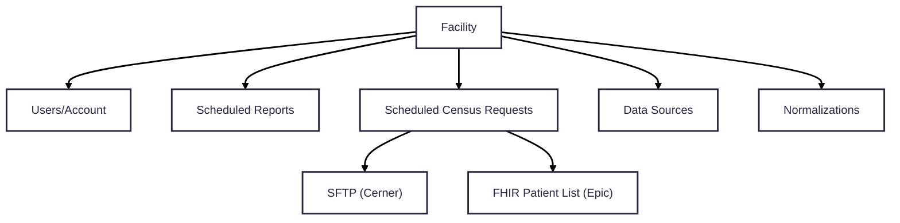
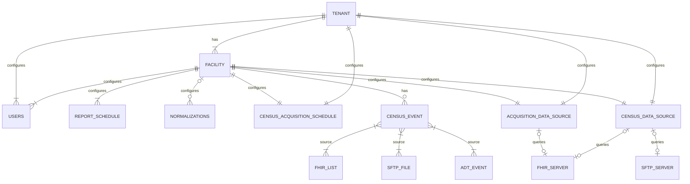

## Background

Link Cloud currently does not have relationship hierarchy present that ties a reporting facility to their parent hospital network. It has been identified that hospital networks often share a single FHIR endpoint as its data source. Because of this, some facility configurations can be redundant. Additionally, there may be query/reporting effieciencies that we can access through this newly present hierarchy. The proposal will target developing the tenant/facility hierachy accross each Link Cloud service. This will include code, data model, Kafka event and API updates.

## Links

## Current Configuration Implementation

The current implementation of Link Cloud represents each facility record without a parent tenant. Because of this, the configuration model to enroll is at the facility level. Below is a diagram of the current configuration relationship for each facility:



### Data Source Configuration 

### Census Configuration

## Requirements

## Proposed Change Summary

### Single Tenant Multi-Facility Relationship



### API Route Conformance

Currently, each Link Cloud service has their own API route definitions to perform various user and system tasks (creating configurations, updating measures, accessing reports). From a user perspective, this may lead to confusion when making requests from one service to another. The Route Guidelines section of the API Guidance page (<Link href="../dev/api_guidance">Link Here</Link>) has guidelines on how we define our service API routes. In the **Proposed Service Changes** section below, there are **API Updates** sections that create/replace our current service API routes. 

**Info Endpoint**

Rather than looking through configurations, an ‘info’ API endpoint will be added to each service to allow users to quickly determine what version of the service is deployed. Below is a snippet from Program.cs → SetupMiddleware() in the Notification service:

```
app.MapGet("/info", () => Results.Ok($"{ServiceActivitySource.ServiceName} version {ServiceActivitySource.Instance.Version}")).AllowAnonymous();
```

**YARP Updates**

Each service will need to update their section of the ReverseProxy setting in `\DotNet\LinkAdmin.BFF\appsettings.Development.json`. Below is a Report service update example of the needed update:

```

"route8": {
  "ClusterId": "ReportService",
  "AuthorizationPolicy": "AuthenticatedUser",
  "Match": {
    "Path": "api/report/{**catch-all}"
  },
  "Transforms": [
    { "PathPattern": "/{**catch-all}" }
  ]
}
```

The following `PathPattern` transform example for each service needs to be added to the BFF container in `docker-compose.yml`:

```
ReverseProxy__Routes__route8__Transforms__0__PathPattern: /{**catch-all}
```

**Service Registry updates**

The following updates need to be made to the `\DotNet\Shared\Application\Models\Configs\ServiceRegistry.cs` file:

- Remove `/api` for each API URL 
- Remove `/<service-name>` for any references to the API URL

## Proposed Service Changes

### Tenant Service

#### API Updates

| Request Type | Route                             								 | API Link                                                                      |  
| ------------ | ------------------------------------------------  | ----------------------------------------------------------------------------- |
| GET					 | /info 																						 |																																							 |
| GET          | /tenants                          								 | <Link href="../../services/TenantService/0.2.0/spec/openapi">Link Here</Link> |
| POST         | /tenants                          								 |                                                                               |
| PUT          | /tenants/\{tenant-id\}                   				 |                                                                               |
| DELETE       | /tenants/\{tenant-id\}                   				 |                                                                               |
| GET          | /tenants/\{tenant-id\}/facilities        				 |                                                                               |
| POST         | /tenants/\{tenant-id\}/facilities        				 |                                                                               |
| PUT          | /tenants/\{tenant-id\}/facilities/\{facility-id\} |                                                                               |
| DELETE       | /tenants/\{tenant-id\}/facilities/\{facility-id\} |                                                                               |

//TODO: Ad Hoc report endpoints

#### Kafka Updates

The following Kafka producer changes will need to be applied to conform to the new event specifications:

| Topic                   | Type      | Event Link                                                                 |  
| ------------            | --------- | -------------------------------------------------------------------------- |
| ReportScheduled         | Producer  | <Link href="../../events/ReportScheduled/0.2.0">Link Here</Link>           |
| GenerateReportRequested | Producer  | <Link href="../../commands/GenerateReportRequested/0.2.0">Link Here</Link> |

**NOTES**:
  - QUESTION FOR ARCH: Do we want to represent the OrgId as a separate column?
  - GET Tenant returns a response body that includes an array of facility resources
  - GET Facility returns a response body that includes a tenant block

### Census Service

#### API Updates

| Request Type | Route                             					  						 | API Link                                                                       |  
| ------------ | -----------------------------------------------					 | -----------------------------------------------------------------------------  |
| GET					 | /info 																						 |																																							 |
| GET          | /configs/\{id\}       					  												 | <Link href="">Link Here</Link> 																								|
| GET          | /configs/tenants/\{tenant-id\}       					  				 | <Link href="">Link Here</Link> 																								|
| POST         | /configs/tenants/\{tenant-id\}       					  				 | <Link href="">Link Here</Link> 																								|
| PUT          | /configs/tenants/\{tenant-id\}       					  				 | <Link href="">Link Here</Link> 																								|
| DELETE       | /configs/tenants/\{tenant-id\}?include-facilities				 | <Link href="">Link Here</Link> 																								|
| GET          | /configs/tenants/\{tenant-id\}/facilities/\{facility-id\} | <Link href="">Link Here</Link> 																								|
| POST         | /configs/tenants/\{tenant-id\}/facilities/\{facility-id\} | <Link href="">Link Here</Link> 																								|
| PUT          | /configs/tenants/\{tenant-id\}/facilities/\{facility-id\} | <Link href="">Link Here</Link> 																								|
| DELETE       | /configs/tenants/\{tenant-id\}/facilities/\{facility-id\} | <Link href="">Link Here</Link> 																								|

//TODO: PatientEvent and Encounter endpoints

#### Kafka Updates

The following Kafka consumer and producer changes will need to be applied to conform to the new event specifications:

| Topic                     | Type      | Event Link                                                                 |  
| ------------              | --------- | -------------------------------------------------------------------------- |
| PatientCensusScheduled    | Producer  | <Link href="../../events/PatientCensusScheduled/0.2.0">Link Here</Link>    |
| PatientEvent              | Producer  | <Link href="../../events/PatientEvent/0.2.0">Link Here</Link>              |
| PatientListAcquired       | Consumer  | <Link href="">Link Here</Link>                                             |
| PatientListAcquired-Retry | Consumer  | <Link href="">Link Here</Link>                                             |
| PatientListAcquired-Error | Producer  | <Link href="">Link Here</Link>                                             |

### Data Acquisition Service

#### Kafka Updates

The following Kafka consumer and producer changes will need to be applied to conform to the new event specifications:

| Topic                        | Type      | Event Link                                                                 |  
| ------------                 | --------- | -------------------------------------------------------------------------- |
| PatientCensusScheduled       | Consumer  | <Link href="../../events/PatientCensusScheduled/0.2.0">Link Here</Link>    |
| PatientCensusScheduled-Retry | Consumer  | <Link href="">Link Here</Link>                                             |
| PatientCensusScheduled-Error | Producer  | <Link href="">Link Here</Link>                                             |
| ReadyToAcquire               | Producer  | <Link href="">Link Here</Link>                                             |

**NOTES**:
- Data Source configuration for an entire tenant
- Overridable Data Source configurations for a facility within a tenant
- How does this affect List Ids for Epic sites?

### Data Acquisition Worker Service

#### Kafka Updates

The following Kafka consumer and producer changes will need to be applied to conform to the new event specifications:

| Topic                        | Type      | Event Link                                                                 |  
| ------------                 | --------- | -------------------------------------------------------------------------- |
| ReadyToAcquire               | Consumer  | <Link href="">Link Here</Link>                                             |
| ReadyToAcquire-Retry         | Consumer  | <Link href="">Link Here</Link>                                             |
| ReadyToAcquire-Error         | Producer  | <Link href="">Link Here</Link>                                             |
| ResourceAcquired             | Producer  | <Link href="../../events/ResourceAcquired/0.2.0">Link Here</Link>          |

### Normalization Service

#### Kafka Updates

The following Kafka consumer and producer changes will need to be applied to conform to the new event specifications:

| Topic                        | Type      | Event Link                                                                 |  
| ------------                 | --------- | -------------------------------------------------------------------------- |
| ResourceAcquired             | Consumer  | <Link href="../../events/ResourceAcquired/0.2.0">Link Here</Link>          |
| ResourceAcquired-Retry       | Consumer  | <Link href="">Link Here</Link>                                             |
| ResourceAcquired-Error       | Producer  | <Link href="">Link Here</Link>                                             |
| ResourceNormalized           | Producer  | <Link href="../../events/ResourceNormalized/0.2.0">Link Here</Link>        |

### Measure Eval Service

#### Kafka Updates

The following Kafka consumer and producer changes will need to be applied to conform to the new event specifications:

| Topic                        | Type      | Event Link                                                                 |  
| ------------                 | --------- | -------------------------------------------------------------------------- |
| ResourceNormalized           | Consumer  | <Link href="../../events/ResourceNormalized/0.2.0">Link Here</Link>        |
| ResourceNormalized-Retry     | Consumer  | <Link href="">Link Here</Link>                                             |
| ResourceNormalized-Error     | Producer  | <Link href="">Link Here</Link>                                             |
| ResourceEvaluated            | Producer  | <Link href="../../events/ResourceEvaluated/0.2.0">Link Here</Link>         |

### Report Service

#### API Updates

| Request Type | Route                             					  						 					| API Link                       | Note 																																			|  
| ------------ | -----------------------------------------------					 					| -------------------------------| -------------------------------------------------------------------------  |
| GET					 | /info 																						 |																																							 |
| GET          | /patient-bundles/facilities/\{facility-id\}/patient/\{patient-id\} | <Link href="">Link Here</Link> | This route replaces /api/Report/Bundle/Patient 	  												|
| GET          | /report-schedules/\{reportschedule-id\} 														| <Link href="">Link Here</Link> | This route replaces /api/Report/Schedule. Since reportScheduleId is required and is always associated with a facility, facility Id isn't needed as part of the request |
| GET          | /report-summaries/ 																                | <Link href="">Link Here</Link> | This route replaces /api/Report/summaries. Noticed this contains a nullable facility id param but also have summaries/facilities. We can remove the facility param and have a route dedicated to report summaries for a facility |
| GET          | /report-summaries/facilities/\{facility-id\}/ 	 									  | <Link href="">Link Here</Link> | This route replaces /api/Report/summaries/\{facilityId\} |
| GET          | /submission-entries/facilities/\{facility-id\}/ 									  | <Link href="">Link Here</Link> | This route replaces /api/Report/summaries/\{facilityId\}/measure-reports |
| GET          | /submission-entries/facilities/\{facility-id\}/ 									  | <Link href="">Link Here</Link> | This route replaces /api/Report/summaries/\{facilityId\}/measure-reports |

//TODO: There are more current API's that need to be added

#### Kafka Updates

The following Kafka consumer and producer changes will need to be applied to conform to the new event specifications:

| Topic                         | Type      | Event Link                                                                 |  
| ------------                  | --------- | -------------------------------------------------------------------------- |
| ResourceEvaluated             | Consumer  | <Link href="../../events/ResourceEvaluated/0.2.0">Link Here</Link>         |
| ResourceEvaluated-Retry       | Consumer  | <Link href="">Link Here</Link>                                             |
| ResourceEvaluated-Error       | Producer  | <Link href="">Link Here</Link>                                             |
| ReportScheduled               | Consumer  | <Link href="../../events/ReportScheduled/0.2.0">Link Here</Link>           |
| ReportScheduled-Retry         | Consumer  | <Link href="">Link Here</Link>                                             |
| ReportScheduled-Error         | Producer  | <Link href="">Link Here</Link>                                             |
| GenerateReportRequested       | Consumer  | <Link href="../../commands/GenerateReportRequested/0.2.0">Link Here</Link> |
| GenerateReportRequested-Retry | Consumer  | <Link href="">Link Here</Link>                                             |
| GenerateReportRequested-Error | Producer  | <Link href="">Link Here</Link>                                             |
| PatientListAcquired           | Consumer  | <Link href="">Link Here</Link>                                             |
| PatientListAcquired-Retry     | Consumer  | <Link href="">Link Here</Link>                                             |
| PatientListAcquired-Error     | Producer  | <Link href="">Link Here</Link>                                             |
| PayloadSubmitted              | Consumer  | <Link href="">Link Here</Link>                                             |
| PayloadSubmitted-Retry        | Consumer  | <Link href="">Link Here</Link>                                             |
| PayloadSubmitted-Error        | Producer  | <Link href="">Link Here</Link>                                             |
| ValidationComplete            | Consumer  | <Link href="../../events/ValidationComplete">Link Here</Link>              |
| ValidationComplete-Retry      | Consumer  | <Link href="">Link Here</Link>                                             |
| ValidationComplete-Error      | Producer  | <Link href="">Link Here</Link>                                             |
| SubmitPayload                 | Producer  | <Link href="">Link Here</Link>                                             |
| ReadyForValidation            | Producer  | <Link href="">Link Here</Link>                                             |
| DataAcquisitionRequested      | Producer  | <Link href="">Link Here</Link>                                             |

### Submission Service

#### API Updates

| Request Type | Route                        	| API Link                       | Note 										     																 		 |  
| ------------ | ---------------------------- 	| -------------------------------| ----------------------------------------------------------------- |
| GET					 | /info 												  |																 |																							 									   |
| GET          | /reports/\{reportschedule-id\} | <Link href="">Link Here</Link> | This route replaces /api/Submisssions/\{facilityId\}/\{reportId\} |

#### Kafka Updates

The following Kafka consumer and producer changes will need to be applied to conform to the new event specifications:

| Topic                         | Type      | Event Link                                                                 |  
| ------------                  | --------- | -------------------------------------------------------------------------- |
| SubmitPayload                 | Consumer  | <Link href="">Link Here</Link>                                             |
| SubmitPayload-Retry           | Consumer  | <Link href="">Link Here</Link>                                             |
| SubmitPayload-Error           | Producer  | <Link href="">Link Here</Link>                                             |

### Account Service

TODO

### Admin UI


