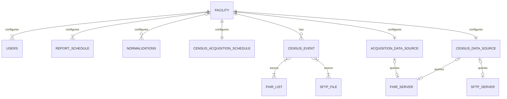
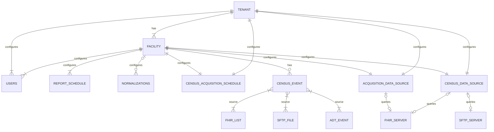
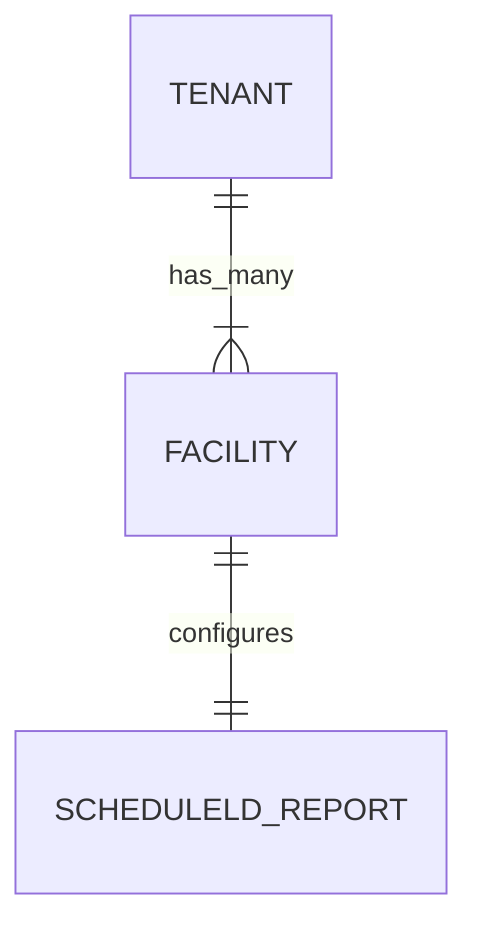
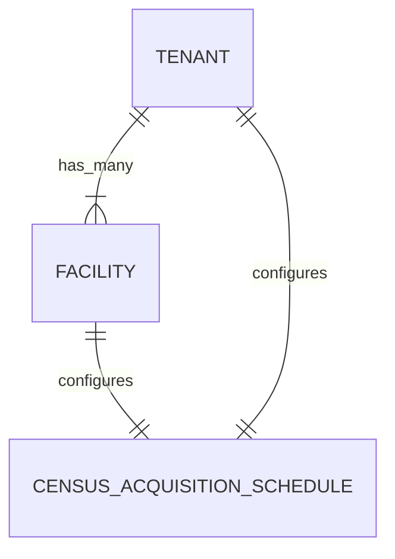
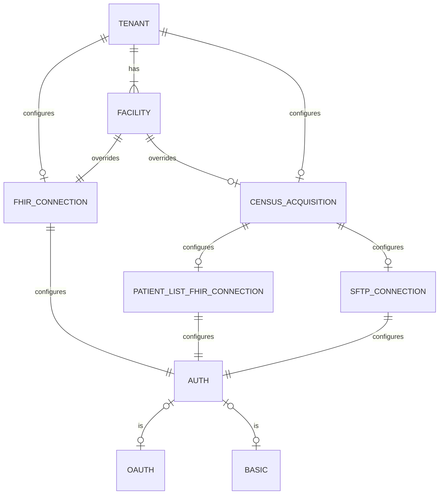

## Background

Link Cloud currently does not have relationship hierarchy present that ties a reporting facility to their parent hospital network. It has been identified that hospital networks often share a single FHIR endpoint as its data source. Because of this, some facility configurations can be redundant. Additionally, there may be query/reporting effieciencies that we can access through this newly present hierarchy. The proposal will target developing the tenant/facility hierachy accross each Link Cloud service. This will include code, data model, Kafka event and API updates.

## Links

## Current Configuration Implementation

The current implementation of Link Cloud represents each facility record as a tenant. Because of this, each tenant that enrolls into the system is at the facility level. Below is a diagram of the current configuration relationship for each facility:



In the current implementation, a health system **must** configure each facility separately regardless if they may share similar settings. For example, if a Tenant has a single FHIR server data source, each facility will still need to apply the same Data Acquisition configs per facility. This is an unecessary burden on sites that decide to enroll into Link Cloud. Other types of duplicate configuration burdens (Census scheduling, Acquisition Lag, etc.) can possibly exist when a tenant also configures multiple facilities. 

## Requirements

### System Requirements

| Link | Description | Requirement Type |
| ---- | ----------- | ---------------- |
|      | Link Rest API's must conform to the route guidance instructions detailed in the Link Cloud API guidance page | Interface |
|      | Link must be capabale of configuring a single tenant/multi facility relationship hierarchy | Interface |

## Proposed Change Summary

### Single Tenant Multi-Facility Relationship

The new proposed relationship will be built where the managing tenant (health system) has one to many reporting facilities. Like Link Cloud's current design, each facility will be responsible for their own reporting. Adding a tenant relationship to facilities allows for sites to configure on either a tenant level (encapsulating the entire facility) or the facility level (for facilities that need targetted configurations that differ from the parent Tenant). For example, a tenant can configure a single FHIR server that all child facilities will interface with for reporting. But if one of the facilities for a parent tenant uses a different data source, they can still have control over configuring for their site. Below is the proposed relationship with tenants and facilities to various entities in Link Cloud:



### API Route Conformance

Currently, each Link Cloud service has their own API route definitions to perform various user and system tasks (creating configurations, updating measures, accessing reports). From a user perspective, this may lead to confusion when making requests from one service to another. The Route Guidelines section of the API Guidance page (<Link href="../dev/api_guidance">Link Here</Link>) has guidelines on how we define our service API routes. Since the tenant-facility proposal will include changes to the Rest API's it gives us the opportunity to align each service to what matches on the guidance page. 

**Info Endpoint**

//TODO: Details instead of 'info'?

Rather than looking through configurations, an ‘info’ API endpoint will be added to each service to allow users to quickly determine what version of the service is deployed. Below is a snippet from Program.cs → SetupMiddleware() in the Notification service:

```
app.MapGet("/info", () => Results.Ok($"{ServiceActivitySource.ServiceName} version {ServiceActivitySource.Instance.Version}")).AllowAnonymous();
```

**YARP Updates**

Each service will need to update their section of the ReverseProxy setting in `\DotNet\LinkAdmin.BFF\appsettings.Development.json`. Below is a Report service update example of the needed update:

```

"route8": {
  "ClusterId": "ReportService",
  "AuthorizationPolicy": "AuthenticatedUser",
  "Match": {
    "Path": "api/report/{**catch-all}"
  },
  "Transforms": [
    { "PathPattern": "/{**catch-all}" }
  ]
}
```

The following `PathPattern` transform example for each service needs to be added to the BFF container in `docker-compose.yml`:

```
ReverseProxy__Routes__route8__Transforms__0__PathPattern: /{**catch-all}
```

**Service Registry updates**

The following updates need to be made to the `\DotNet\Shared\Application\Models\Configs\ServiceRegistry.cs` file:

- Remove `/api` for each API URL 
- Remove `/<service-name>` for any references to the API URL

### Query Dispatch Removal

This proposal assumes that the Query Dispatch service has been removed from Link Cloud.

## Proposed Service Changes

### Tenant Service

#### Data Model Updates

The Tenant Service data model must maintain a relationship of a single Tenant record to many child Facilities. Each of the child Facility records will be responsible for maintaning their own individual scheduled reports (exactly as how it does in Link Cloud's current state):



#### API Updates

| Request Type | Route                             								 | API Link                                                                      | Note  |
| ------------ | ------------------------------------------------  | ----------------------------------------------------------------------------- | ----- |
| GET					 | /info 																						 |																																							 |       |
| GET          | /tenants                          								 | <Link href="../../services/TenantService/0.2.0/spec/openapi">Link Here</Link> |       |
| POST         | /tenants                          								 |                                                                               |       |
| PUT          | /tenants/\{tenant-id\}                   				 |                                                                               |       |
| DELETE       | /tenants/\{tenant-id\}                   				 |                                                                               |       |
| GET          | /tenants/\{tenant-id\}/facilities        				 |                                                                               |       |
| POST         | /tenants/\{tenant-id\}/facilities        				 |                                                                               |       |
| PUT          | /tenants/\{tenant-id\}/facilities/\{facility-id\} |                                                                               |       |
| DELETE       | /tenants/\{tenant-id\}/facilities/\{facility-id\} |                                                                               |       |
| POST         | /regenerate-reports/facilities/\{facility-id\}/reports/\{report-id\}?bypass-submission |                                          |       |
| POST         | /adhoc-reports/facilities/\{facility-id\}/reports/\{report-id\} |                                                                 |       |

#### Kafka Updates

The following Kafka producer changes will need to be applied to conform to the new event specifications:

| Topic                   | Type      | Event Link                                                                 |  
| ------------            | --------- | -------------------------------------------------------------------------- |
| ReportScheduled         | Producer  | <Link href="../../events/ReportScheduled/0.2.0">Link Here</Link>           |
| GenerateReportRequested | Producer  | <Link href="../../commands/GenerateReportRequested/0.2.0">Link Here</Link> |

**NOTES**:
  - QUESTION FOR ARCH: Do we want to represent the OrgId as a separate column?
  - GET Tenant returns a response body that includes an array of facility resources
  - GET Facility returns a response body that includes a tenant block

### Census Service

#### Data Model Updates



//TODO: Add Census event sourcing tables to data model

#### API Updates

| Request Type | Route                             					  						 | API Link                                                                       |  
| ------------ | -----------------------------------------------					 | -----------------------------------------------------------------------------  |
| GET					 | /info 																						 				 |																																							  |
| GET          | /configs/\{id\}       					  												 | <Link href="">Link Here</Link> 																								|
| GET          | /configs/tenants/\{tenant-id\}       					  				 | <Link href="">Link Here</Link> 																								|
| POST         | /configs/tenants/\{tenant-id\}       					  				 | <Link href="">Link Here</Link> 																								|
| PUT          | /configs/tenants/\{tenant-id\}       					  				 | <Link href="">Link Here</Link> 																								|
| DELETE       | /configs/tenants/\{tenant-id\}?include-facilities				 | <Link href="">Link Here</Link> 																								|
| GET          | /configs/tenants/\{tenant-id\}/facilities/\{facility-id\} | <Link href="">Link Here</Link> 																								|
| POST         | /configs/tenants/\{tenant-id\}/facilities/\{facility-id\} | <Link href="">Link Here</Link> 																								|
| PUT          | /configs/tenants/\{tenant-id\}/facilities/\{facility-id\} | <Link href="">Link Here</Link> 																								|
| DELETE       | /configs/tenants/\{tenant-id\}/facilities/\{facility-id\} | <Link href="">Link Here</Link> 																								|

//TODO: PatientEvent and Encounter endpoints

#### Kafka Updates

The following Kafka consumer and producer changes will need to be applied to conform to the new event specifications:

| Topic                     | Type      | Event Link                                                                 |  
| ------------              | --------- | -------------------------------------------------------------------------- |
| PatientCensusScheduled    | Producer  | <Link href="../../events/PatientCensusScheduled/0.2.0">Link Here</Link>    |
| PatientEvent              | Producer  | <Link href="../../events/PatientEvent/0.2.0">Link Here</Link>              |
| PatientListAcquired       | Consumer  | <Link href="">Link Here</Link>                                             |
| PatientListAcquired-Retry | Consumer  | <Link href="">Link Here</Link>                                             |
| PatientListAcquired-Error | Producer  | <Link href="">Link Here</Link>                                             |

### Data Acquisition Service

#### Data Model Updates



#### API Updates

**NOTE**: No Authentication API updates have been added to the table since [LNK-4227](https://lantana.atlassian.net/browse/LNK-4227) has not been developed as of the time of writing this proposal. If an Auth endpoint still exists, please consider it with the following changes below.

| Request Type | Route                        					                                             | API Link                       | Note 										     																 		 |  
| ------------ | -----------------------------------------------------------------------             | -------------------------------| ----------------------------------------------------------------- |
| GET					 | /info 												  				                                             |																 |																							 									   |
| GET					 | /configs/fhir-patient-lists/\{id\} 	                                               |																 |																							 									   |
| GET					 | /configs/fhir-patient-lists/\{id\} 	                                               |																 |																							 									   |
| GET					 | /configs/fhir-patient-lists/tenants/\{tenant-id\}                            	     |																 |																							 									   |
| POST				 | /configs/fhir-patient-lists/tenants/\{tenant-id\}                            	     |																 |																							 									   |
| PUT 				 | /configs/fhir-patient-lists/tenants/\{tenant-id\}                            	     |																 |																							 									   |
| DELETE			 | /configs/fhir-patient-lists/tenants/\{tenant-id\}                            	     |																 |																							 									   |
| GET					 | /configs/fhir-patient-lists/tenants/\{tenant-id\}/facilities/\{facility-id\} 	     |																 |																							 									   |
| POST				 | /configs/fhir-patient-lists/tenants/\{tenant-id\}/facilities/\{facility-id\} 	     |																 |																							 									   |
| PUT 				 | /configs/fhir-patient-lists/tenants/\{tenant-id\}/facilities/\{facility-id\} 	     |																 |																							 									   |
| DELETE			 | /configs/fhir-patient-lists/tenants/\{tenant-id\}/facilities/\{facility-id\} 	     |																 |																							 									   |
| GET					 | /configs/fhir-connections/\{id\} 	                                                 |																 |																							 									   |
| GET					 | /configs/fhir-connections/tenants/\{tenant-id\}                            	       |																 |																							 									   |
| POST				 | /configs/fhir-connections/tenants/\{tenant-id\}                            	       |																 |																							 									   |
| PUT 				 | /configs/fhir-connections/tenants/\{tenant-id\}                            	       |																 |																							 									   |
| DELETE			 | /configs/fhir-connections/tenants/\{tenant-id\}                            	       |																 |																							 									   |
| POST         | /configs/fhir-connections/tenants/\{tenant-id\}/validate                            |                                 |                                                                   |  
| GET					 | /configs/fhir-connections/tenants/\{tenant-id\}/facilities/\{facility-id\} 	       |																 |																							 									   |
| POST				 | /configs/fhir-connections/tenants/\{tenant-id\}/facilities/\{facility-id\} 	       |																 |																							 									   |
| PUT 				 | /configs/fhir-connections/tenants/\{tenant-id\}/facilities/\{facility-id\} 	       |																 |																							 									   |
| DELETE			 | /configs/fhir-connections/tenants/\{tenant-id\}/facilities/\{facility-id\} 	       |																 |																							 									   |
| POST         | /configs/fhir-connections/tenants/\{tenant-id\}/facilities/\{facility-id\}/validate |                                 |                                                                   |  
| GET					 | /acquisition-logs/\{id\} 	                                                         |																 |																							 									   |
| PUT					 | /acquisition-logs/\{id\} 	                                                         |																 |																							 									   |
| DELETE  		 | /acquisition-logs/\{id\} 	                                                         |																 |																							 									   |
| GET					 | /acquisition-logs/tenants/\{tenant-id\} 	                                           |																 |																							 									   |
| GET					 | /acquisition-logs/tenants/\{tenant-id\}/facilities/\{facility-id\}                  |																 |																							 									   |
| GET					 | /acquisition-logs/statistics/reports/\{report-id\} 	                               |																 |																							 									   |
| POST  		   | /acquisition-logs/process/\{id\}                                                    |																 |																							 									   |
| GET					 | /fhir-queries/                                     	                               |																 |																							 									   |

TODO: Look into acquisition efficiency strategies to determine if we are going to POST logs that contain only a tenant id (no facilitiy)
TODO: Look into if we create a ticket to remove storing auth in the db. 
TODO: Do we include query plans at the Tenant level?

#### Kafka Updates

The following Kafka consumer and producer changes will need to be applied to conform to the new event specifications:

| Topic                        | Type      | Event Link                                                                 |  
| ------------                 | --------- | -------------------------------------------------------------------------- |
| PatientCensusScheduled       | Consumer  | <Link href="../../events/PatientCensusScheduled/0.2.0">Link Here</Link>    |
| PatientCensusScheduled-Retry | Consumer  | <Link href="">Link Here</Link>                                             |
| PatientCensusScheduled-Error | Producer  | <Link href="">Link Here</Link>                                             |
| ReadyToAcquire               | Producer  | <Link href="">Link Here</Link>                                             |

**NOTES**:
- Data Source configuration for an entire tenant
- Overridable Data Source configurations for a facility within a tenant
- How does this affect List Ids for Epic sites?

### Data Acquisition Worker Service

#### Kafka Updates

The following Kafka consumer and producer changes will need to be applied to conform to the new event specifications:

| Topic                        | Type      | Event Link                                                                 |  
| ------------                 | --------- | -------------------------------------------------------------------------- |
| ReadyToAcquire               | Consumer  | <Link href="">Link Here</Link>                                             |
| ReadyToAcquire-Retry         | Consumer  | <Link href="">Link Here</Link>                                             |
| ReadyToAcquire-Error         | Producer  | <Link href="">Link Here</Link>                                             |
| ResourceAcquired             | Producer  | <Link href="../../events/ResourceAcquired/0.2.0">Link Here</Link>          |

### Normalization Service

#### API Updates

| Request Type | Route                        									| API Link                       | Note 										     																 		 |  
| ------------ | --------------------------------------					| -------------------------------| ----------------------------------------------------------------- |
| GET					 | /info 												  								|																 |																							 									   |
| GET					 | /operations/\{operation-id\} 									|																 |																							 									   |
| DELETE			 | /operations/\{operation-id\}										|																 |																																	 |
| POST				 | /operations/																		|																 |																							 									   |
| PUT  				 | /operations/																		|																 |																							 									   |
| GET					 | /operations/facilities/\{facility-id\} 				|																 |																							 									   |
| POST				 | /operations/facilities/\{facility-id\} 				|																 |																							 									   |
| PUT  				 | /operations/facilities/\{facility-id\} 				|																 |																							 									   |
| DELETE			 | /operations/facilities/\{facility-id\} 				|																 |																							 									   |
| POST				 | /operations/tests															|																 |																							 									   |
| POST				 | /operations/\{operation-id\}/tests							|																 |																							 									   |
| GET					 | /operaton-sequences/facilities/\{facility-id\} | 															 | 																																	 | 
| POST				 | /operaton-sequences/facilities/\{facility-id\} | 															 | 																																	 | 
| DELETE			 | /operaton-sequences/facilities/\{facility-id\} | 															 | 																																	 | 

//TODO: Do normalizations need to be applied to the Tenant level? Will this add unecessary complexity?
//TODO: Investigate normalizations/resource endpoint
//TODO: Look into resource type is required for operation sequence endpoints

#### Kafka Updates

The following Kafka consumer and producer changes will need to be applied to conform to the new event specifications:

| Topic                        | Type      | Event Link                                                                 |  
| ------------                 | --------- | -------------------------------------------------------------------------- |
| ResourceAcquired             | Consumer  | <Link href="../../events/ResourceAcquired/0.2.0">Link Here</Link>          |
| ResourceAcquired-Retry       | Consumer  | <Link href="">Link Here</Link>                                             |
| ResourceAcquired-Error       | Producer  | <Link href="">Link Here</Link>                                             |
| ResourceNormalized           | Producer  | <Link href="../../events/ResourceNormalized/0.2.0">Link Here</Link>        |

### Measure Eval Service

#### API Updates

| Request Type | Route                        	| API Link                       | Note 										     																 		 |  
| ------------ | ---------------------------- 	| -------------------------------| ----------------------------------------------------------------- |
| GET					 | /info 												  |																 |																							 									   |

#### Kafka Updates

The following Kafka consumer and producer changes will need to be applied to conform to the new event specifications:

| Topic                        | Type      | Event Link                                                                 |  
| ------------                 | --------- | -------------------------------------------------------------------------- |
| ResourceNormalized           | Consumer  | <Link href="../../events/ResourceNormalized/0.2.0">Link Here</Link>        |
| ResourceNormalized-Retry     | Consumer  | <Link href="">Link Here</Link>                                             |
| ResourceNormalized-Error     | Producer  | <Link href="">Link Here</Link>                                             |
| ResourceEvaluated            | Producer  | <Link href="../../events/ResourceEvaluated/0.2.0">Link Here</Link>         |

### Report Service

#### API Updates

| Request Type | Route                             					  						 					| API Link                       | Note 																																			|  
| ------------ | ----------------------------------------------------------------		| -------------------------------| -------------------------------------------------------------------------  |
| GET					 | /info 																						                  |																 |                                                                            |
| GET          | /patient-bundles/facilities/\{facility-id\}/patient/\{patient-id\} | <Link href="">Link Here</Link> | This route replaces /api/Report/Bundle/Patient 	  												|
| GET          | /report-schedules/\{reportschedule-id\} 														| <Link href="">Link Here</Link> | This route replaces /api/Report/Schedule. Since reportScheduleId is required and is always associated with a facility, facility Id isn't needed as part of the request |
| GET          | /report-summaries/ 																                | <Link href="">Link Here</Link> | This route replaces /api/Report/summaries. Noticed this contains a nullable facility id param but also have summaries/facilities. We can remove the facility param and have a route dedicated to report summaries for a facility |
| GET          | /report-summaries/facilities/\{facility-id\}/ 	 									  | <Link href="">Link Here</Link> | This route replaces /api/Report/summaries/\{facilityId\} |
| GET          | /submission-entries/facilities/\{facility-id\}/ 									  | <Link href="">Link Here</Link> | This route replaces /api/Report/summaries/\{facilityId\}/measure-reports |
| GET          | /submission-entries/facilities/\{facility-id\}/ 									  | <Link href="">Link Here</Link> | This route replaces /api/Report/summaries/\{facilityId\}/measure-reports |

//TODO: There are more current API's that need to be added

#### Kafka Updates

The following Kafka consumer and producer changes will need to be applied to conform to the new event specifications:

| Topic                         | Type      | Event Link                                                                 |  
| ------------                  | --------- | -------------------------------------------------------------------------- |
| ResourceEvaluated             | Consumer  | <Link href="../../events/ResourceEvaluated/0.2.0">Link Here</Link>         |
| ResourceEvaluated-Retry       | Consumer  | <Link href="">Link Here</Link>                                             |
| ResourceEvaluated-Error       | Producer  | <Link href="">Link Here</Link>                                             |
| ReportScheduled               | Consumer  | <Link href="../../events/ReportScheduled/0.2.0">Link Here</Link>           |
| ReportScheduled-Retry         | Consumer  | <Link href="">Link Here</Link>                                             |
| ReportScheduled-Error         | Producer  | <Link href="">Link Here</Link>                                             |
| GenerateReportRequested       | Consumer  | <Link href="../../commands/GenerateReportRequested/0.2.0">Link Here</Link> |
| GenerateReportRequested-Retry | Consumer  | <Link href="">Link Here</Link>                                             |
| GenerateReportRequested-Error | Producer  | <Link href="">Link Here</Link>                                             |
| PatientListAcquired           | Consumer  | <Link href="">Link Here</Link>                                             |
| PatientListAcquired-Retry     | Consumer  | <Link href="">Link Here</Link>                                             |
| PatientListAcquired-Error     | Producer  | <Link href="">Link Here</Link>                                             |
| PayloadSubmitted              | Consumer  | <Link href="">Link Here</Link>                                             |
| PayloadSubmitted-Retry        | Consumer  | <Link href="">Link Here</Link>                                             |
| PayloadSubmitted-Error        | Producer  | <Link href="">Link Here</Link>                                             |
| ValidationComplete            | Consumer  | <Link href="../../events/ValidationComplete">Link Here</Link>              |
| ValidationComplete-Retry      | Consumer  | <Link href="">Link Here</Link>                                             |
| ValidationComplete-Error      | Producer  | <Link href="">Link Here</Link>                                             |
| SubmitPayload                 | Producer  | <Link href="">Link Here</Link>                                             |
| ReadyForValidation            | Producer  | <Link href="">Link Here</Link>                                             |
| DataAcquisitionRequested      | Producer  | <Link href="">Link Here</Link>                                             |

### Submission Service

#### API Updates

| Request Type | Route                        	| API Link                       | Note 										     																 		 |  
| ------------ | ---------------------------- 	| -------------------------------| ----------------------------------------------------------------- |
| GET					 | /info 												  |																 |																							 									   |
| GET          | /reports/\{reportschedule-id\} | <Link href="">Link Here</Link> | This route replaces /api/Submisssions/\{facilityId\}/\{reportId\} |

#### Kafka Updates

The following Kafka consumer and producer changes will need to be applied to conform to the new event specifications:

| Topic                         | Type      | Event Link                                                                 |  
| ------------                  | --------- | -------------------------------------------------------------------------- |
| SubmitPayload                 | Consumer  | <Link href="">Link Here</Link>                                             |
| SubmitPayload-Retry           | Consumer  | <Link href="">Link Here</Link>                                             |
| SubmitPayload-Error           | Producer  | <Link href="">Link Here</Link>                                             |

### Account Service

#### API Updates

| Request Type | Route                        	| API Link                       | Note 										     																 		 |  
| ------------ | ---------------------------- 	| -------------------------------| ----------------------------------------------------------------- |
| GET					 | /info 												  |																 |																							 									   |

### Admin UI


