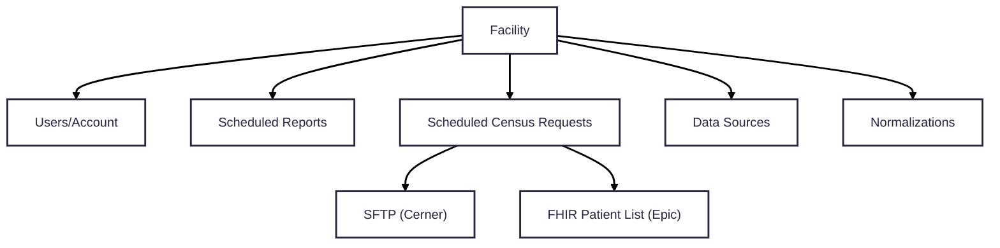
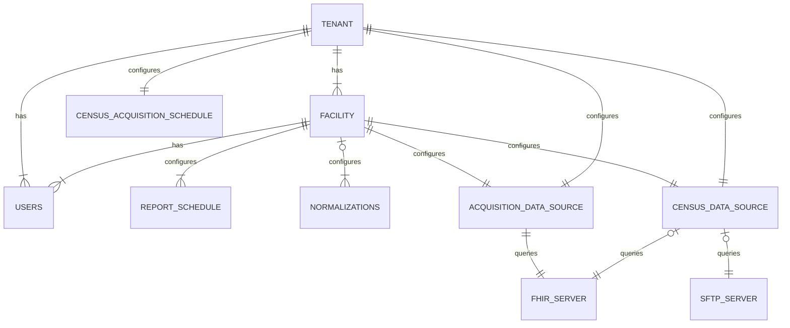

## Background

Link Cloud currently does not have relationship hierarchy present that ties a reporting facility to their parent hospital network. It has been identified that hospital networks often share a single FHIR endpoint as its data source. Because of this, some facility configurations can be redundant. Additionally, there may be query/reporting effieciencies that we can access through this newly present hierarchy. The proposal will target developing the tenant/facility hierachy accross each Link Cloud service. This will include code, data model, Kafka event and API updates.

## Links

## Current Configuration Implementation

The current implementation of Link Cloud represents each facility record without a parent tenant. Because of this, the configuration model to enroll is at the facility level. Below is a diagram of the current configuration relationship for each facility:

### Data Source Configuration 

### Census Configuration

## Requirements

## Proposed Changes

### Proposed Configuration State

### Tenant Service

#### API Updates

| Request Type | Route                             | API Link                                                                      |  
| ------------ | -----------------------------     | ----------------------------------------------------------------------------- |
| GET          | /tenants                          | <Link href="../../services/TenantService/0.2.0/spec/openapi">Link Here</Link> |
| POST         | /tenants                          |                                                                               |
| PUT          | /tenants/\{id\}                   |                                                                               |
| DELETE       | /tenants/\{id\}                   |                                                                               |
| GET          | /tenants/\{id\}/facilities        |                                                                               |
| POST         | /tenants/\{id\}/facilities        |                                                                               |
| PUT          | /tenants/\{id\}/facilities/\{id\} |                                                                               |
| DELETE       | /tenants/\{id\}/facilities/\{id\} |                                                                               |

#### Kafka Updates

The following Kafka producer changes will need to be applied to conform to the new event specifications:

| Topic                   | Type      | Event Link                                                                 |  
| ------------            | --------- | -------------------------------------------------------------------------- |
| ReportScheduled         | Producer  | <Link href="../../events/ReportScheduled/0.2.0">Link Here</Link>           |
| GenerateReportRequested | Producer  | <Link href="../../commands/GenerateReportRequested/0.2.0">Link Here</Link> |

**NOTES**:
  - QUESTION FOR ARCH: Do we want to represent the OrgId as a separate column?
  - GET Tenant returns a response body that includes an array of facility resources
  - GET Facility returns a response body that includes a tenant block

### Census Service

#### API Updates

| Request Type | Route                             | API Link                                                                      |  
| ------------ | -----------------------------     | ----------------------------------------------------------------------------- |
| GET          | /census/conf                          | <Link href="">Link Here</Link> |

#### Kafka Updates

The following Kafka consumer and producer changes will need to be applied to conform to the new event specifications:

| Topic                     | Type      | Event Link                                                                 |  
| ------------              | --------- | -------------------------------------------------------------------------- |
| PatientCensusScheduled    | Producer  | <Link href="../../events/PatientCensusScheduled/0.2.0">Link Here</Link>    |
| PatientEvent              | Producer  | <Link href="../../events/PatientEvent/0.2.0">Link Here</Link>              |
| PatientListAcquired       | Consumer  | <Link href="">Link Here</Link>                                             |
| PatientListAcquired-Retry | Consumer  | <Link href="">Link Here</Link>                                             |

### Query Dispatch Sevice

#### Kafka Updates

If the Query Dispatch Retirement epic has not been completed ([Link Here](https://lantana.atlassian.net/browse/LNK-4193)), the following Kafka consumer and producer changes will need to be applied to conform to the new event specifications:

| Topic                    | Type      | Event Link                                                                  |  
| ------------             | --------- | --------------------------------------------------------------------------- |
| ReportScheduled          | Consumer  | <Link href="../../events/ReportScheduled/0.2.0">Link Here</Link>            |
| ReportScheduled-Retry    | Consumer  | <Link href="">Link Here</Link>                                              |
| ReportScheduled-Error    | Producer  | <Link href="">Link Here</Link>                                              |
| PatientEvent-Retry       | Consumer  | <Link href="">Link Here</Link>                                              |
| PatientEvent-Error       | Producer  | <Link href="">Link Here</Link>                                              |
| DataAcquisitionRequested | Producer  | <Link href="../../commands/DataAcquisitionRequested/0.2.0">Link Here</Link> |

### Census Service

#### Kafka Updates

The following Kafka consumer and producer changes will need to be applied to conform to the new event specifications:

| Topic                     | Type      | Event Link                                                                 |  
| ------------              | --------- | -------------------------------------------------------------------------- |
| PatientCensusScheduled    | Producer  | <Link href="../../events/PatientCensusScheduled/0.2.0">Link Here</Link>    |
| PatientEvent              | Producer  | <Link href="../../events/PatientEvent/0.2.0">Link Here</Link>              |
| PatientListAcquired       | Consumer  | <Link href="">Link Here</Link>                                             |
| PatientListAcquired-Retry | Consumer  | <Link href="">Link Here</Link>                                             |
| PatientListAcquired-Error | Producer  | <Link href="">Link Here</Link>                                             |

### Data Acquisition Service

#### Kafka Updates

The following Kafka consumer and producer changes will need to be applied to conform to the new event specifications:

| Topic                        | Type      | Event Link                                                                 |  
| ------------                 | --------- | -------------------------------------------------------------------------- |
| PatientCensusScheduled       | Consumer  | <Link href="../../events/PatientCensusScheduled/0.2.0">Link Here</Link>    |
| PatientCensusScheduled-Retry | Consumer  | <Link href="">Link Here</Link>                                             |
| PatientCensusScheduled-Error | Producer  | <Link href="">Link Here</Link>                                             |
| ReadyToAcquire               | Producer  | <Link href="">Link Here</Link>                                             |

**NOTES**:
- Data Source configuration for an entire tenant
- Overridable Data Source configurations for a facility within a tenant
- How does this affect List Ids for Epic sites?

### Data Acquisition Worker Service

#### Kafka Updates

The following Kafka consumer and producer changes will need to be applied to conform to the new event specifications:

| Topic                        | Type      | Event Link                                                                 |  
| ------------                 | --------- | -------------------------------------------------------------------------- |
| ReadyToAcquire               | Consumer  | <Link href="">Link Here</Link>                                             |
| ReadyToAcquire-Retry         | Consumer  | <Link href="">Link Here</Link>                                             |
| ReadyToAcquire-Error         | Producer  | <Link href="">Link Here</Link>                                             |
| ResourceAcquired             | Producer  | <Link href="../../events/ResourceAcquired/0.2.0">Link Here</Link>          |

### Normalization Service

#### Kafka Updates

The following Kafka consumer and producer changes will need to be applied to conform to the new event specifications:

| Topic                        | Type      | Event Link                                                                 |  
| ------------                 | --------- | -------------------------------------------------------------------------- |
| ResourceAcquired             | Consumer  | <Link href="../../events/ResourceAcquired/0.2.0">Link Here</Link>          |
| ResourceAcquired-Retry       | Consumer  | <Link href="">Link Here</Link>                                             |
| ResourceAcquired-Error       | Producer  | <Link href="">Link Here</Link>                                             |
| ResourceNormalized           | Producer  | <Link href="../../events/ResourceNormalized/0.2.0">Link Here</Link>        |

### Measure Eval Service

#### Kafka Updates

The following Kafka consumer and producer changes will need to be applied to conform to the new event specifications:

| Topic                        | Type      | Event Link                                                                 |  
| ------------                 | --------- | -------------------------------------------------------------------------- |
| ResourceNormalized           | Consumer  | <Link href="../../events/ResourceNormalized/0.2.0">Link Here</Link>        |
| ResourceNormalized-Retry     | Consumer  | <Link href="">Link Here</Link>                                             |
| ResourceNormalized-Error     | Producer  | <Link href="">Link Here</Link>                                             |
| ResourceEvaluated            | Producer  | <Link href="../../events/ResourceEvaluated/0.2.0">Link Here</Link>         |

### Report Service

#### Kafka Updates

The following Kafka consumer and producer changes will need to be applied to conform to the new event specifications:

| Topic                         | Type      | Event Link                                                                 |  
| ------------                  | --------- | -------------------------------------------------------------------------- |
| ResourceEvaluated             | Consumer  | <Link href="../../events/ResourceEvaluated/0.2.0">Link Here</Link>         |
| ResourceEvaluated-Retry       | Consumer  | <Link href="">Link Here</Link>                                             |
| ResourceEvaluated-Error       | Producer  | <Link href="">Link Here</Link>                                             |
| ReportScheduled               | Consumer  | <Link href="../../events/ReportScheduled/0.2.0">Link Here</Link>           |
| ReportScheduled-Retry         | Consumer  | <Link href="">Link Here</Link>                                             |
| ReportScheduled-Error         | Producer  | <Link href="">Link Here</Link>                                             |
| GenerateReportRequested       | Consumer  | <Link href="../../commands/GenerateReportRequested/0.2.0">Link Here</Link> |
| GenerateReportRequested-Retry | Consumer  | <Link href="">Link Here</Link>                                             |
| GenerateReportRequested-Error | Producer  | <Link href="">Link Here</Link>                                             |
| PatientListAcquired           | Consumer  | <Link href="">Link Here</Link>                                             |
| PatientListAcquired-Retry     | Consumer  | <Link href="">Link Here</Link>                                             |
| PatientListAcquired-Error     | Producer  | <Link href="">Link Here</Link>                                             |
| PayloadSubmitted              | Consumer  | <Link href="">Link Here</Link>                                             |
| PayloadSubmitted-Retry        | Consumer  | <Link href="">Link Here</Link>                                             |
| PayloadSubmitted-Error        | Producer  | <Link href="">Link Here</Link>                                             |
| ValidationComplete            | Consumer  | <Link href="../../events/ValidationComplete">Link Here</Link>              |
| ValidationComplete-Retry      | Consumer  | <Link href="">Link Here</Link>                                             |
| ValidationComplete-Error      | Producer  | <Link href="">Link Here</Link>                                             |
| SubmitPayload                 | Producer  | <Link href="">Link Here</Link>                                             |
| ReadyForValidation            | Producer  | <Link href="">Link Here</Link>                                             |
| DataAcquisitionRequested      | Producer  | <Link href="">Link Here</Link>                                             |

### Submission Service

#### Kafka Updates

The following Kafka consumer and producer changes will need to be applied to conform to the new event specifications:

| Topic                         | Type      | Event Link                                                                 |  
| ------------                  | --------- | -------------------------------------------------------------------------- |
| SubmitPayload                 | Consumer  | <Link href="">Link Here</Link>                                             |
| SubmitPayload-Retry           | Consumer  | <Link href="">Link Here</Link>                                             |
| SubmitPayload-Error           | Producer  | <Link href="">Link Here</Link>                                             |

### Account Service

TODO
