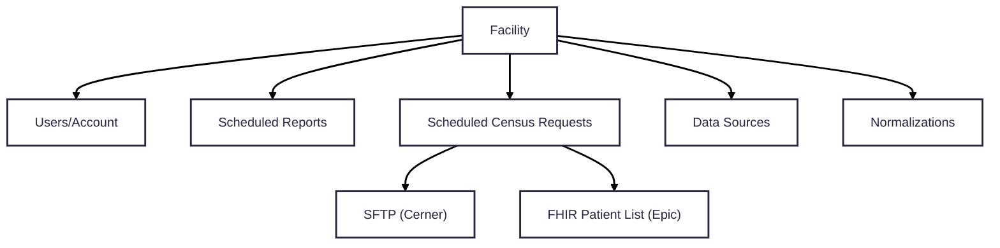
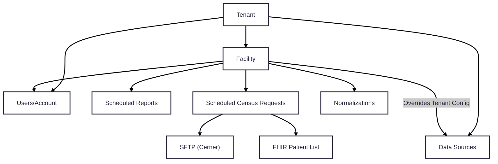

# Background

# Links

# Current Implementation

## Facility Configuration

- All configurations are on the facility level

## Data Source Configuration 

## Census Configuration

# Requirements

# Proposed Changes

## Proposed Configuration State

## Tenant Service

- API to perform CRUD operations for a Tenant:
  - TODO: Get
  - TODO: Post
  - TODO: Put
  - TODO: Delete  

- API updates to Facility endpoint to support parent Tenant
  - QUESTION FOR ARCH: Do we want to represent the OrgId as a separate column?

## Census Service

TODO

## Data Acquisition Service

- Data Source configuration for an entire tenant
- Overridable Data Source configurations for a facility within a tenant
- How does this affect List Ids for Epic sites?

## Account Service

TODO

## Event Structure

- Events containing Facility Id should also include Tenant Id
