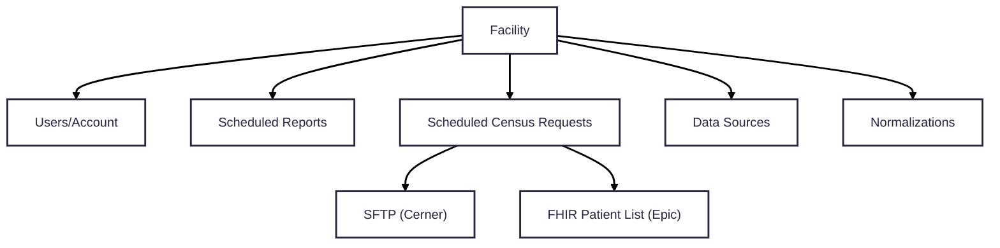
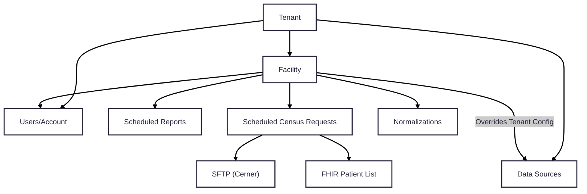

## Background

Link Cloud currently does not have relationship hierarchy present that ties a reporting facility to their parent hospital network. It has been identified that hospital networks often share a single FHIR endpoint as its data source. Because of this, some facility configurations can be redundant. Additionally, there may be query/reporting effieciencies that we can access through this newly present hierarchy. The proposal will target developing the tenant/facility hierachy accross each Link Cloud service. This will include code, data model, Kafka event and API updates.

## Links

## Current Configuration Implementation

The current implementation of Link Cloud represents each facility record without a parent tenant. Because of this, the configuration model to enroll is at the facility level. Below is a diagram of the current configuration relationship for each facility:

### Data Source Configuration 

### Census Configuration

## Requirements

## Proposed Changes

### Proposed Configuration State

### Tenant Service

- API to perform CRUD operations for a Tenant:

| Request Type | Route                             | API Link                                                                      |  
| ------------ | -----------------------------     | ----------------------------------------------------------------------------- |
| GET          | /tenants                          | <Link href="../../services/TenantService/0.2.0/spec/openapi">Link Here</Link> |
| POST         | /tenants                          |                                                                               |
| PUT          | /tenants/\{id\}                   |                                                                               |
| DELETE       | /tenants/\{id\}                   |                                                                               |
| GET          | /tenants/\{id\}/facilities        |                                                                               |
| POST         | /tenants/\{id\}/facilities        |                                                                               |
| PUT          | /tenants/\{id\}/facilities/\{id\} |                                                                               |
| DELETE       | /tenants/\{id\}/facilities/\{id\} |                                                                               |

**NOTES**:
  - QUESTION FOR ARCH: Do we want to represent the OrgId as a separate column?
  - GET Tenant returns a response body that includes an array of facility resources
  - GET Facility returns a response body that includes a tenant block

### Census Service

TODO

### Data Acquisition Service

- Data Source configuration for an entire tenant
- Overridable Data Source configurations for a facility within a tenant
- How does this affect List Ids for Epic sites?

### Account Service

TODO

### Event Structure

- Events containing Facility Id should also include Tenant Id
