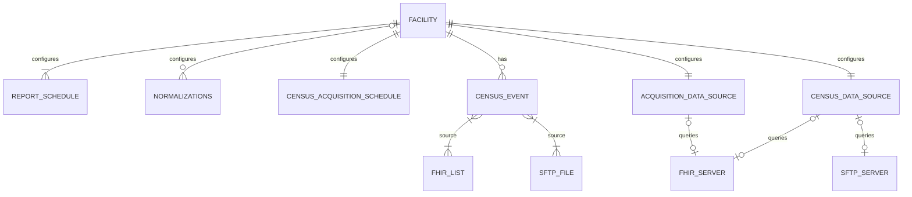
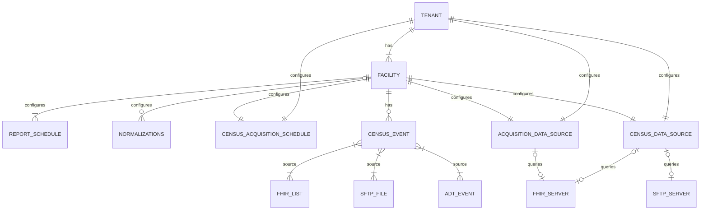
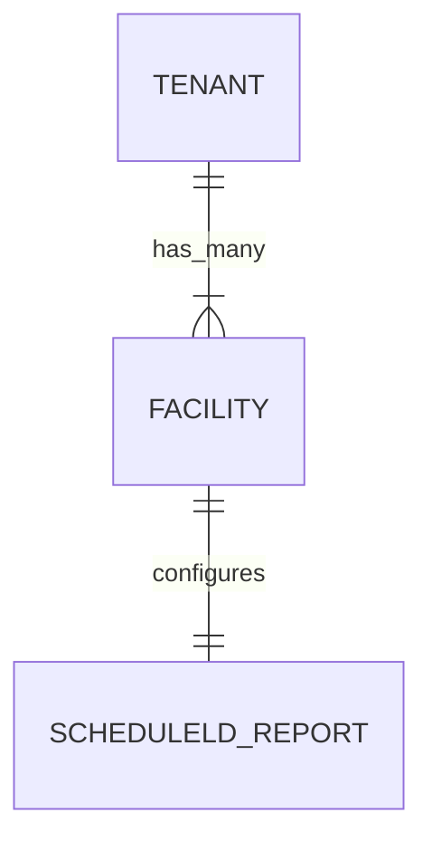
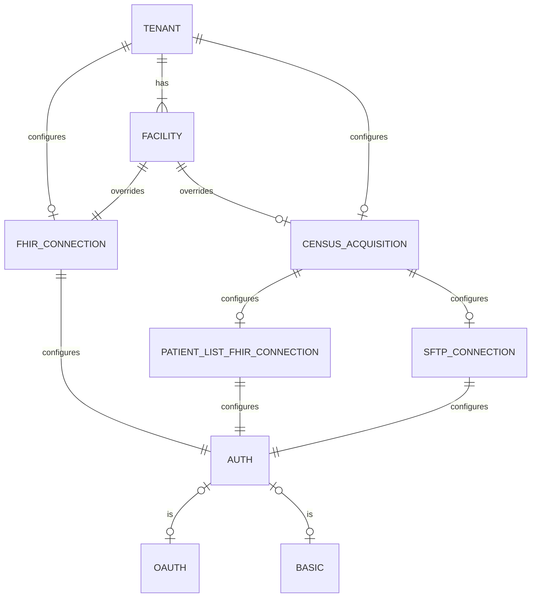
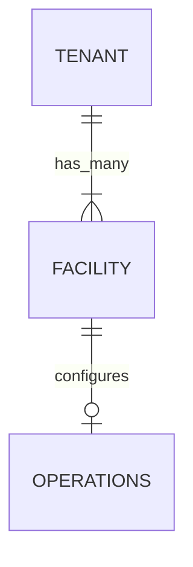
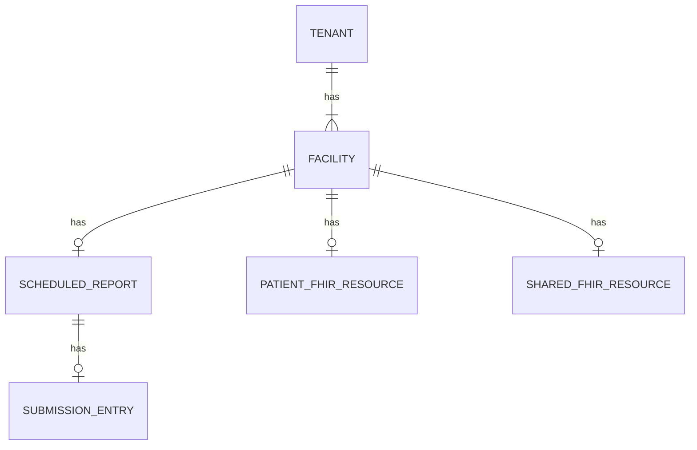

## Background

Link Cloud currently does not have relationship hierarchy present that ties a reporting facility to their parent hospital network. It has been identified that hospital networks often share a single FHIR endpoint as its data source. Because of this, some facility configurations can be redundant. Additionally, there may be query and reporting effieciencies that we can access through this newly present hierarchy. This proposal will target developing the tenant/facility hierachy accross each Link Cloud service. Data models, Kafka events and service API updates will need to be made to support the requirements detailed in this proposal.

## Links

## Current Configuration Implementation

The current implementation of Link Cloud represents each facility record as a tenant. Because of this, each tenant that enrolls into the system is at the facility level. Below is a diagram of the current configuration relationship for each facility:



In our current implementation, a health system **must** configure each facility separately regardless if they may share similar settings. For example, if a Tenant has a single FHIR server data source, each facility will still need to apply the same Data Acquisition configs per facility. This is an unecessary burden on sites that decide to enroll into Link Cloud. Other types of duplicate configuration burdens (Census scheduling, Acquisition Lag, etc.) can possibly exist when a tenant also configures multiple facilities. 

## Requirements

### System Requirements

| Link | Description | Requirement Type |
| ---- | ----------- | ---------------- |
|      | Link Rest API's must conform to the route guidance instructions detailed in the Link Cloud API guidance page | Interface |
|      | Link must be capabale of configuring a single tenant/multi facility relationship hierarchy | Interface |

## Proposed Change Summary

### Single Tenant Multi-Facility Relationship

The new proposed relationship will be built where the managing tenant (health system) has one to many reporting facilities. Like Link Cloud's current design, each facility will be responsible for their own reporting. Adding a tenant relationship to facilities allows for sites to configure on either a tenant level (encapsulating the entire facility) or the facility level (for facilities that need targetted configurations that differ from the parent Tenant). For example, a tenant can configure a single FHIR server that all child facilities will interface with for reporting. But if one of the facilities for a parent tenant uses a different data source, they can still have control over configuring for their site. To support this change, services across Link Cloud will need their API's, Kafka Consumers and Producers, and Data Models updated. Below is the proposed relationship with tenants and facilities to various entities in Link Cloud:



**Service Database Updates**: Any service database that has tables or collections for a facilityId **must** also maintain the new tenant id.

**Report Schedule**: In the Tenant service, scheduled reports will still be managed per facility. However, each facility **must** now have a parent Tenant.  

**Normalizations**: Normalization operations will still be managed per facility

**Census Acquisition Schedule**: The Census scheduling component should be able to be managed at the Tenant level. If a facility wants to run census acquisitions at a different duration than their parent tenant, they should be able to do so.     

**Acquisition and Census Data Source**: The Data Acquisition data sources (FHIR Patient List config, FHIR Acquisition config, SFTP census config) should be able to be managed at the tenant level. If a facility wants to configure a data source at the facility level, they should be able to do so. 

### API Route Conformance

Currently, each Link Cloud service has their own API route definitions to perform various user and system tasks (creating configurations, updating measures, accessing reports). From a user perspective, this may lead to confusion when making requests from one service to another. The Route Guidelines section of the API Guidance page (<Link href="../dev/api_guidance">Link Here</Link>) has guidelines on how we define our service API routes. Since the tenant-facility proposal will include changes to the Rest API's it gives us the opportunity to align each service to what matches on the guidance page. 

**Tenant Validation**

When tenant related API requests are made, the Link service **must** validate that the Tenant exists in the Tenant service. This functionality should be similar to current service functionality that validates that the tenant exists. Additionally, services have a Service Registry app setting to bypass Tenant validation. A similar app config should be available for Tenant validation bypasses. An example of the current config is below:

```
"ServiceRegistry": {
  "TenantService": {
	  "TenantServiceUrl": "https://localhost:7332",
	  "CheckIfTenantExists": true,
	  "GetTenantRelativeEndpoint": "facility/"
  }
}
```

**YARP Updates**

Each service will need to update their section of the ReverseProxy setting in `\DotNet\LinkAdmin.BFF\appsettings.Development.json`. Below is a Report service update example of the needed update:

```

"route8": {
  "ClusterId": "ReportService",
  "AuthorizationPolicy": "AuthenticatedUser",
  "Match": {
    "Path": "api/report/{**catch-all}"
  },
  "Transforms": [
    { "PathPattern": "/{**catch-all}" }
  ]
}
```

The following `PathPattern` transform example for each service needs to be added to the BFF container in `docker-compose.yml`:

```
ReverseProxy__Routes__route8__Transforms__0__PathPattern: /{**catch-all}
```

**Service Registry updates**

The following updates need to be made to the `\DotNet\Shared\Application\Models\Configs\ServiceRegistry.cs` file:

- Remove `/api` for each API URL 
- Remove `/<service-name>` for any references to the API URL

### Out of Scope

- This proposal assumes that the Query Dispatch service has been removed from Link Cloud.
- Updates to the Account service will be added in a separate Jira epic. No changes to the Account service will be proposed here.
- Data querying efficiency strategy for tenants 

### TODO

- https://learn.microsoft.com/en-us/azure/azure-sql/database/saas-tenancy-app-design-patterns?view=azuresql
- Delete tenant / facility that scrubs all of Link

## Proposed Service Changes

### Tenant Service

#### Data Model Updates

The Tenant Service data model must maintain a relationship of a single Tenant record to many child Facilities. Each of the child Facility records will be responsible for maintaning their own individual scheduled reports (exactly as how it does in Link Cloud's current state):



#### API Updates

| Request Type | Route                             								 																	| Note  																																																													   				 |
| ------------ | ------------------------------------------------  																	| --------------------																																																						   				 |
| GET					 | /info 																						 																	| Replaces `/api/info`																																																						   				 |
| GET          | /tenants                          								 																	| New endpoint: Returns all tenants including info for each related facility  																										   				 |
| POST         | /tenants                          								 																	| New endpoint: Creates a tenant record																																														   				 |
| PUT          | /tenants/\{tenant-id\}                   				 																	| New endpoint: Updates a tenant record																																														   				 |
| DELETE       | /tenants/\{tenant-id\}                   				 																	| New endpoint: Deletes a tenant record and all related facilities																																   				 |
| GET          | /tenants/\{tenant-id\}/facilities        				 																	| Replaces `/api/Facility`. Gets a facility record. Response should include tenant info																							 				 |
| POST         | /tenants/\{tenant-id\}/facilities        				 																	| Replaces `/api/Facility`. Facility Id should be autogenerated when not supplied. This will support NHSN OrgIds and other future Link cases |
| PUT          | /tenants/\{tenant-id\}/facilities/\{facility-id\} 																	| Replaces `/api/Facility`																																																					 				 |
| DELETE       | /tenants/\{tenant-id\}/facilities/\{facility-id\} 																	| Replaces `/api/Facility`																																																					 				 |
| POST         | /facilities/\{facility-id\}/reports/\{report-id\}/$regenererate?bypass-submission 	|	Replaces POST `/api/Facility/{facility-id}/RegenerateReport` 																																		   				 |
| POST         | /facilities/\{facility-id\}/reports/\{report-id\}/$adhoc 													| Replaces POST `/api/Facility/{{facility-id}}/AdHocReport`																																				   				 |

#### Kafka Updates

The following Kafka producer changes will need to be applied to conform to the new event specifications:

| Topic                   | Type      | Event Link                                                                 |  
| ------------            | --------- | -------------------------------------------------------------------------- |
| ReportScheduled         | Producer  | <Link href="../../events/ReportScheduled/0.2.0">Link Here</Link>           |
| GenerateReportRequested | Producer  | <Link href="../../commands/GenerateReportRequested/0.2.0">Link Here</Link> |

### Census Service

#### Data Model Updates


//TODO: Add Census event sourcing tables to data model

#### API Updates

| Request Type | Route                             					  						 | Note                                             |  
| ------------ | -----------------------------------------------					 | -----------------------------------------------  |
| GET					 | /info 																						 				 |																								  |
| GET          | /configs/\{id\}       					  												 |  																								|
| GET          | /configs/tenants/\{tenant-id\}       					  				 |  																								|
| POST         | /configs/tenants/\{tenant-id\}       					  				 |  																								|
| PUT          | /configs/tenants/\{tenant-id\}       					  				 |  																								|
| DELETE       | /configs/tenants/\{tenant-id\}?include-facilities				 |  																								|
| GET          | /configs/tenants/\{tenant-id\}/facilities/\{facility-id\} |  																								|
| POST         | /configs/tenants/\{tenant-id\}/facilities/\{facility-id\} |  																								|
| PUT          | /configs/tenants/\{tenant-id\}/facilities/\{facility-id\} |  																								|
| DELETE       | /configs/tenants/\{tenant-id\}/facilities/\{facility-id\} |  																								|

//TODO: PatientEvent and Encounter endpoints

#### Kafka Updates

The following Kafka consumer and producer changes will need to be applied to conform to the new event specifications:

| Topic                     | Type      | Event Link                                                               |  
| ------------              | --------- | ------------------------------------------------------------------------ |
| PatientCensusScheduled    | Producer  | <Link href="../../events/PatientCensusScheduled/0.2.0">Link Here</Link>  |
| PatientEvent              | Producer  | <Link href="../../events/PatientEvent/0.2.0">Link Here</Link>            |
| PatientListAcquired       | Consumer  | <Link href="../../events/PatientListsAcquired/0.2.0">Link Here</Link>    |
| PatientListAcquired-Retry | Consumer  | <Link href="../../events/PatientListsAcquired/0.2.0">Link Here</Link>    |
| PatientListAcquired-Error | Producer  | <Link href="../../events/PatientListsAcquired/0.2.0">Link Here</Link>    |

#### Code Updates

Update \Shared\Application\Services\TenantApiService.cs -> CheckFacilityExists to ensure that it points to the new Tenant route for facility validation

### Data Acquisition Service

#### Data Model Updates



#### API Updates

**NOTE**: No Authentication API updates have been added to the table since [LNK-4227](https://lantana.atlassian.net/browse/LNK-4227) has not been developed as of the time of writing this proposal. If an Auth endpoint still exists, please consider it with the following changes below. 

| Request Type | Route                        					                                              			| Note										     	 																																																		 |  
| ------------ | -----------------------------------------------------------------------              			| ----------------------------- 																																																		 |
| GET					 | /info 												  				                                              			| Replaces `/api/info`																																																							 |
| GET					 | /configs/fhir-patient-lists/\{id\} 	                                                			| New endpoint: returns patient list acquisition config by id																																				 |
| GET					 | /configs/fhir-patient-lists/tenants/\{tenant-id\}                            	      			| New endpoint: returns patient list acquisition config by tenant id. Should return tenant config as well as any facility overrides	 |
| POST				 | /configs/fhir-patient-lists/tenants/\{tenant-id\}                            	      			| New endpoint: creates patient list config for a tenant																																						 |
| PUT 				 | /configs/fhir-patient-lists/tenants/\{tenant-id\}                            	      			| New endpoint: updates patient list config for a tenant 																																						 |
| DELETE			 | /configs/fhir-patient-lists/tenants/\{tenant-id\}                            	      			| New endpoint: deletes patient list config for a tenant																																						 |
| GET					 | /configs/fhir-patient-lists/tenants/\{tenant-id\}/facilities/\{facility-id\} 	      			| Replaces `/api/data/{facility-id}/fhirQueryList`																																									 |
| POST				 | /configs/fhir-patient-lists/tenants/\{tenant-id\}/facilities/\{facility-id\} 	      			| Replaces `/api/data/fhirQueryList`																																																 |
| PUT 				 | /configs/fhir-patient-lists/tenants/\{tenant-id\}/facilities/\{facility-id\} 	      			| Replaces `/api/data/fhirQueryList`																																																 |
| DELETE			 | /configs/fhir-patient-lists/tenants/\{tenant-id\}/facilities/\{facility-id\} 	      			| Replaces `/api/data/{facility-id}/fhirQueryList`															 										      													 |
| GET					 | /configs/fhir-connections/\{id\} 	                                                  			| New endpoint: returns fhir connection config by id																																								 |
| GET					 | /configs/fhir-connections/tenants/\{tenant-id\}                            	        			| New endpoint: returns the fhir connection config by tenant id																																			 |
| POST				 | /configs/fhir-connections/tenants/\{tenant-id\}                            	        			| New endpoint: creates a fhir connection config for a tenant id																																		 |
| PUT 				 | /configs/fhir-connections/tenants/\{tenant-id\}                            	        			| New endpoint: update a fhir connection config for a tenant id 																																		 |
| DELETE			 | /configs/fhir-connections/tenants/\{tenant-id\}                            	        			| New endpoint: delete a fhir connection config for a tenant id																																			 |
| POST         | /configs/fhir-connections/tenants/\{tenant-id\}/$validate                            			| New endpoint: validate that the tenant fhir connection config successfully connects to the configured fhir server									 |  
| GET					 | /configs/fhir-connections/tenants/\{tenant-id\}/facilities/\{facility-id\} 	        			| Replaces `/api/data/{facility-id}/fhirQueryConfiguration`																																					 |
| POST				 | /configs/fhir-connections/tenants/\{tenant-id\}/facilities/\{facility-id\} 	        			|	Replaces `/api/data/fhirQueryConfiguration/`																																											 |
| PUT 				 | /configs/fhir-connections/tenants/\{tenant-id\}/facilities/\{facility-id\} 	        			| Replaces `/api/data/fhirQueryConfiguration/`																																											 |
| DELETE			 | /configs/fhir-connections/tenants/\{tenant-id\}/facilities/\{facility-id\} 	        			|	Replaces `/api/data/{facility-id}/fhirQueryConfiguration`																																					 |
| POST         | /configs/fhir-connections/tenants/\{tenant-id\}/facilities/\{facility-id\}/$validate 			| Replaces `api/data/connectionValidation/{facility-id}/$validate`																																	 |  
| GET					 | /acquisition-logs/				 	                                                          			| Replaces `api/data/acquisition-logs`																																															 |
| GET					 | /acquisition-logs/\{id\} 	                                                          			|	Replaces `api/data/acquisition-logs/{id}`																																													 |
| PUT					 | /acquisition-logs/\{id\} 	                                                          			|	Replaces `api/data/acquisition-logs/{id}`																																													 |
| DELETE  		 | /acquisition-logs/\{id\} 	                                                          			|	Replaces `api/data/acquisition-logs/{id}`																																													 |
| GET					 | /acquisition-logs/tenants/\{tenant-id\}/facilities/\{facility-id\}/patients/\{patient-id\} |	Replaces `api/data/acquisition-logs/facility/{facility-id}/patient/{patient-id}`																									 |
| GET					 | /acquisition-logs/tenants/\{tenant-id\} 	                                            			| New endpoint: returns logs by tenant id																																														 |
| GET					 | /acquisition-logs/tenants/\{tenant-id\}/facilities/\{facility-id\}                   			|	Replaces `api/data/acquisition-logs/facility/{facility-id}`																																				 |
| GET					 | /acquisition-logs/report-statistics/\{report-id\} 	                                				| Replaces `api/data/acquisition-logs/report/{reportId}/statistics`																																	 |
| POST  		   | /acquisition-logs/\{id\}/$process                                                    			| Replaces `api/data/acquisition-logs/{id}/process`																																									 |
| GET					 | /fhir-queries/tenants/\{tenant-id\}/facilities\{facility-id\}                         			|	Replaces `api/data/{facilityId}/[controller]`																																											 |
| GET					 | /query-plans/tenants/\{tenant-id\}																													| New endpoint: returns query plans for a tenant 																																										 |
| POST				 | /query-plans/tenants/\{tenant-id\}																													| New endpoint: creates query plans for a tenant 																																										 |
| PUT				 	 | /query-plans/tenants/\{tenant-id\}																													| New endpoint: updates query plans for a tenant 																																										 |
| DELETE		 	 | /query-plans/tenants/\{tenant-id\}																													| New endpoint: deletes a query plans for a tenant (should validate that all tenant facilities have a query plan prior to deleting)  |
| GET					 | /query-plans/tenants/\{tenant-id\}/facilities\{facility-id\}																| Replaces `api/data/{facilityId}/QueryPlan` 																																												 |
| POST				 | /query-plans/tenants/\{tenant-id\}/facilities\{facility-id\}																| Replaces `api/data/{facilityId}/QueryPlan` 																																												 |
| PUT				 	 | /query-plans/tenants/\{tenant-id\}/facilities\{facility-id\}																| Replaces `api/data/{facilityId}/QueryPlan` 																																												 |
| DELETE		 	 | /query-plans/tenants/\{tenant-id\}/facilities\{facility-id\}																| Replaces `api/data/{facilityId}/QueryPlan` 																																												 |

#### Kafka Updates

This proposal assumes that the Query Dispatch service has been removed from Link Cloud. The following Kafka consumer and producer changes will need to be applied to conform to the new event specifications:

| Topic                        		| Type      | Event Link                                                                  |  
| ------------                 		| --------- | --------------------------------------------------------------------------  |
| PatientCensusScheduled       		| Consumer  | <Link href="../../events/PatientCensusScheduled/0.2.0">Link Here</Link>     |
| PatientCensusScheduled-Retry 		| Consumer  | <Link href="../../events/PatientCensusScheduled/0.2.0">Link Here</Link>     |
| PatientCensusScheduled-Error 		| Producer  | <Link href="../../events/PatientCensusScheduled/0.2.0">Link Here</Link>     |
| DataAcquisitionRequested				| Consumer  | <Link href="../../commands/DataAcquisitionRequested/0.2.0">Link Here</Link> |
| DataAcquisitionRequested-Retry	| Consumer  | <Link href="../../commands/DataAcquisitionRequested/0.2.0">Link Here</Link> |
| DataAcquisitionRequested-Error	| Producer  | <Link href="../../commands/DataAcquisitionRequested/0.2.0">Link Here</Link> |
| PatientEvent								 		| Consumer  | <Link href="../../events/PatientEvent/0.2.0">Link Here</Link>							  |
| PatientEvent-Retry					 		| Consumer  | <Link href="../../events/PatientEvent/0.2.0">Link Here</Link>							  |
| PatientEvent-Error					 		| Producer  | <Link href="../../events/PatientEvent/0.2.0">Link Here</Link>							  |
| ReadyToAcquire               		| Producer  | <Link href="../../events/ReadyToAcquire/0.2.0">Link Here</Link>             |

**NOTES**:
- How does this affect List Ids for Epic sites? As of now, the API allows for lists at the tenant level. This will need to change so that the data source is at the tenant level but the lists are still defined at the facility level

### Data Acquisition Worker Service

#### Kafka Updates

The following Kafka consumer and producer changes will need to be applied to conform to the new event specifications:

| Topic                  | Type      | Event Link                                                         		|  
| ------------           | --------- | ---------------------------------------------------------------------- |
| ReadyToAcquire         | Consumer  | <Link href="../../events/ReadyToAcquire/0.2.0">Link Here</Link>    		|
| ReadyToAcquire-Retry   | Consumer  | <Link href="../../events/ReadyToAcquire/0.2.0">Link Here</Link>    		|
| ReadyToAcquire-Error   | Producer  | <Link href="../../events/ReadyToAcquire/0.2.0">Link Here</Link>    		|
| ResourceAcquired       | Producer  | <Link href="../../events/ResourceAcquired/0.2.0">Link Here</Link>  		|
| PatientListAcquired    | Producer  | <Link href="../../events/PatientListsAcquired/0.2.0">Link Here</Link>  |

### Normalization Service

#### Data Model Updates



#### API Updates

| Request Type | Route                        																				 | Note                           										 																																|  
| ------------ | --------------------------------------																 | --------------------------------------------------------------------------------------------------------------			|
| GET					 | /info 												  																			 | Replaces `api/normalization/info`									 																																|
| GET					 | /operations/\{operation-id\} 																				 |																 										 																																|
| DELETE			 | /operations/\{operation-id\}																					 |																 										 																																|
| POST				 | /operations/																													 |																 										 																																|
| PUT  				 | /operations/																													 |																 										 																																|
| GET					 | /operations/tenants/\{tenant-id\}/facilities/\{facility-id\} 				 |																 										 																																|
| POST				 | /operations/tenants/\{tenant-id\}/facilities/\{facility-id\} 				 |																 										 																																|
| PUT  				 | /operations/tenants/\{tenant-id\}/facilities/\{facility-id\} 				 |																 										 																																|
| DELETE			 | /operations/tenants/\{tenant-id\}/facilities/\{facility-id\} 				 |																 										 																																|
| POST				 | /operations/tests																										 |																 										 																																|
| POST				 | /operations/\{operation-id\}/tests																		 |																 										 																																|
| GET					 | /operation-sequences/tenants/\{tenant-id\}/facilities/\{facility-id\} | 															 	 										 																																| 
| POST				 | /operation-sequences/tenants/\{tenant-id\}/facilities/\{facility-id\} | 															 	 										 																																| 
| DELETE			 | /operation-sequences/tenants/\{tenant-id\}/facilities/\{facility-id\} | 															 	 										 																																| 
| GET					 | /resources/																													 | Replaces `api/normalization/resource/resources`		 																																| 
| GET					 | /resources/\{resource-name\}																					 | Replaces `api/normalization/resource/{resource-name}` 																															| 
| POST				 | /resources/\{resource-name\}?bypass=true															 | Replaces `api/normalization/resource/{resource-name}` and combines `api/normalization/resource/{resource}/bypass` 	| 
| DELETE			 | /resources/\{resource-name\}																					 | Replaces `api/normalization/resource/{resource-name}` 																															| 
| POST				 | /resources/$initialize																								 | Replaces `api/normalization/resource/initialize` 																																	| 
| GET					 | /vendors/																													   | Replaces `api/normalization/vendor/vendors`		 																																		| 
| GET					 | /vendors/\{vendor-name\}																						   | Replaces `api/normalization/vendor/{vendor-name}`																																	| 
| POST				 | /vendors/\{vendor-name\}																						   | Replaces `api/normalization/vendor/{vendor-name}`																																	| 
| DELETE			 | /vendors/\{vendor-name\}																						   | Replaces `api/normalization/vendor/{vendor-name}`																																	| 
| GET					 | /vendors/presets																										   | Replaces `api/normalization/vendor/presets/{vendor-name}`																													| 
| POST				 | /vendors/presets																										   | Replaces `api/normalization/vendor/presets/{vendor-name}`																													| 
| GET					 | /vendors/\{vendor-name\}/presets/\{preset-id\}											   | Replaces `api/normalization/vendor/presets/{vendor-name}/{preset-id}`																							| 
| DELETE			 | /vendors/\{vendor-name\}/presets/\{preset-id\}											   | Replaces `api/normalization/vendor/presets/{vendor-name}/{preset-id}`																							| 

#### Kafka Updates

The following Kafka consumer and producer changes will need to be applied to conform to the new event specifications:

| Topic                        | Type      | Event Link                                                           |  
| ------------                 | --------- | -------------------------------------------------------------------- |
| ResourceAcquired             | Consumer  | <Link href="../../events/ResourceAcquired/0.2.0">Link Here</Link>    |
| ResourceAcquired-Retry       | Consumer  | <Link href="../../events/ResourceAcquired/0.2.0">Link Here</Link>    |
| ResourceAcquired-Error       | Producer  | <Link href="../../events/ResourceAcquired/0.2.0">Link Here</Link>    |
| ResourceNormalized           | Producer  | <Link href="../../events/ResourceNormalized/0.2.0">Link Here</Link>  |

### Measure Eval Service

#### API Updates

| Request Type | Route                        									| Note 										  			 		 																																																											 | 
| ------------ | ---------------------------- 									| ------------------------------------ 																																																											 |
| GET					 | /info 												  								|	Replaces `api/measure-definition/info`	 																																																									 |
| GET					 | /measure-definitions														| Replaces `api/measure-definition`		 																																																											 |
| PUT					 | /measure-definitions														| Replaces `api/measure-definition`		 																																																											 |
| GET					 | /measure-definitions/\{id\}										| Replaces `api/measure-definition/{id}`																																																										 |
| POST 				 | /measure-definitions/\{id\}/$evaluate					| Replaces `api/measure-definition/{id}/$evaluate`																																																					 |
| GET					 | /reports/\{report-id\}/patients/\{patient-id\}	| Replaces `api/patient/{facility-id}/{report-id}/{patient-id}`. Using report id and patient id in the request should be enough to return the correct bundle |

#### Kafka Updates

The following Kafka consumer and producer changes will need to be applied to conform to the new event specifications:

| Topic                        | Type      | Event Link                                                           |  
| ------------                 | --------- | -------------------------------------------------------------------- |
| ResourceNormalized           | Consumer  | <Link href="../../events/ResourceNormalized/0.2.0">Link Here</Link>  |
| ResourceNormalized-Retry     | Consumer  | <Link href="../../events/ResourceNormalized/0.2.0">Link Here</Link>  |
| ResourceNormalized-Error     | Producer  | <Link href="../../events/ResourceNormalized/0.2.0">Link Here</Link>  |
| ResourceEvaluated            | Producer  | <Link href="../../events/ResourceEvaluated/0.2.0">Link Here</Link>   |

### Validation Service

#### Data Model Updates

#### API Updates

| Request Type | Proposed Route       									  		  	  | Note    											  															 																						|  
| ------------ | --------------------------							  		  	  | ------------------------------------------------------------------------------------------------------ 		|
| GET					 | /info 			                  					  		  	  |	N/A		  											  														 																							|
| GET					 | /artifacts	                  					  		  	  | Replaces `/api/validation/artifact`			  									 																							|
| POST				 | /artifacts/$initialize        					  		  	  | Replaces `/api/validation/artifact/$initialize`							 																							|
| GET				   | /artifacts/types/\{type\}/names/\{name\}/contents  | Replaces `/api/validation/artifact/\{type\}/\{name\}/content` 																						|
| POST 				 | /categories/$initialize													  | Replaces `/api/validation/category/$initialize` 							 																						|
| POST 				 | /categories/$bulk-import													  | Replaces `/api/validation/category/$bulk-import`							 																						|
| GET 				 | /categories/$bulk-export													  | Replaces `/api/validation/category/$bulk-export`							 																						|
| GET 				 | /categories/																			  | Replaces `/api/validation/category`							 						 																							|
| GET 				 | /categories/\{id\}/rule													  | Replaces `/api/validation/category/{id}/rule`							 	 																							|
| GET 				 | /categories/\{id\}/rule-history									  | Replaces `/api/validation/category/{id}/rule/history`			 	 																							|
| POST				 | /$validate																				  | Replaces `/api/validation/$validate`													 																						| 
| POST				 | /$categorize																			  | Replaces `/api/validation/$categorize`												 																						| 
| GET					 | /results/reports/{report-id}											  | Replaces `/api/validation/result/{facility-id}/{report-id}` Using report id should be enough 							|
| GET					 | /results/reports/{report-id}/patients/{patient-id} | Replaces `/api/validation/result/{facility-id}/{report-id}/{patient-id}` Using report id should be enough |
| GET					 | /pre-qual/reports/\{report-id\}										| Replaces `/api/validation/pre-qual/:facilityId/:reportId`																									|

#### Kafka Updates

The following Kafka consumer and producer changes will need to be applied to conform to the new event specifications:

| Topic                     | Type      | Event Link                                                           |  
| ------------              | --------- | -------------------------------------------------------------------- |
| ValidationComplete        | Producer  | <Link href="../../events/ValidationComplete/0.2.0">Link Here</Link>  |
| ReadyForValidation 				| Consumer  | <Link href="../../events/ReadyForValidation/0.2.0">Link Here</Link>  |
| ReadyForValidation-Retry	| Consumer  | <Link href="../../events/ReadyForValidation/0.2.0">Link Here</Link>  |
| ReadyForValidation-Error	| Producer  | <Link href="../../events/ReadyForValidation/0.2.0">Link Here</Link>  |

### Report Service

#### Data Model Updates



#### API Updates

| Request Type | Route                             					  						 					|  Note																														|  
| ------------ | ----------------------------------------------------------------		|  -------------------------------------------------------------  |
| GET					 | /info 																						                  |			                                                            |
| GET          | /patient-bundles/facilities/\{facility-id\}/patient/\{patient-id\} | Replaces /api/Report/Bundle/Patient 	  												|
| GET          | /report-schedules/\{reportschedule-id\} 														| Replaces /api/Report/Schedule. Since reportScheduleId is required and is always associated with a facility, facility Id isn't needed as part of the request |
| GET          | /report-summaries/ 																                | Replaces /api/Report/summaries. Noticed this contains a nullable facility id param but also have summaries/facilities. We can remove the facility param and have a route dedicated to report summaries for a facility |
| GET          | /report-summaries/facilities/\{facility-id\}/ 	 									  | Replaces /api/Report/summaries/\{facilityId\} |
| GET          | /submission-entries/facilities/\{facility-id\}/ 									  | Replaces /api/Report/summaries/\{facilityId\}/measure-reports |
| GET          | /submission-entries/facilities/\{facility-id\}/ 									  | Replaces /api/Report/summaries/\{facilityId\}/measure-reports |

//TODO: There are more current API's that need to be added

#### Kafka Updates

The following Kafka consumer and producer changes will need to be applied to conform to the new event specifications:

| Topic                         | Type      | Event Link                                                                  |  
| ------------                  | --------- | --------------------------------------------------------------------------  |
| ResourceEvaluated             | Consumer  | <Link href="../../events/ResourceEvaluated/0.2.0">Link Here</Link>          |
| ResourceEvaluated-Retry       | Consumer  | <Link href="../../events/ResourceEvaluated/0.2.0">Link Here</Link>          |
| ResourceEvaluated-Error       | Producer  | <Link href="../../events/ResourceEvaluated/0.2.0">Link Here</Link>          |
| ReportScheduled               | Consumer  | <Link href="../../events/ReportScheduled/0.2.0">Link Here</Link>            |
| ReportScheduled-Retry         | Consumer  | <Link href="../../events/ReportScheduled/0.2.0">Link Here</Link>            |
| ReportScheduled-Error         | Producer  | <Link href="../../events/ReportScheduled/0.2.0">Link Here</Link>            |
| GenerateReportRequested       | Consumer  | <Link href="../../commands/GenerateReportRequested/0.2.0">Link Here</Link>  |
| GenerateReportRequested-Retry | Consumer  | <Link href="../../commands/GenerateReportRequested/0.2.0">Link Here</Link>  |
| GenerateReportRequested-Error | Producer  | <Link href="../../commands/GenerateReportRequested/0.2.0">Link Here</Link>  |
| PatientListAcquired           | Consumer  | <Link href="../../events/PatientListsAcquired/0.2.0">Link Here</Link>       |
| PatientListAcquired-Retry     | Consumer  | <Link href="../../events/PatientListsAcquired/0.2.0">Link Here</Link>       |
| PatientListAcquired-Error     | Producer  | <Link href="../../events/PatientListsAcquired/0.2.0">Link Here</Link>       |
| PayloadSubmitted              | Consumer  | <Link href="../../events/PayloadSubmitted/0.2.0">Link Here</Link>           |
| PayloadSubmitted-Retry        | Consumer  | <Link href="../../events/PayloadSubmitted/0.2.0">Link Here</Link>           |
| PayloadSubmitted-Error        | Producer  | <Link href="../../events/PayloadSubmitted/0.2.0">Link Here</Link>           |
| ValidationComplete            | Consumer  | <Link href="../../events/ValidationComplete/0.2.0">Link Here</Link>         |
| ValidationComplete-Retry      | Consumer  | <Link href="../../events/ValidationComplete/0.2.0">Link Here</Link>         |
| ValidationComplete-Error      | Producer  | <Link href="../../events/ValidationComplete/0.2.0">Link Here</Link>         |
| SubmitPayload                 | Producer  | <Link href="../../commands/SubmitPayload/0.2.0">Link Here</Link>            |
| ReadyForValidation            | Producer  | <Link href="../../events/ReadyForValidation/0.2.0">Link Here</Link>         |
| DataAcquisitionRequested      | Producer  | <Link href="../../commands/DataAcquisitionRequested/0.2.0">Link Here</Link> |

### Submission Service

#### API Updates

| Request Type | Route                        	| Note 										     																 		 |  
| ------------ | ---------------------------- 	| ----------------------------------------------------------------- |
| GET					 | /info 												  |	  			 																		 									   |
| GET          | /reports/\{reportschedule-id\} | This route replaces /api/Submisssions/\{facilityId\}/\{reportId\} |

#### Kafka Updates

The following Kafka consumer and producer changes will need to be applied to conform to the new event specifications:

| Topic                         | Type      | Event Link                                                                 |  
| ------------                  | --------- | -------------------------------------------------------------------------- |
| SubmitPayload                 | Consumer  | <Link href="../../commands/SubmitPayload">Link Here</Link>                 |
| SubmitPayload-Retry           | Consumer  | <Link href="../../commands/SubmitPayload">Link Here</Link>                 |
| SubmitPayload-Error           | Producer  | <Link href="../../commands/SubmitPayload">Link Here</Link>                 |

### Audit Service

#### API Updates

| Request Type | Route                        	| Note 										     																 		 |  
| ------------ | ---------------------------- 	| ---------------------------------------------------------------- |
| GET					 | /info 												  |																							 									   |

### Admin UI

- Create Tenant page
- Create Facility within a Tenant
- Tenant Available Configurations:
  - Census Acquisition Schedule
  - Census Acquisition Data Source (FHIR Patient List, SFTP)
  - FHIR Data Source
- Update Service API requests to conform to new route changes
- Update integreation page to support Kafka events that contain Tenant ID

### Azure Configuration Updates 

### Postman Updates
