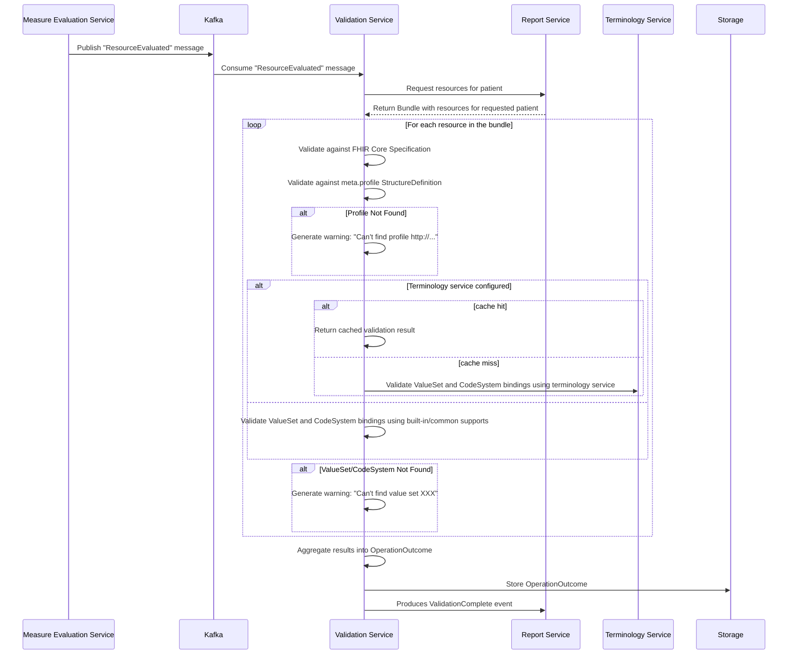

---

id: ValidationService
name: Validation Service
version: 0.6.0
summary: |
  Service that provides functionality for validating clinical data in the system.

receives:
  - id: ReadyForValidation
    
sends:
  - id: ValidateValueSetCode
  - id: ValidateCodeSystemCode
  - id: ValidationComplete

specifications:
  openapiPath: openapi.yml

badges:
  - content: "Java"
    backgroundColor: green
    textColor: white
  - content: MSSQL
    backgroundColor: red
    textColor: white
  - content: '8075'
    backgroundColor: gray
    textColor: white
  - content: "CPU: 500m-3"
    backgroundColor: blue
    textColor: white
  - content: "RAM: 3Gi-4Gi"
    backgroundColor: blue
    textColor: white

---

## Overview

The Validation service is a Java based application that is responsible for validating FHIR resources against the FHIR specification and any additional constraints defined by the Link Cloud tenant. The service utilizes the [HAPI FHIR library](https://hapifhir.io/) to perform the validation.

<SchemaViewer file="db.schema.json" title="Database Schema" />

## Nodes
  
<NodeGraph />

## Common Configurations

* [Azure App Config](/docs/custom/config/java#azure-app-config)
* [Telemetry](/docs/custom/config/java#telemetry)
* [Swagger](/docs/custom/config/java#swagger)
* [SQL Server](/docs/custom/config/java#sql-server)
* [Kafka](/docs/custom/config/java#kafka)
* [Service Authentication](/docs/custom/config/java#service-authentication)

## Environment Variables

| Env Variable      | Description                                                                       | Type/Value              | Secret? |
|-------------------|-----------------------------------------------------------------------------------|-------------------------|---------|
| JAVA_TOOL_OPTIONS | Specify min/max Java heap size                                                    | `-Xms1024 -Xmx2048`     | No      |

## Custom Configurations

| Property Name                     | Description                                                                                                          | Type/Value              | Secret? |
|-----------------------------------|----------------------------------------------------------------------------------------------------------------------|-------------------------|---------|
| artifact.init                     | Whether or not to initialize the artifacts in the database with default artifacts                                    | true (default) or false | No      |
| link.fhir-terminology-service-url | URL of an external standards-compliant FHIR Terminology server used directly for terminology calls. (First priority) | URL                     | No      |
| link.terminology-service-url      | Base URL of the Link Terminology Service; service appends /api/terminology/fhir automatically. (Second priority)     | URL                     | No      |
| cache.type                        | Cache implementation used for validate-code calls                                                                    | none, memory, redis     | No      |
| cache.validate-code.ttl           | TTL for validate-code cache entries (in seconds)                                                                     | integer (seconds)       | No      |
| spring.data.redis.host            | Redis host (used when cache.type=redis)                                                                              | string                  | No      |
| spring.data.redis.port            | Redis port (used when cache.type=redis)                                                                              | integer                 | No      |
| spring.data.redis.password        | Redis password (used when cache.type=redis)                                                                          | string                  | Yes     |
| spring.data.redis.username        | Redis username (optional; used when cache.type=redis)                                                                | string                  | No      |
| spring.data.redis.database        | Redis database index (used when cache.type=redis)                                                                    | integer                 | No      |

## Features and Functionality

### New Installation Notes

After a new installation of the validation service, the following should be run/executed:

* `/api/aritfact/$initialize` endpoint should be run to initialize the database with artifacts that are embedded in the validation service.
* `/api/category/$initialize` endpoint should be run to initialize the database with default categories stored in `/src/main/resources/categories.json` (within the code-base)

PENDING: This functionality is going to be altered so that they are automatically initialized on service startup when no artifacts or categories already exist in the service's database.

### Upload & Storage

Artifacts are uploaded either individual or as an NPM package (preferred).

- Individually: `PUT /api/validation/artifact/:type/:name`
- `type` = "RESOURCE"
- `name` = FHIR resource `id`
- As a package: `PUT /api/validation/artifact/:type/:name`
- `type` = "PACKAGE"
- `name` = NPM package id

> Note: The Admin UI currently only supports uploading a FHIR `Bundle` of resources. Doing so implies that the Admin UI can only upload individual resources from that Bundle to the validation service. We may consider using NPM packages in the Admin UI and aligning the MeasureEval service and the Validation service to use just NPM packages.

### Process Flow

<AccordionGroup>
  <Accordion title="1. Measure Evaluation Completion">
    - The Measure Evaluation Service evaluates a patient.
    - Once evaluation is complete, it produces a Kafka `ResourceEvaluated` message for each resource returned by measure evaluation (including the MeasureReport).
  </Accordion>
  <Accordion title="2. Report Services Persists MeasureReport">
    The report service consumes `ResourceEvaluated` and persists the resources.
    * When the `MeasureReport` is processed by the Report service, it uses that to determine when it has received and persisted *all* resources.
    * After all resources are persisted, the status of the patient for the submission changes to `ReadyToValidate`.
    * After the status of the patient's submission changes, it produces a `ReadyForValidation` event.
  </Accordion>
  <Accordion title="3. Validation Service Consumption">
    - The Validation Service consumes the Kafka `ReadyForValidation` event.
    - It retrieves the **MeasureReport** for the specified patient from the Report Service.
    - It extracts all contained FHIR resources and constructs a **Bundle** for validation.
  </Accordion>
  <Accordion title="4. Validation Execution">
    - Each resource in the bundle is validated individually.
    - The validation process includes:
    - **FHIR Core Specification Validation**: Ensures compliance with the base FHIR standard.
    - **Profile Validation**: Each resource is checked against the profiles asserted in `meta.profile`.
    - If a required **StructureDefinition** (profile) is missing, a **warning** is generated:
    *"Can't find profile http://.../us-core-observation"*
    - **ValueSet and CodeSystem Validation**: Ensures that coded elements conform to the expected ValueSets and CodeSystems.
    - If a required **ValueSet** or **CodeSystem** is missing, a **warning** is generated:
    *"Can't find value set XXX"*
    - All validation results are aggregated into a single **OperationOutcome**, capturing any validation issues.
    - The **OperationOutcome** containing all validation issues is stored for further processing or review.
    - The categorization process is initiated against the validation issues found, and each issue is matched (if possible) to a category.
    - Categorized results are persisted in the database.
    - The validation service produces a `ValidationComplete` Kafka event and includes an indication of whether the patient's submission is valid.
  </Accordion>
</AccordionGroup>

### Configuration

The Validation Service supports two types of artifacts that define validation rules:

1. **Package (`package.tgz` format)**
 - A packaged collection of FHIR artifacts (profiles, ValueSets, CodeSystems).

2. **FHIR Resource Artifacts**
 - Individual **StructureDefinitions**, **ValueSets**, and **CodeSystems** can be provided.

In addition to artifacts, categories must be initialized/specified in order to have categorized results. Otherwise, all validation results end up being "uncategorized".

### Validation Categories

Validation categories are used to group similar validation issues together, providing a way to manage and prioritize them. Each category defines a set of rules (matchers) that determine which validation issues belong to it.

#### Category Properties

Each category consists of the following properties:

- **ID**: A unique identifier for the category (e.g., `Incorrect_display_value_for_code`).
- **Title**: A human-readable name for the category.
- **Severity**: The severity level assigned to issues in this category (`ERROR`, `WARNING`, or `INFORMATION`).
- **Acceptable**: A boolean flag indicating if the issues in this category are considered acceptable. 
  - *Note: In the future, this flag will be used to determine if a report should be submitted (e.g., if all issues are marked as acceptable, the report can still be submitted).*
- **Guidance**: Instructions or information on how to resolve the issues in this category.
- **Matcher**: A rule or set of rules used to match validation issues.

#### Rule Matching Fields

Rules can be keyed on the following fields of a validation result (OperationOutcome.issue):

- **MESSAGE**: Matches against the human-readable description of the issue.
- **SEVERITY**: Matches against the FHIR severity of the issue (e.g., `error`, `warning`, `information`).
- **CODE**: Matches against the FHIR issue type code (e.g., `code-invalid`, `value`).
- **EXPRESSION**: Matches against the FHIRPath expression pointing to the element in the resource that caused the issue.

#### Matcher Types

Validation matchers are used to define the rules for a category. All matchers support an `inverted` property, which allows for logical negation of the match result.

- **RegexMatcher**: The primary matcher used for field-level matching. It evaluates a regular expression against a specific field of a validation issue.
- **InvertibleMatcher**: This is the base abstract implementation for other matchers. While not used directly, it provides the `inverted` property to its subclasses (`RegexMatcher` and `CompositeMatcher`), allowing any rule to be negated.
- **CompositeMatcher**: A powerful matcher that allows grouping multiple other matchers (including other composite matchers) to create complex matching logic. It uses a `requiresAllChildren` flag to determine if it should act as a logical AND (true) or logical OR (false).

#### Detailed Matcher Examples

Below are more detailed examples showing the differences and use cases for each matcher implementation.

**1. RegexMatcher**

The `RegexMatcher` is the most straightforward way to match a validation issue. It targets a specific field of the `OperationOutcome.issue`.

Example: Matching a specific code
```json
{
  "field": "CODE",
  "regex": "^code-invalid$"
}
```

**2. InvertibleMatcher (Negation)**

Since `RegexMatcher` and `CompositeMatcher` both extend `InvertibleMatcher`, they can both be negated using the `inverted` flag.

Example: Negative Match (Anything except a specific message)
This will match any validation issue *except* those where the message starts with "Success".
```json
{
  "field": "MESSAGE",
  "regex": "^Success",
  "inverted": true
}
```

**3. CompositeMatcher (Logical Grouping)**

The `CompositeMatcher` is used to combine multiple rules. It can be used as a logical **AND** or a logical **OR**.

Example: Logical AND (Matching a specific code AND a specific severity)
Matches only if the issue has a code of `value` AND a severity of `error`.
```json
{
  "requiresAllChildren": true,
  "children": [
    {
      "field": "CODE",
      "regex": "^value$"
    },
    {
      "field": "SEVERITY",
      "regex": "^error$"
    }
  ]
}
```

Example: Logical OR (Matching any of multiple fields)
Matches if either the message OR the expression contains "Patient".
```json
{
  "requiresAllChildren": false,
  "children": [
    {
      "field": "MESSAGE",
      "regex": "Patient"
    },
    {
      "field": "EXPRESSION",
      "regex": "Patient"
    }
  ]
}
```

Example: Complex Nested Logic
Matches if the severity is `error` AND the issue does NOT have a code of `informational`.
```json
{
  "requiresAllChildren": true,
  "children": [
    {
      "field": "SEVERITY",
      "regex": "^error$"
    },
    {
      "field": "CODE",
      "regex": "^informational$",
      "inverted": true
    }
  ]
}
```

#### Example Categories

**Example 1: Incorrect Display Value (Acceptable)**

This category matches issues where a code's display name is incorrect. It is marked as `acceptable: true`.

```json
{
  "id": "Incorrect_display_value_for_code",
  "title": "Incorrect display value for code",
  "severity": "WARNING",
  "acceptable": true,
  "guidance": "The display name for the code does not match the expected value in the terminology server. This is usually a minor issue and does not affect the validity of the data itself.",
  "matcher": {
    "field": "MESSAGE",
    "regex": "^Wrong Display Name '.*' for .* should be .*'.*' .*"
  }
}
```

**Example 2: Unable to Match Profile (Not Acceptable)**

This category matches issues where a resource's profile cannot be found. It is marked as `acceptable: false`.

```json
{
  "id": "Unable_to_match_profile",
  "title": "Unable to match profile",
  "severity": "ERROR",
  "acceptable": false,
  "guidance": "The resource asserts a profile that is not available in the validation service. Please ensure all required profiles are uploaded as artifacts.",
  "matcher": {
    "field": "MESSAGE",
    "regex": "^Unable to find a match for profile .* among choices:"
  }
}
```

The system reserves a category with an ID of "uncategorized" for any validation issues within a report that are not mapped or associated with a defined category. This ensures that all validation issues are always captured, even when they don't match any of the configured category rules.

Categories can be configured individually or in bulk via the API.

### Example: Profile Validation

When the validation service encounters an Observation resource like the following:

```jsonc
{
  "resourceType": "Observation",
  "meta": {
    "profile": ["http://.../us-core-observation"]
  }
  // ... other properties
}
```

It will:

* Validate the resource against the core FHIR specification.
* Validate against the http://.../us-core-observation profile.
* If the profile is missing, generate a warning.

Similarly, for properties bound to a ValueSet or CodeSystem, the service expects these artifacts to be provided. If they
are missing, it will issue warnings.

### Sequence Diagram

The following diagram illustrates the relationship between the Measure Evaluation Service, Kafka, and the Validation Service:



### Terminology Service Integration and Caching

The Validation Service validates coded elements using either a remote terminology capability or local in-memory supports, depending on how the service is configured.

Terminology resolution options (in order of precedence):
- External FHIR Terminology server: If configured, the validator directs terminology operations (e.g., $validate-code) to the external server.
- Link Terminology Service: If enabled, the validator uses Link's built-in Terminology Service (FHIR endpoint) for terminology operations.
- Local supports only: If no remote option is configured, the validator falls back to built-in/common supports (e.g., common code systems and in-memory validation support). In this mode, validations that require external ValueSets/CodeSystems may produce warnings (e.g., "Can't find value set XXX").

Caching behavior:
- Remote validate-code calls are wrapped with a cache to reduce repeated network requests.
- The cache implementation is selectable (e.g., none, in-memory, or distributed) and a TTL can be set to control how long results are retained.
- The cache key is derived from the tuple (codeSystem, code, display, valueSetUrl), ensuring semantically distinct requests are cached separately.
- A distributed cache option supports shared caching across instances (e.g., via Redis), while an in-memory option keeps cache local to the process.

Configuration reference:
- For exact property names, possible values, Redis connection options, and sample YAML, see the Custom Configurations section above.
- If using the Link Terminology Service, the service automatically targets its FHIR endpoint.
- If no terminology endpoint is configured, the validator will not make network calls for terminology; only built-in/common supports are used.

### Known Deficiencies
- **Global scope**: All stored artifacts are always loaded; there is no filtering or scoping based on tenant or package.
- **No tenant-specific configuration**: There is no ability to configure validation behavior per tenant or per package version.
- Use of the HAPI FHIR validation libraries only supports `CodeSystem`, `ValueSet`, and `StructureDefinition` resources.

## Future Considerations

* Operation to bulk _retrieve_ categories and their rules that can be updated in an text editor and then provided back to the _bulk save_ operation.
* Operation to validate _and_ categorize a resource (or Bundle) and return a composite response of the validation results and associated categories.
* Operation to re-validate and re-categorize a given report, to update the persisted set of results and categories for the report. 