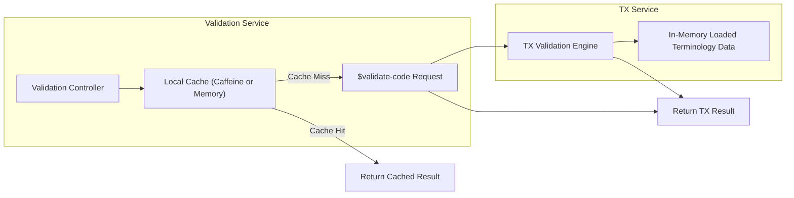

# Terminology Service

## Overview

```mermaid
flowchart LR
    subgraph Validation Service
        VC["Validation Controller"]
        CL["Local Cache (Caffeine or Memory)"]
        VC --> CL
        CL -- Cache Miss --> TXCALL["$validate-code Request"]
    end

    subgraph TX Service
        TXCALL --> TXCORE["TX Validation Engine"]
        TXCORE --> INMEM["In-Memory Loaded Terminology Data"]
    end

    CL -- Cache Hit --> RESP1["Return Cached Result"]
    TXCALL --> RESP2["Return TX Result"]
    TXCORE --> RESP2
```